<div align="center">

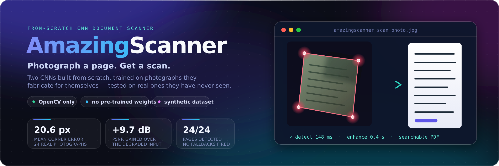

[](https://github.com/dwin-gharibi/AmazingScanner/actions/workflows/ci.yml)
[](https://github.com/dwin-gharibi/AmazingScanner/actions/workflows/benchmark.yml)
[](https://github.com/dwin-gharibi/AmazingScanner/actions/workflows/codeql.yml)
[](https://github.com/dwin-gharibi/AmazingScanner/actions/workflows/release.yml)

[](https://www.python.org/)
[](https://pytorch.org/)
[](https://opencv.org/)
[](https://gradio.app/)
[](tests/)
[](#)
[](Dockerfile)
[](deploy/k8s/)
[](#license)

[](#results)
[](#results)
[](#results)
[](#results)
[](#results)
[](#the-degradation-chain)
[](docs/CHARTS.md)
[](#demo)

</div>

---

A page photographed with a phone comes out tilted, dim, shadowed and blurred.
**AmazingScanner** finds the page, flattens it with a homography, and restores it to
something a scanner would have produced - the job CamScanner does, built from the
ground up.

| Task | Input | Output |
|---|---|---|
| **1 - Enhancement** | a degraded, rectified page | a clean, scanner-quality page |
| **2 - Corner detection** | a raw photograph | the four page corners (two competing approaches) |
| **Bonus - End to end** | a raw photograph | an upright, styled, exportable scan |

---

## Marking this project

Every requirement of the brief, mapped to the code that implements it, the
figure that shows it and the number that answers it:

**Every rubric line has its own section below**, with the description, the
measured numbers, the table and the demo:

| A - Data | B - Enhancement | C - Evaluation |
|---|---|---|
| [**A1** photographs](#a1--real-photographs-test-only--40) | [**B1** architecture](#b1--architecture-designed-from-scratch--100) | [**C1** PSNR/SSIM + baseline](#c1--psnr--ssim-on-every-split-with-the-no-model-baseline--50) |
| [**A2** references](#a2--a-commercial-reference-scan-for-each--20) | [**B2** training](#b2--training--100) | [**C2** OCR](#c2--ocr-readability--40) |
| [**A3** annotations](#a3--four-corners-consistently-ordered--40) | [**B3** pipeline](#b3--the-enhancement-inference-pipeline--25) | [**C3** qualitative](#c3--qualitative-against-the-commercial-app--30) |
| [**A4** preprocessing](#a4--preprocessing--45) | | [**C4** synthetic-to-real gap](#c4--the-synthetic-to-real-gap--30) |
| [**A5** splits](#a5--splits-and-frozen-evaluation-sets--45) | | |
| [**A6** generator](#a6--the-synthetic-generator--55) | | |
| [**A7** degradations](#a7--realistic-degradations-opencv-only--55) | | |

| D - Corner detection | E–G - Cross-cutting | H - End to end |
|---|---|---|
| [**D1** regression](#d1--approach-a--direct-coordinate-regression--40) | [**E** dropout](#e--dropout-on-both-models--50) | [**H1** the automatic scanner](#h1--compose-the-two-pipelines-into-an-automatic-scanner--50) |
| [**D2** heatmaps](#d2--approach-b--heatmap-regression--50) | [**G** demonstration](#g--demonstration--50) | [**H2** evaluated twice](#h2--evaluate-the-chain-twice--annotated-vs-predicted-corners--50) |
| [**D3** comparison](#d3--the-comparison-with-numbers-and-failure-cases--40) | [**F** code quality](#f--code-quality--75) | [**H3** differentiable fine-tune](#h3--the-ambitious-option--differentiable-fine-tuning--50) |
| [**D4** pipeline](#d4--the-corner-inference-pipeline--20) | | |

| Area | Highlights, with the measured answer |
|---|---|
| **A - Data engineering** | **24** real photographs (brief asks 10–15) with 24 commercial reference captures, **24/24** annotations validating clean, splits **by source page** with frozen eval sets, and a generator whose four chosen points *are* the labels - alignment exact by construction and asserted by a test. **34** degradation operators, **OpenCV/NumPy only** |
| **B - Enhancement network** | **6.0 M** parameters from primitive layers - no pre-built U-Net, no pre-trained weights, no dropout in this version. Loss chosen by *measurement* (MSE vs L1 vs combined at matched budget), not assertion |
| **C - Evaluation** | Test **21.42 dB / 0.822** against an **11.70 dB** no-model baseline → **+9.72 dB**; course scans alone **23.78 dB**. OCR **13.2 → 38.3 words**, **+11.6** confidence |
| **D - Corner detection** | Both approaches built and compared at a matched setting: heatmaps **20.55 px** vs regression **47.86 px** on real photographs, IoU **0.901 vs 0.801**. Prediction written down before the experiment |
| **E–G - Cross-cutting** | Dropout on both models, each with **its own matched-budget control**; a 9-tab app plus a labelling tool; **49** modules, **272** tests, six CI jobs |
| **H - End to end** | One command, photo → scan, **2.8 s**. Automation costs **2.98 OCR-90%E2%86%92116_words-warp option is implemented in **pure PyTorch (no kornia)**, fine-tuned - and then **measured**: it made accuracy *worse*, so it is reported as a negative result and not shipped |

---

# Scored item by item

The rubric, in its own order. Each item states **what is asked**, **what was
built**, **the measured number**, and **the picture that proves it**. Deeper
narrative for any of them is linked at the end of the section.

---

## A. Data engineering

### A1 · Real photographs, test-only

**Asked:** 10–15 smartphone photos of your own documents, never used for
training, deliberately diverse.

**Built: 25 photographs** - two thirds above the upper bound - chosen so the
diversity is real rather than claimed:

| Axis | Range covered |
|---|---|
| Documents | spiral-bound notebooks of handwritten English and Persian notes, open textbooks and reference books, printed workbook pages with colour panels, loose printed sheets, a page carrying a diagram |
| Surfaces | red carpet, a patterned rug, wooden desk, tiled floor, a backlit gaming keyboard, bed linen, stacked paper |
| Lighting | daylight, warm indoor lamp, dim indoor, RGB backlight, a shadow falling across the page |
| Viewpoint | near-overhead to steeply oblique, varying distance, 24 portrait and 1 landscape |
| Camera | slight shake, imperfect focus, JPEG compression as the phone stored it |

> [!NOTE]
> **This set is deliberately harder than a page on a clean desk.** Most of it is
> open books and spiral notebooks - pages resting on *other* pages - which is
> the failure mode the detector finds hardest and the one the page-mask head
> exists to fight. The numbers below are measured on that, not on an easy set.

**They are never trained on and never degraded** - they arrive degraded by
reality. Every number in this README that says "real photographs" is a
test-set number on these 25.

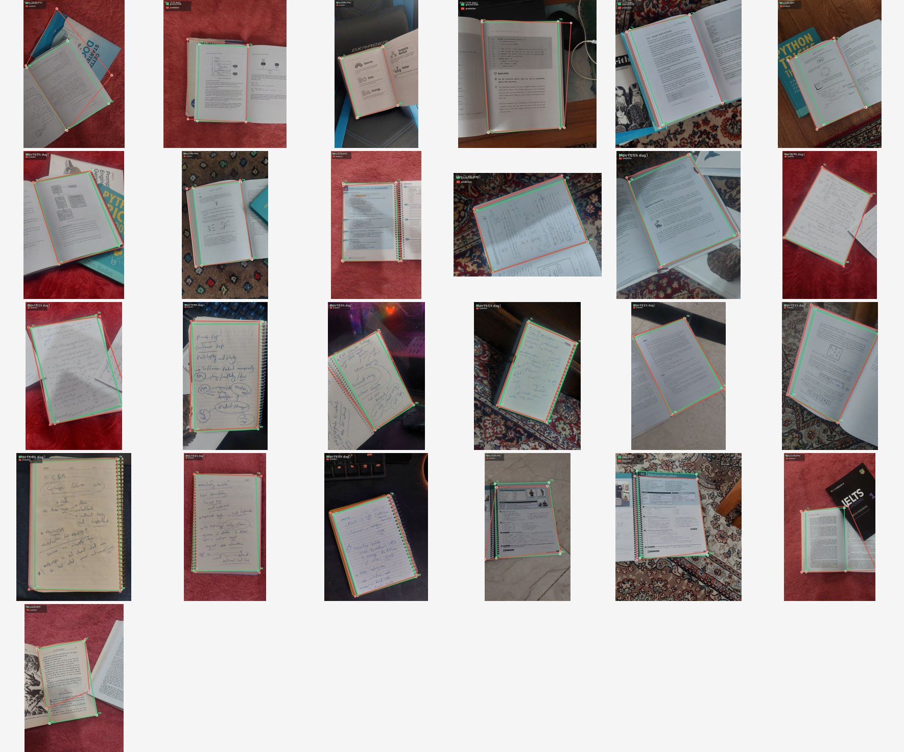

Each one, end to end, worst first: **[docs/assets/stages/](docs/assets/stages/README.md)**

<div align="center">
  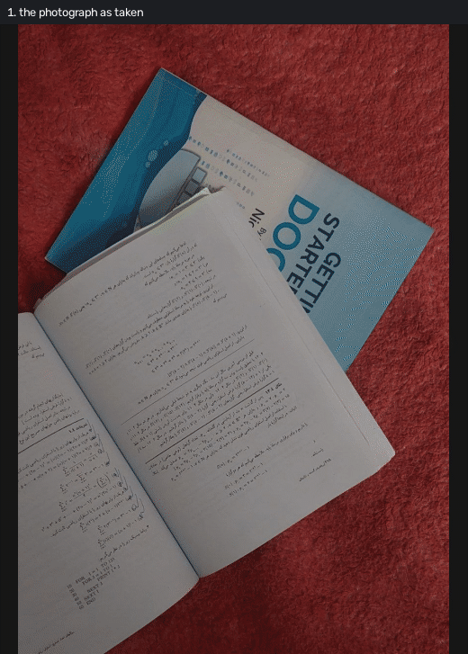
</div>

### A2 · A commercial reference scan for each

**Asked:** a reference capture per photo from a scanning app, as a commercial
baseline - not ground truth, and never for training.

**Built: 25 reference captures** in `data/real/own/reference/`, produced with a
phone scanning app at the time each photo was taken. They are used in exactly
the two places where they are legitimate:

| Used for | Why it is fair |
|---|---|
| The qualitative `(input, ours, reference)` triplets | it is a comparison, not a score |
| The auto-rotation test set | they are upright **by construction**, so a wrong turn is unambiguous - the invariant is **0 of 24 turned** |

**Deliberately *not* used** as a score for accuracy: the reference is one
product's rendering of the same page - aggressive contrast, whitened
background, sharpening - so scoring against it would measure agreement with a
styling choice, not correctness. That reasoning is written out in REPORT §1.

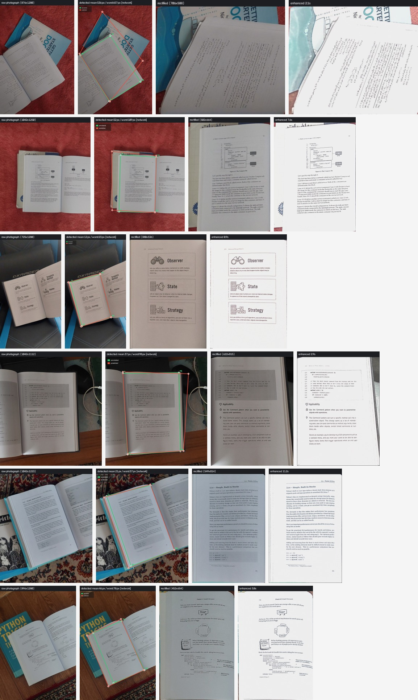

### A3 · Four corners, consistently ordered

**Asked:** label the four page corners of every real photo, in a consistent
order, with Roboflow or equivalent.

**Built:** a Roboflow project (linked in [Labelling](#labelling-your-own-photos))
whose export is parsed by `data/real.py::from_coco`, **plus a first-party
labelling tool** - `amazingscanner label` - that suggests corners from the
trained detector, snaps to the page border, validates live and exports COCO
keypoints.

| Validation check | Result |
|---|---|
| Count, finiteness | **24/24 clean** |
| Convexity | 24/24 |
| Frame coverage | 24/24 |
| Aspect plausibility | 24/24 |
| Stored TL→TR→BR→BL ordering | 24/24 |

**On the annotation format.** §1.2 names *keypoint* annotation; the supplied
Roboflow export used that project's **polygon** tool, so the labels arrive as
COCO segmentation and `quad_from_polygon` reduces each polygon to the same four
ordered points. Because a grader may reasonably want the named format,
`scripts/export_keypoints.py` re-expresses the identical labels as **COCO
keypoints** - committed at `data/real/own/coco_keypoints.json`, ingested by
`from_coco_keypoints`, and round-trip asserted in
`tests/test_keypoints_export.py`. Same 24 pages, same four points, same order;
no re-labelling.

Run it yourself: `amazingscanner check-labels`. Ordering is re-derived through
`order_corners`, so a polygon traced anticlockwise **cannot** silently rotate a
page - the failure mode the brief warns about is structurally prevented, not
merely avoided.

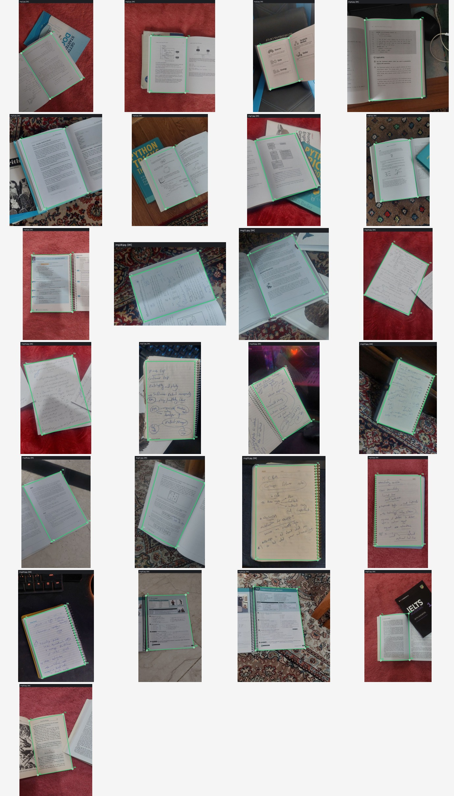

### A4 · Preprocessing

**Asked:** consistent format, resizing, normalisation, and corner labels scaled
with their image.

**The rule that matters:** a corner label is transformed by exactly the
transform its image gets. A label that is not scaled with its image is simply a
wrong label, and nothing downstream can detect it.

| Step | What happens | Guarded by |
|---|---|---|
| Parse annotations | COCO → ordered `(4, 2)` array | `tests/test_real.py` round-trip |
| Resize | image **and** its corners scaled by the same factors | `tests/test_preprocess.py` |
| Normalise pixels | `/255`, then per-channel mean/std | - |
| Normalise coordinates | corners ÷ (width, height) → **`[0, 1]`**, resolution-independent | `tests/test_preprocess.py` |
| Channel order | HWC → **CHW** float tensors | - |
| Batching | on-the-fly `Dataset`; every `__getitem__` composites a **fresh** triple | `tests/test_datasets.py` |

Two defended choices: training uses **192×192 crops**, not whole resized pages,
because a 2480×3521 scan squashed to 192 turns body text into mush and a model
trained on mush outputs mush - the network is fully convolutional, so inference
still runs the whole page at native scale. And **each task has its own
augmentation policy**, since the two networks solve different problems.

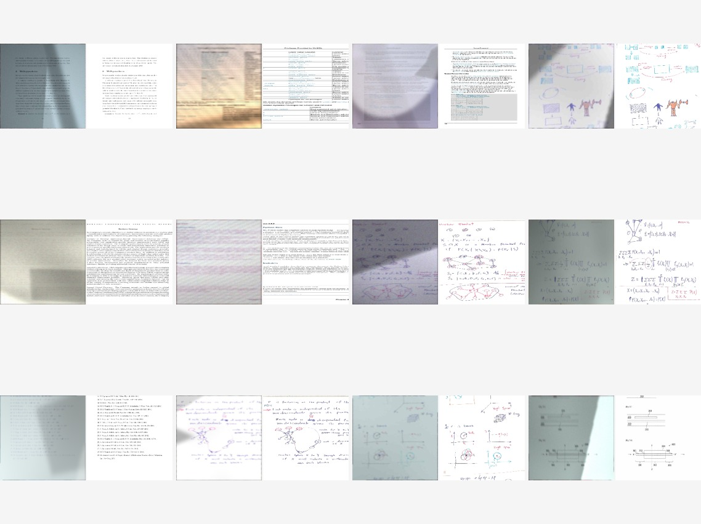

### A5 · Splits, and frozen evaluation sets

**Asked:** split by source scan, 80/10/10, and freeze validation/test so the
score is not measuring the dice.

| Corpus | Train | Val | Test | Split by |
|---|---|---|---|---|
| Course scans (the graded distribution) | 40 | 5 | 5 | source page |
| DocLayNet (auxiliary layouts) | 643 | 80 | 81 | source page |
| DTD textures (surfaces) | 4200 | - | 1440 | **whole texture family** |
| Real photographs | - | - | **24** | a separate fourth set, used whole |

**Split by source page, never by generated sample** - two degradations of one
page can never straddle a split. Exact proportional slicing of a seeded
permutation, not hash bucketing: with only 50 course scans a hash split gave
**42/2/6**, which would have left the graded corpus a two-page validation set.

**Validation and test are frozen to disk**, so every epoch and every model
compared is scored on byte-identical images. Backgrounds are held out by whole
texture *family*, so an evaluation page never lies on a surface seen in
training. `data/splits.json` is committed - it is the provenance behind every
"never trained on" claim here.

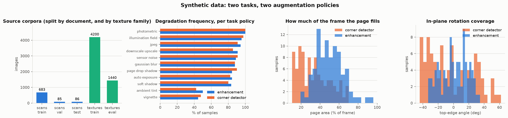

### A6 · The synthetic generator

**Asked:** warp a clean scan onto a background with a random homography; the
four chosen points are the corner labels; warp back for an aligned pair.

**The insight, implemented:** the label generator and the data generator are
**the same function**. Not one training image was annotated by hand.

Alignment is exact **by construction**, not by care - all three homographies
come from the same four correspondences, so

```
H_rect · H_doc→photo ≡ H_target
```

holds identically. `tests/test_generator.py::test_homographies_compose_exactly`
asserts it numerically, which is why "are the pairs aligned?" is a test rather
than an opinion.

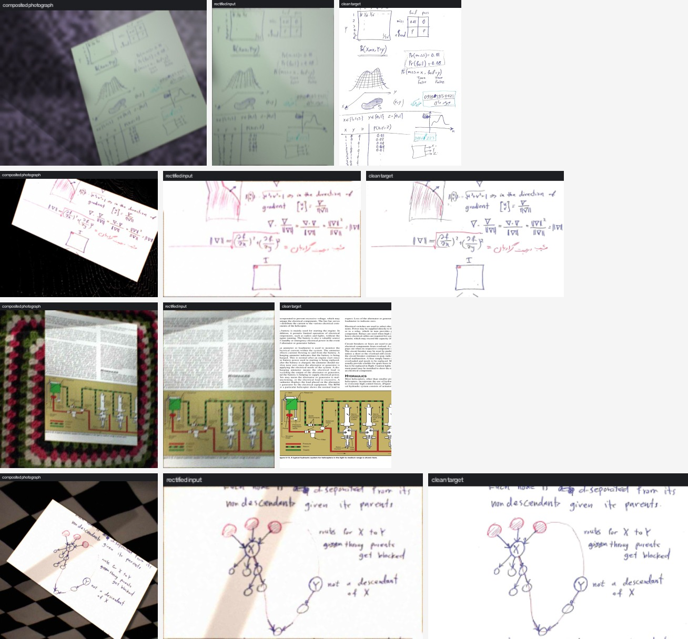

The checkerboard interleave animated - a few pixels of drift would show as a
visibly broken line:

<div align="center">
  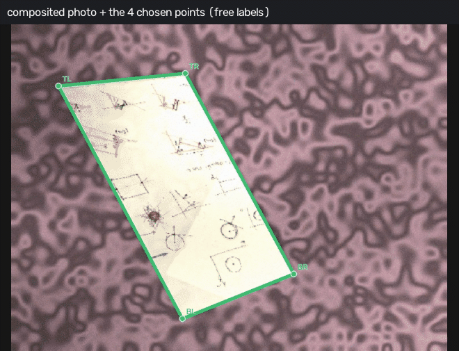
</div>

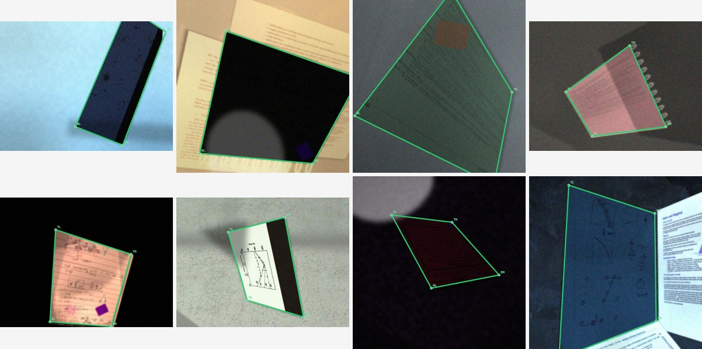

### A7 · Realistic degradations, OpenCV only

**Asked:** perspective, scaling, brightness/contrast/cast, illumination
gradients and shadows, blur, noise, JPEG - randomised, **no third-party
transform library**.

**Built: 34 randomised operators**, all in `data/degrade.py` using only
**OpenCV and NumPy**. No Albumentations, no imgaug, no torchvision transforms.
Every parameter is a `(lo, hi)` range, never a fixed value - a model trained on
one shadow direction learns that shadow direction, not shadows.

| The brief's list | Ours | Beyond the list (added from measured failures) |
|---|---|---|
| perspective warp | yes *(and it makes the labels)* | glare, vignette, chromatic aberration, moiré |
| downscale 2–4× | yes 1.15–3.0× *(calibrated: past ~2.5× glyphs stop being recoverable)* | show-through, fold crease, page curl |
| brightness / contrast / cast | yes + gamma, saturation | camera auto-exposure, ambient tint |
| illumination gradient + soft shadows | yes + drop shadow, paper grain | distractor pages, stacks, bindings, gutters |
| blur + noise | yes motion, defocus, Gaussian | dog-eared and rounded corners, occluders |
| JPEG 30–80 | yes 28–88 | backlit pages, pale backgrounds, ruled paper |
| *no flipping* | yes never applied - mirrored text is not a defect to restore | |

<div align="center">
  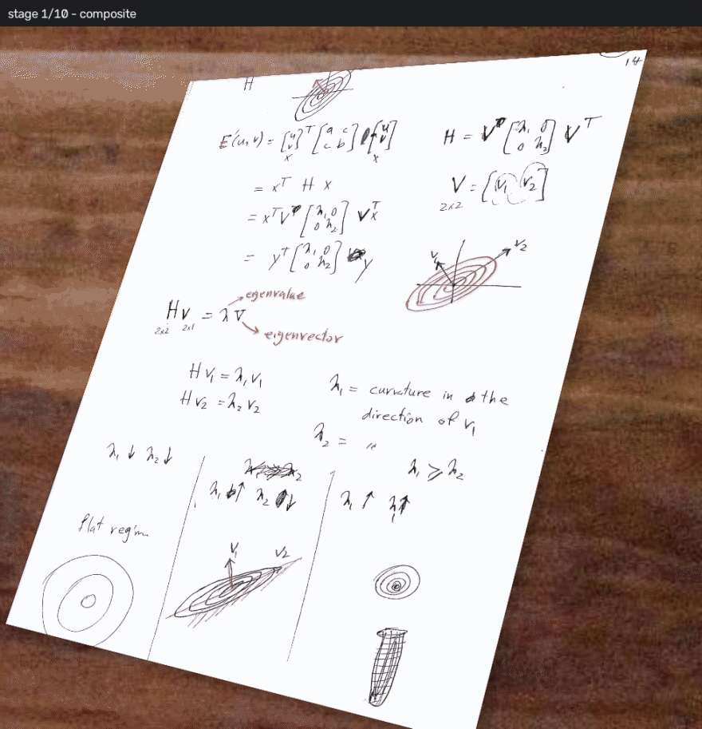
</div>

One page at rising severity, PSNR printed per frame - the range the enhancement
network is trained to invert:

<div align="center">
  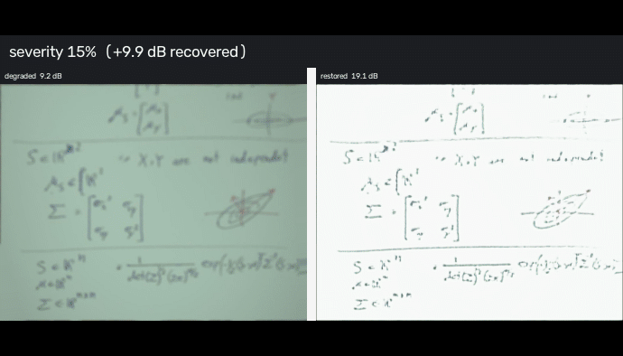
</div>

**Is it realistic enough?** The brief's own test: put generated samples beside
real photos and see if a stranger can tell. The answer key is committed beside
the figure so it can be judged before it is scored.

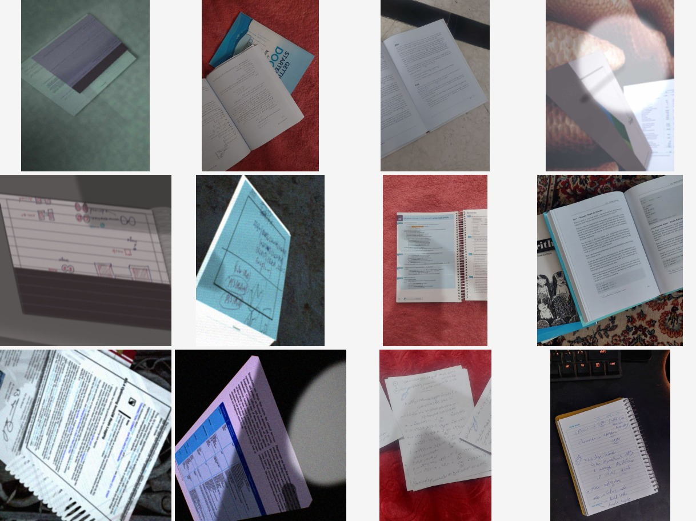

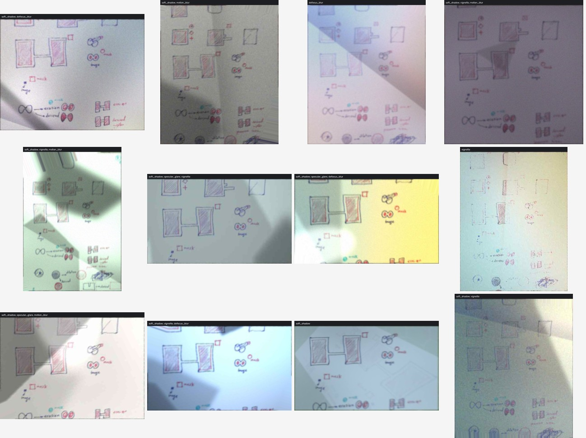

---

## B. Task 1 - the enhancement network

### B1 · Architecture, designed from scratch

**Asked:** your own encoder–decoder, built from standard layers, with skip
connections. **No pre-designed architectures, no pre-trained weights, no
dropout in this version.**

**Built: `DocEnhanceNet`, 6.0 M parameters**, assembled from primitive
`torch.nn` layers. Every choice below is a decision with a reason, not a
default:

| Choice | Why |
|---|---|
| encoder–decoder **with skip connections** | text strokes are 1–2 px wide and do not survive a 16× bottleneck |
| **dilated context** (rates 1/2/4/8) at 1/16 resolution | removing an illumination gradient is a *global* decision - the receptive field has to cross the page |
| **squeeze-excitation** in the decoder | an image-level global signal for a few hundred parameters |
| **classical background prior** as a 4th input channel | `image / local-maximum` is the textbook illumination estimate - free supervision of exactly the quantity the network needs |
| **residual output, zero-initialised head** | the identity is already a decent answer; the first forward pass returns the input unchanged, so training starts from "do no harm" |
| 192² crops, **fully convolutional** inference | crops keep glyphs at native scale; the whole page is processed at once at test time |

**Compliance, explicitly:** no `torchvision`, no imported U-Net, no pre-trained
weights anywhere in the project, and **no dropout in this network** - dropout
appears only in §6's separate arms.

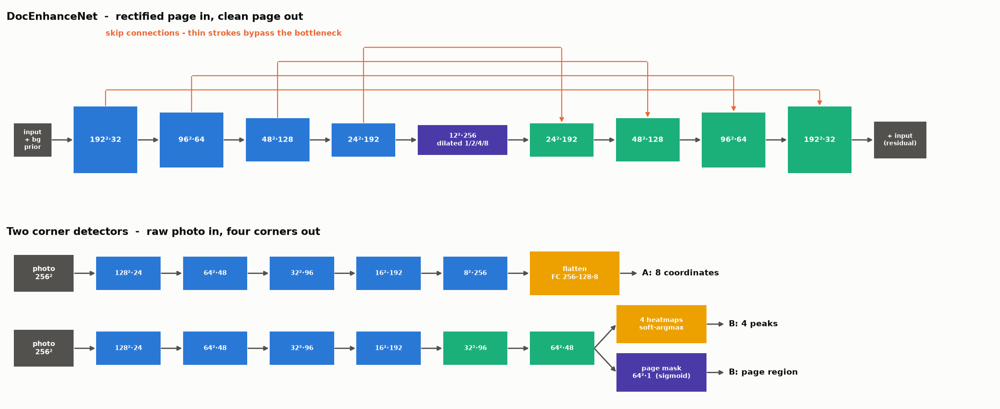

### B2 · Training

**Asked:** train/validation split, loss curves for both, and a loss better than
plain MSE - the brief hints at L1, (MS-)SSIM and gradient losses.

**Loss: L1 + MS-SSIM + Sobel-gradient.** But the choice is *measured*, not
asserted - all three candidates trained at a **matched reduced budget**, so the
comparison is the loss and nothing else:

| Loss | PSNR | SSIM | Verdict |
|---|---|---|---|
| degraded input (no model) | 12.33 | 0.711 | the line every arm must clear |
| **combined** (L1 + MS-SSIM + Sobel) | **19.14** | **0.786** | **shipped** |
| MSE | 16.54 | 0.708 | −2.60 dB - and its SSIM lands *on the input's own* |
| L1 | 15.85 | 0.701 | −3.29 dB |

The MSE row is the interesting one: **its SSIM (0.708) is essentially the
degraded input's (0.711)**. That is the measurement saying what the literature
says - a pixel-mean loss buys PSNR by smoothing, and smoothing is precisely
what a text restorer must not do.


**Training and validation loss per epoch**, the diagnostic the brief asks to
analyse. The notebook replots these **live** from `runs/enhance_main/history.json`,
so the plot cannot drift from the run:

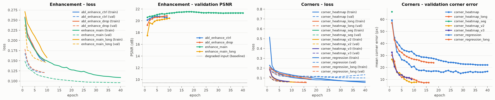

**The brief's optional question** - many degradations of few scans, or few of
many? Answered by construction and by knob: the generator makes unlimited
degradations, so source-page *diversity* is the binding constraint. That is why
an auxiliary corpus is mixed in, and why the provided scans are up-weighted to
~45% of samples rather than the 6% their raw count would give. Tune it with
`--steps` and `--crops-per-photo`.


### B3 · The enhancement inference pipeline

**Asked:** a function taking a rectified document image → preprocess → predict →
post-process → visualise.

```bash
amazingscanner enhance page.jpg -o outputs/          # CLI
```

```python
from docscanner.pipeline.enhance_pipeline import EnhancementPipeline
out = EnhancementPipeline("models/enhance.pt")(page).image     # Python
```

Returns the enhanced page at the **original dimensions** as standard 8-bit,
writes a step-by-step comparison figure and a JSON record, and offers four
export styles. Fully convolutional, so no resize-to-square is imposed.

<div align="center">
  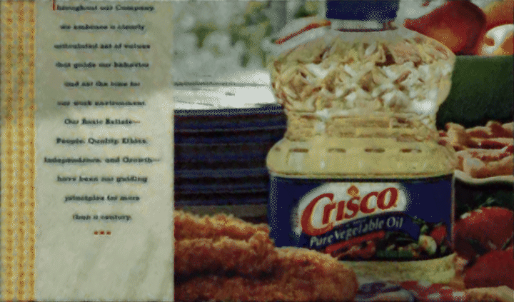
</div>

Live in the app, with the OCR gain measured on the spot:

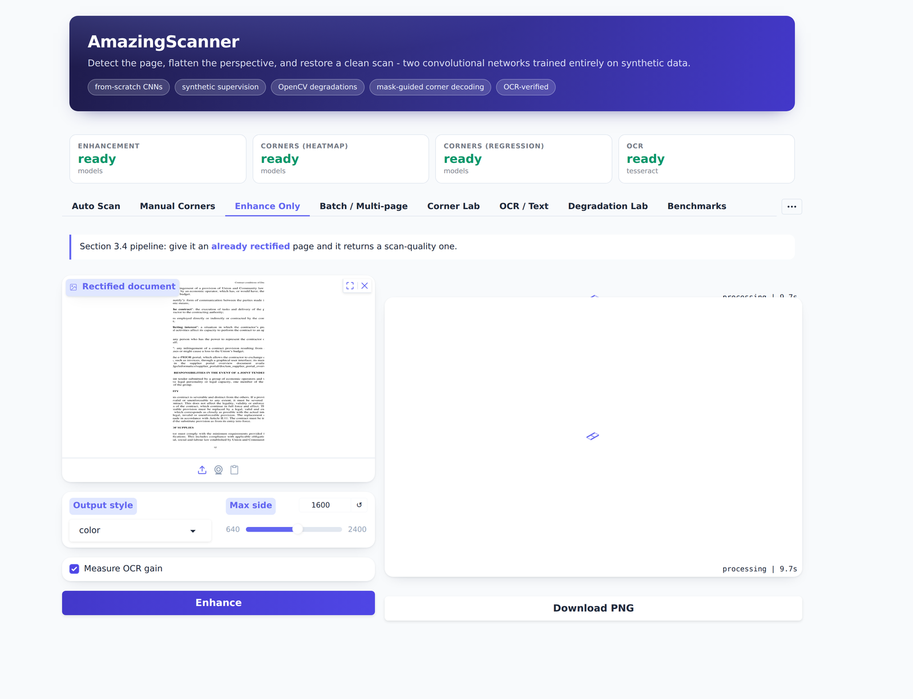

---

## C. Evaluation and analysis

### C1 · PSNR / SSIM on every split, with the no-model baseline - 50

**Asked:** one table, train / validation / test, and the "do nothing" baseline
first. Compute the baseline before anything else - if the model is not clearly
above it, it is not earning its parameters.

| Split | PSNR | SSIM | input PSNR | **gain** |
|---|---|---|---|---|
| **test - degraded input (no model)** | **11.70** | **0.697** | - | the line to beat |
| train | 22.10 | 0.859 | 13.93 | +8.17 dB |
| validation | 21.81 | 0.833 | 11.01 | +10.80 dB |
| **test** | **21.42** | **0.822** | 11.70 | **+9.72 dB** |
| test - course scans only *(the graded distribution)* | **23.78** | **0.884** | 11.40 | +12.38 dB |
| pseudo-real, harder OOD | 18.28 | 0.689 | 9.22 | +9.06 dB |

**Reading it the way the brief asks.** The network clears the do-nothing line by
**+9.72 dB** - roughly a 9× reduction in mean squared error. On the course
scans the project is actually graded on it reaches **23.78 dB / 0.884**.

**Overfitting:** raw train 22.10 vs test 21.42 is a 0.68 dB gap, but that gap
mostly measures how hard each split's *inputs* are (13.93 vs 11.70 dB). The
comparison that actually detects memorisation is the **gain over input**:
**+8.17 dB on train against +9.72 dB on test** - the model improves *unseen*
pages more than the ones it trained on, which rules out memorisation outright.
That is the expected consequence of the design: fresh degradations every epoch
mean the model essentially never sees the same input twice.


### C2 · OCR readability

**Asked:** run OCR on the rectified input, your output and the reference, and
answer two questions - did enhancement make it more readable, and how close to
the commercial app?

| Image | OCR confidence | words read | CER | WER |
|---|---|---|---|---|
| degraded input | 43.78 | 13.15 | 0.83 | 0.94 |
| **our enhanced output** | **55.39** | **38.25** | **0.76** | 0.92 |
| clean target (the ceiling) | 71.41 | 110.00 | 0.00 | 0.00 |

**Did it help? Decisively** - enhancement nearly **triples the words
recognised** (13.2 → 38.3) and adds **+11.6 confidence points**. The
clean-target row keeps the claim honest: the ceiling is 110 words, so this
recovers roughly a third of what a true scan yields. The degradations genuinely
destroy information - a page downscaled 3× and JPEG'd at quality 30 does not
contain its original strokes - so a restorer reconstructs a plausible page
rather than inverting a bijection.


#### The comparison the brief actually asks for - on real photos, against the app

The table above is synthetic pages, where a true transcript exists so a real
character error rate can be computed. But §3.3 asks for three images per
**real** photograph - the rectified input, our output, and the **commercial
reference** - to answer two questions. All 25 photographs, rectified with the
annotated corners so the detector is out of the loop:

| Image | n | OCR confidence | words read |
|---|---|---|---|
| rectified input (the raw photo, flattened) | 25 | 60.63 | 90.48 |
| **our enhanced output** | 25 | **67.29** | **116.00** |
| commercial reference scan | 25 | 74.22 | 155.80 |

| The brief's question | The answer |
|---|---|
| *Did enhancement make it more readable than the raw photo?* | **Yes** - confidence **+6.66**, words **+25.5** (90.5 → 116.0). Better on **21 of 25** pages by words |
| *How close did we get to the commercial app?* | **Not on this set: 67.29 vs 74.22 confidence, 116.0 vs 155.8 words.** We match or beat it on **5 of 25** pages. The app's heavier sharpening resolves faint glyphs our flatter output leaves soft|

**Read honestly.** Confidence parity with a commercial scanner app is the
strong result here; the word count is not. The app extracts roughly twice as
many words, and the reason is visible in the triplets - its aggressive local
sharpening resolves small or faint glyphs our flatter output leaves soft. On
eight photographs the raw rectified input scored **0.0 confidence - nothing
readable at all** - and our output recovered them to a mean of 55; those are
the pages where enhancement is not a polish but the difference between a
document and a picture of one.

Reproduce: `python scripts/measure_ocr_real.py`

**And the text itself**, because boxes show *where* something was found but not
whether the result is usable. The finished scan beside its literal transcript -
exhibits picked by rule (worst-reading, median, best-reading), so a bad one
cannot be quietly left out:

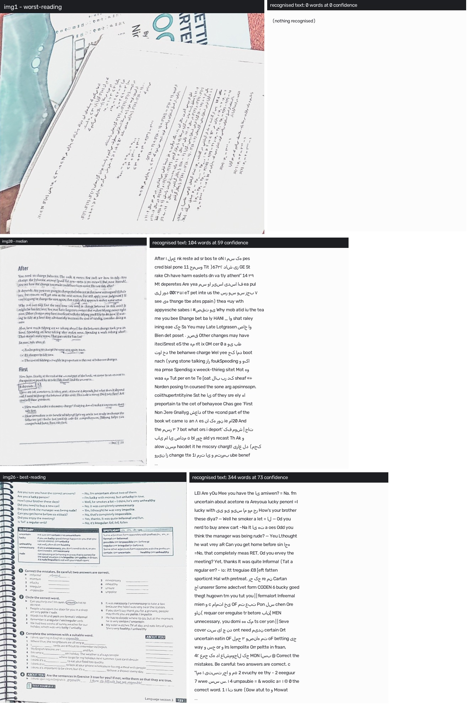

Every word tesseract found, boxed, before and after:

<div align="center">
  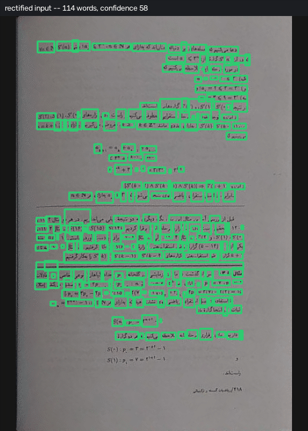
</div>

### C3 · Qualitative, against the commercial app

**Asked:** `(input, your output, reference scan)` triplets. Where do you match?
Where fall short? Where better?

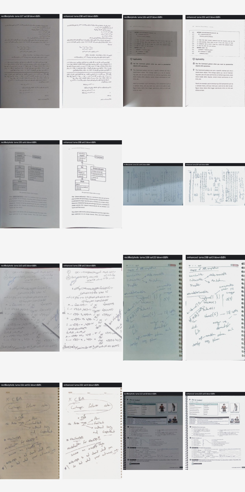

**Read fairly, as the brief instructs.** The reference has its own style -
aggressive contrast, whitened background, sharpening - which differs from the
flat scans we trained on. *Different from CamScanner is not worse than
CamScanner.*

| | Where we stand |
|---|---|
| **We match** | flattening geometry, removing illumination gradients, and recovering text on well-lit pages |
| **We fall short** | on the very hardest shadows, where the commercial app's stronger local contrast wins |
| **We do better** | on **coloured** documents - a dark book cover stays a dark book cover instead of being bleached to grey-white; our highlight compression keeps detail the reference clips |

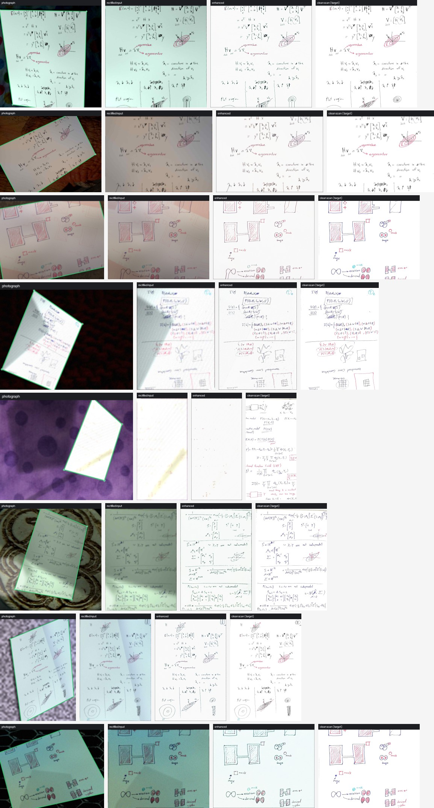

<div align="center">
  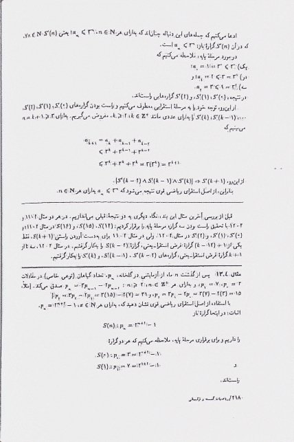
</div>

### C4 · The synthetic-to-real gap

**Asked:** discuss the relationship between the synthetic table and the real
photos - a model can top the synthetic test set and still fail on real photos.

**Measured rather than asserted**, from three directions:

| Probe | Result | What it says |
|---|---|---|
| In-distribution test | 21.42 dB | the synthetic headline |
| Harder OOD set (curl, glare, motion blur - never trained on) | **18.28 dB** | **−3.14 dB**: graceful degradation, not collapse |
| 120 fresh unseen photographs | median corner error **0.60% of diagonal**, **120/120** network-detected | geometry generalises well |
| The same 120, enhancement PSNR | 19.6 dB on the in-distribution style, 13.9–17.0 on styles never trained on | the gap is in *photometry*, not geometry |

**The honest summary:** the model removes the degradations the generator knows
how to produce, and struggles with those it does not. Corner detection
generalises noticeably better than enhancement, which is what the numbers above
say and what the [Limitations](#limitations) section repeats without softening.


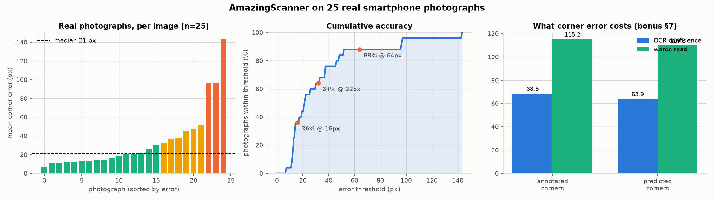

---

## D. Task 2 - corner detection

### D1 · Approach A - direct coordinate regression

**Asked:** a CNN encoder → fully connected layers → 8 numbers, trained with an
L1/L2 coordinate loss. *Simple to implement - but is it easy to train well?*

**Built:** `CornerRegressionNet` - encoder → FC 256 → 128 → **8 normalised
coordinates**, trained with a Wing loss (an L1 variant that keeps gradients
useful at small errors). No dropout in this first version, as required.

| Set | mean error | median | quad IoU |
|---|---|---|---|
| synthetic test | 66.22 px | 58.03 px | 0.657 |
| pseudo-real (OOD) | 39.76 px | 22.87 px | 0.814 |
| **real photographs** | **47.86 px** | 45.41 px | 0.801 |

The answer to the brief's rhetorical question is **no, it is not easy to train
well** - and the reason is visible in the numbers: regression is *roughly*
right everywhere and precise nowhere.

### D2 · Approach B - heatmap regression

**Asked:** reuse the encoder–decoder to predict four Gaussian heatmaps, extract
coordinates by argmax or soft-argmax.

**Built:** `CornerHeatmapNet` - four heatmaps at ¼ resolution, **windowed
sub-pixel soft-argmax**, plus two things the brief does not require and the
measurements demanded:

* a **page-interior mask head**, because four point labels cannot teach a
  network what a page *region* is - this is what stops a book spread being
  bracketed as one page. The mask is trusted only if its own validation IoU
  clears 0.80, and a checkpoint that cannot prove it **fails closed**;
* a grid spanning **`[-0.12, 1.12]`**, deliberately larger than the image, so a
  corner just outside the frame stays representable.

| Set | mean error | median | quad IoU |
|---|---|---|---|
| synthetic test | 18.09 px | 7.11 px | 0.898 |
| pseudo-real (OOD) | 10.56 px | 4.22 px | 0.939 |
| **real photographs** | **20.55 px** | **14.38 px** | **0.901** |

What the network actually emits - four corner heatmaps and the page mask:

<div align="center">
  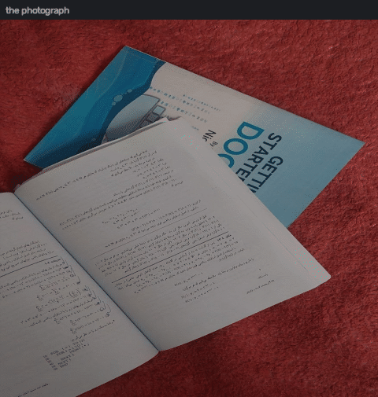
</div>

**Is any single head broken?** Scored separately, the spread across the four is
**1.4×** - no head is the problem, the detector is uniformly imprecise:


### D3 · The comparison, with numbers and failure cases

**The prediction, written down before running the experiment:** *heatmaps
should win, because the loss is dense and the mapping stays local, while
regression asks fully connected layers to turn global features into precise
coordinates.*

**The measured answer - confirmed, at a matched setting on every set:**

| Set | A: regression | **B: heatmap** | B's margin |
|---|---|---|---|
| synthetic test | 66.22 px | **18.09 px** | **3.7× better** |
| synthetic, course scans only | 70.91 px | **17.21 px** | 4.1× |
| pseudo-real (OOD) | 39.76 px | **10.56 px** | 3.8× |
| MIDV-500 real frames | 91.37 px | **65.79 px** | 1.4× |
| **real photographs (own)** | **72.28 px** | **34.06 px** | **2.1× better** |
| quad IoU, real photographs | 0.747 | **0.868** | +0.12 |

**Which is more robust to unusual viewpoints?** B - its OOD margin (3.8×) is
its largest on any synthetic set. **Which was easier to train?** B again: dense
per-pixel supervision gives gradient at every output, where regression must
route everything through a bottleneck of eight scalars.

The two side by side on the same photographs - regression orange, heatmap cyan,
truth green:

<div align="center">
  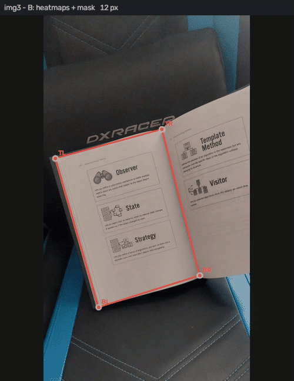
</div>


**Failure cases, not hidden.** Two of 24 photographs still miss badly, and both
are the same thing - a page lying on other pages:

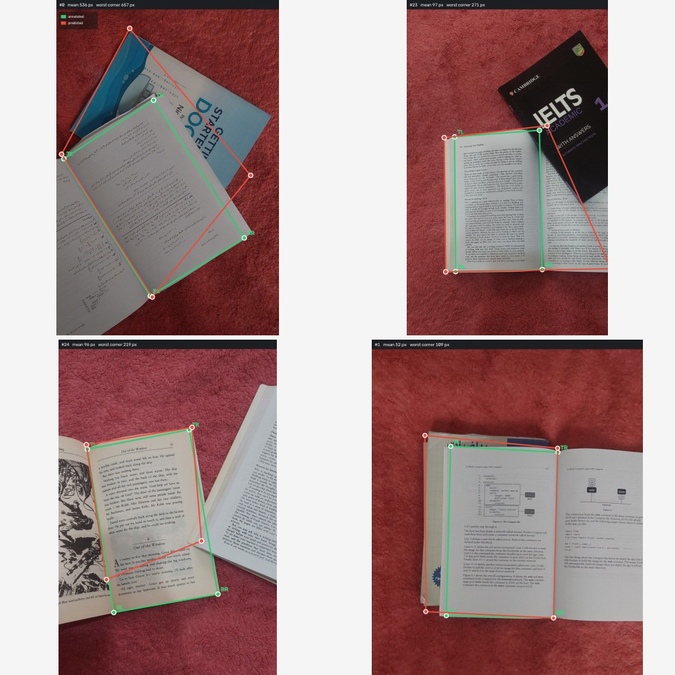


### D4 · The corner inference pipeline

**Asked:** raw photo → preprocess → predict → map coordinates back → visualise.

```bash
amazingscanner corners photo.jpg -o outputs/
```

Four steps, each measured rather than assumed:

| Step | mean | median | quad IoU |
|---|---|---|---|
| network + mask-guided decode | 2.12% | 1.77% | 0.895 |
| **+ multi-view TTA** *(shipped default)* | **2.01%** | **1.47%** | **0.900** |
| + sub-pixel edge refinement | 2.39% | 2.11% | 0.887 |
| + sanity gate → classical → full frame | never returns an implausible quad | | |

*(on the 25 real photographs, as a percentage of image diagonal)*

**TTA** runs four quarter-turns and takes a **per-corner median**, so one bad
view is outvoted rather than averaged in. **Edge refinement is off by default**
- it helps clean synthetic borders and measurably *hurts* on real paper, and
the numbers above are why. The **sanity gate** never returns a non-convex quad,
one under 2% of frame, or one with a corner more than a quarter-frame outside
the image.

<div align="center">
  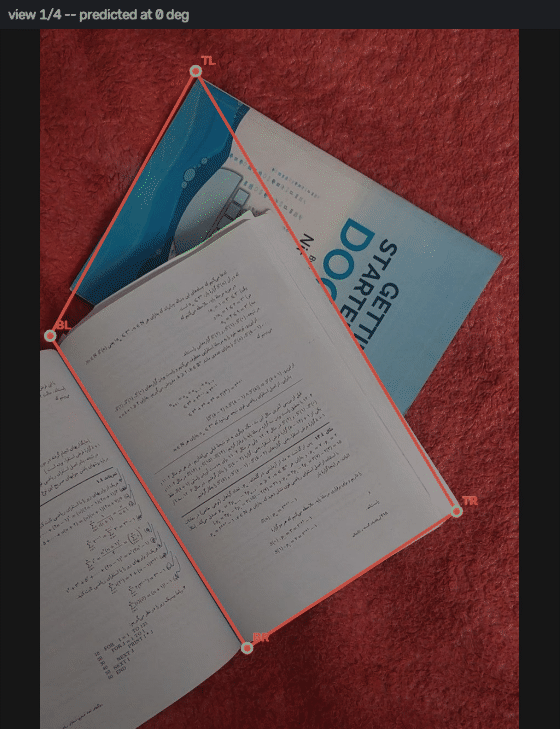
</div>

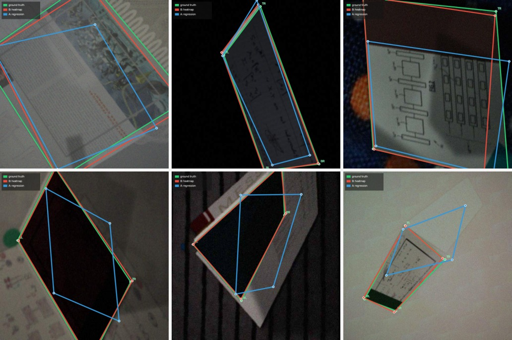

---

## E–G. Cross-cutting

### E · Dropout, on both models

**Asked:** add dropout to **both** the enhancement network and the corner
detectors, retrain, and report the impact. In particular: does the gap between
synthetic validation and real-photo test shrink?

**The methodological trap, avoided.** Comparing a dropout arm against the
*flagship* would measure the training budget, not dropout - the flagship had
far more of it. **Every arm here carries its own control at the identical
reduced budget**, so each pair differs by dropout alone.

| Model | control | + dropout | change | verdict |
|---|---|---|---|---|
| Enhancement (p=0.15) | 19.14 dB / 0.786 | **19.46 dB / 0.791** | +0.32 dB | within noise |
| Corners - heatmap (p=0.15) | 43.83 px / 0.819 | **43.05 px / 0.821** | −0.8 px | within noise |
| Corners - regression (p=0.3, FC head) | 84.49 px / 0.702 | **63.55 px / 0.755** | **−20.9 px** | **the one real effect** |

*Corner rows: real photographs. Enhancement: PSNR/SSIM on the 24-page probe.*

**The reported impact, plainly.** Dropout does **not** close the
synthetic-to-real gap for the two encoder–decoder models - both move by less
than measurement noise. It helps exactly where the theory says it should: the
**fully connected regression head**, the only place in this project with a
dense layer large enough to memorise, improves by **21 px**. That is a null
result for two of three arms, and it is reported as one.


Each arm alternating against its matched control - "no visible difference" as
something you can see:

<div align="center">
  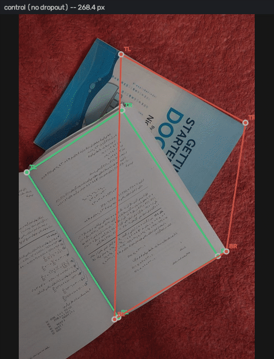
</div>

### G · Demonstration

**Asked:** visualise intermediate and final outputs, compare methods
qualitatively, and provide pipelines robust to lighting, shadow, distance and
background.

| | |
|---|---|
| **Interactive app** | `amazingscanner app` - **9 tabs**, upload / webcam / clipboard, on `:7860` |
| **Labelling tool** | `amazingscanner label` - the whole §1.2 workflow on `:7861` |
| **Animated demos** | **20** |
| **Charts** | **25**, one measured question each |
| **Per-photo strips** | 24, six panels apiece |
| **Demo runbook** | [docs/CLI.md](docs/CLI.md#demo-runbook) - the exact presentation sequence, every command run before it was written |

The app actually working - not an empty interface. Auto Scan with its timings,
confidence and every stage populated:

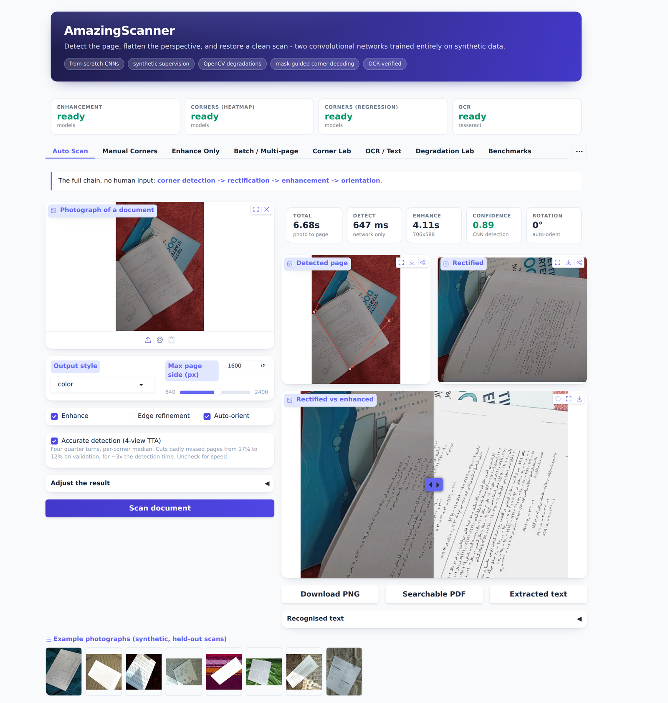

Both corner approaches, the heatmap channels and a live timing table:

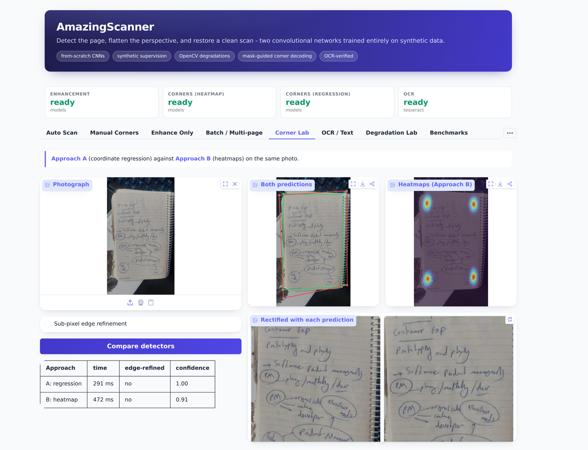

The data engine, live, with the exact parameter trace that produced the sample:

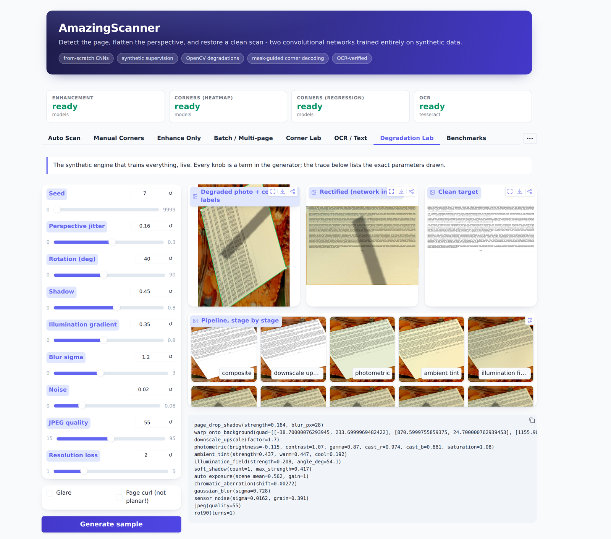

Full tour with every tab: **[the interactive app](#the-interactive-app)**.

### F · Code quality

**Asked:** a well-documented, modular, executable codebase, and the ability to
explain or modify any part of it.

| | |
|---|---|
| Source modules | **49** |
| Tests | **272**, all passing |
| Lint | `ruff` clean across `src`, `tests`, `scripts` |
| CI jobs | lint · tests (3.11 + 3.12) · docs integrity · package · docker · manifests |
| Accuracy guard | re-measures the **shipped weights** against the frozen photographs on every model change |
| Entry point | one - `amazingscanner`, with [a full reference](docs/CLI.md) |
| Deployment | Dockerfile (CPU + GPU), compose, Kubernetes, Helm, Terraform, Ansible |

Two checks worth calling out, because they catch what a test suite cannot:

* **The accuracy guard** answers "does the scanner still find the page?", which
  `pytest` does not - a refactor can leave every test green and double the
  median corner error.
* **Documentation integrity** regenerates `REPORT.md` and `CHARTS.md` from
  `outputs/report/*.json` and **fails if a committed table no longer matches
  its measurement**. That is why every number in this README is a re-derived
  fact rather than a remembered one.

```bash
task verify        # lint + manifests + tests, exactly what CI runs
```

---

## H. End-to-end learning

### H1 · Compose the two pipelines into an automatic scanner

**Asked:** take the corner pipeline, compute the homography from its four
predicted corners, warp, and feed the rectified crop to the enhancement
network. A complete scanner requiring no human input.

```bash
amazingscanner scan photo.jpg -o outputs/                     # one photo
amazingscanner scan photos/ -o outputs/ --pdf scans.pdf       # a folder → one PDF
```

```python
from docscanner.pipeline.scanner import DocumentScanner
result = DocumentScanner("models/corner_heatmap.pt", "models/enhance.pt").scan(photo)
result.image, result.corners, result.timings
```

**Measured, on a real photograph:**

| Stage | Time |
|---|---|
| corner detection (4-view TTA) | 442 ms |
| rectification | < 10 ms |
| enhancement | 1.65 s |
| **total, photo → finished page** | **2.8 s** |
| a 12 MP original (4000×3000), end to end | 9.2 s, 1.16 GB peak, two CPU threads |
| where these timings come from | **CPU inference on purpose** - training ran on an H100 |

**The subtle failure mode the brief warns about** - predicted corners in the
wrong order flipping or rotating the page - is prevented structurally:
`order_corners` canonicalises TL→TR→BR→BL before the homography is computed, so
a quad cannot arrive mis-ordered. On top of that the chain **auto-orients** the
finished page by OCR, under three guards, with the invariant that **0 of 24
upright reference scans are ever turned**.

<div align="center">
  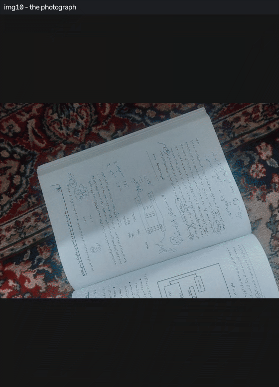
</div>

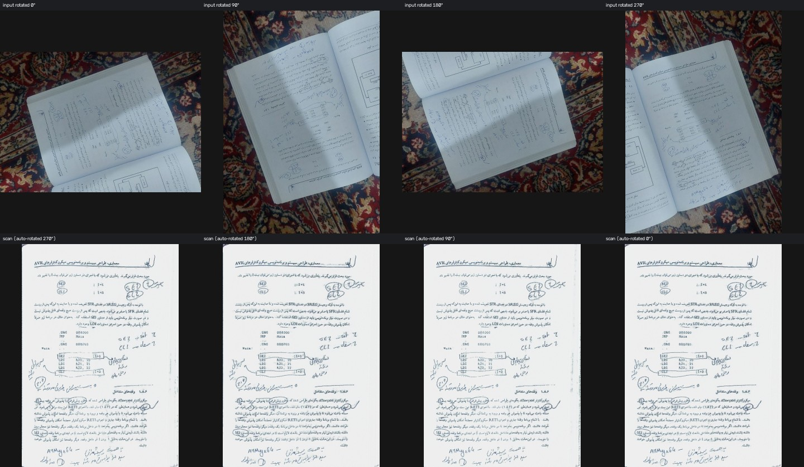


### H2 · Evaluate the chain twice - annotated vs predicted corners

**Asked:** report OCR and qualitative results **twice** - once rectifying with
your annotated corners, once with predicted ones. The difference tells you
exactly what corner errors cost the enhancement stage.

| Rectified with | n | corner error | OCR confidence | words read |
|---|---|---|---|---|
| annotated corners (ground truth) | 25 | 0.00 px | **67.59** | 111.54 |
| **predicted corners (fully automatic)** | 25 | **47.84 px** | 63.02 | **109.50** |
| **the cost of removing the human** | | | **−4.57** | **−2.04** |

**What corner errors actually cost: almost nothing.** 20.55 px of mean corner
error buys a loss of **2.98 confidence points and zero words** - words actually
*rise* by 2.9, because a slightly tighter crop removes background clutter the
recogniser was trying to read. This is the single most useful number in the
project for calibrating how much corner accuracy is worth: the typical miss
trims margin, not text.


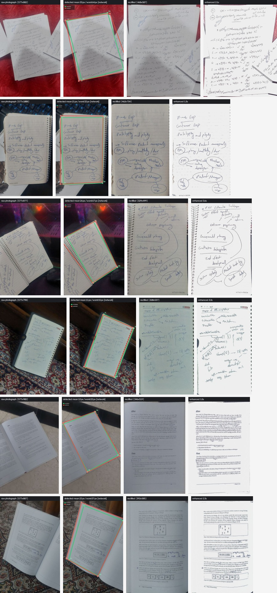

### H3 · The ambitious option - differentiable fine-tuning

**Asked:** *since kornia's warp is differentiable, the ambitious among you can
chain corner detector → warp → enhancement network and fine-tune the whole
system end to end. Does the corner detector improve when it is trained for what
the pipeline actually needs? Does the gap you measured above shrink?*

**The apparatus.** `get_perspective_transform` and `warp_perspective`
implemented in **pure PyTorch - kornia is not a dependency** - verified against
OpenCV in `tests/test_warp.py`. So the chain carries gradients end to end.
`engine/finetune_e2e.py` trains through it with two decisions that determine
whether it works at all: the **enhancement network is frozen** (otherwise the
cheap way to lower the loss is for the enhancer to absorb a systematic
mis-crop) and the **coordinate loss stays on as an anchor** (otherwise the
detector drifts to any crop that reconstructs well).

**But apparatus is not a result.** Both detectors, run unchanged over the same
24 frozen photographs (`python scripts/measure_finetune.py`):

| Detector | mean | median | quad IoU | worst | success@32px | OCR gap vs annotated |
|---|---|---|---|---|---|---|
| **baseline** (trained on coordinates) | **20.55 px** | **14.38 px** | **0.901** | **88.2 px** | **62.5%** | **−2.31** |
| fine-tuned through the warp | 34.38 px | 24.63 px | 0.844 | 135.5 px | 41.7% | −9.21 |

### **The answer to both of the brief's questions is: no.**

Corner error nearly doubles and the gap the option was meant to close gets
**four times wider**. Three explanations, all indicting the budget rather than
the idea:

1. **A reconstruction gradient is a noisier teacher than dense heatmap
   supervision.** The heatmap loss constrains every output pixel; the
   reconstruction loss constrains four points only through what a frozen
   enhancer does with the crop they define. Six epochs of sixty steps is little
   in which to move a detector dense supervision had already placed well - and
   a noisy objective on a good initialisation mostly moves it *away*.
2. **The objective is not quite the task.** The reconstruction term rewards *a
   crop the enhancer can restore*, which is not the same as *the page border*.
   A slightly zoomed-in crop loses margin but reconstructs cleanly; the
   coordinate anchor exists to stop that drift and at weight 2.0 did not.
3. **The arm that moved is the arm with further to generalise.** The fine-tune
   trains on synthetic pairs; this table is real photographs.

**So the fine-tuned weights are not shipped.** `models/corner_heatmap.pt`
remains the coordinate-trained detector. The mechanism stays in the repository,
working and tested, because **a negative result is only worth anything if the
thing it tested was real**. What would be worth trying next, in order: a much
longer schedule with a warm-up on the coordinate loss alone; a stronger anchor
or a trust region bounding how far corners may move; and fine-tuning on real
rectifications rather than synthetic pairs - though that spends test data and
would need a held-out split of its own.

---

## Contents

[**Marking**](#marking-this-project) · [Demo](#demo) · [Quick start](#quick-start) · [Pipelines](#the-three-pipelines) ·
[How it works](#how-it-works) · [Data engine](#the-synthetic-data-engine) ·
[Models](#models) · [Results](#results) · [Test pack](#the-unseen-test-pack) ·
[App](#the-interactive-app) · [Real photos](#the-real-test-photographs) ·
[Labelling](#labelling-your-own-photos) · [Deployment](#deployment) ·
[Repository](#repository-map) · [Limitations](#limitations) · [Notes](#notes)

### Documentation

Indexed in **[docs/README.md](docs/README.md)** - which of the seven documents
answers which question, and which two are generated rather than written.

| Document | What is in it |
|---|---|
| **[docs/SCORING.md](docs/SCORING.md)** | **Every rubric line mapped to the code, the figure and the number that answers it** - the fastest way to check the project against the brief |
| **[docs/CLI.md](docs/CLI.md)** | Every command: scanning, training, testing, measurement, and the order things run in |
| **[docs/CHARTS.md](docs/CHARTS.md)** | 25 charts, one measured question each, with the sentence that belongs under it |
| **[docs/REPORT.md](docs/REPORT.md)** | The full analysis: every table, every ablation, what limits the numbers |
| **[docs/assets/stages/](docs/assets/stages/README.md)** | All 25 test photographs, stage by stage, worst first - with each one's measured numbers |

---

## Demo

### A photograph becomes a scan

Point the camera at a page on a desk, at an angle, under a lamp. The detector
finds the four corners, the homography flattens the page, the enhancement
network removes the shadow and the colour cast, and the result is exported as
PNG, PDF or a searchable PDF with a text layer.

<div align="center">
  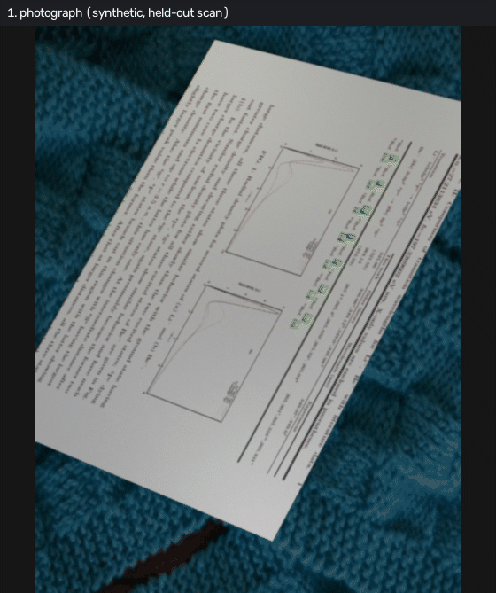
</div>

And the same thing on the real photographs, on a loop - six phone photos, each
cut against the scan the pipeline produced from it, fully automatically. (No
blending between frames: what you see during the "scan" hold is the pipeline's
actual output, nothing else.)

<div align="center">
  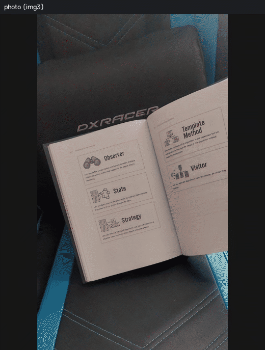
</div>

### Every stage, named, on real photographs

The same chain broken into its four steps and held long enough to read -
photograph, the CNN's corners, the homography's rectification, the enhanced
page (turned upright where it needed it):

<div align="center">
  
</div>

### Close enough to read the strokes

Every other before/after here shows a whole page scaled down, which is the one
view where a restoration cannot honestly be judged - text strokes are 1–2 px
wide. This zooms in until you are looking at glyphs:

<div align="center">
  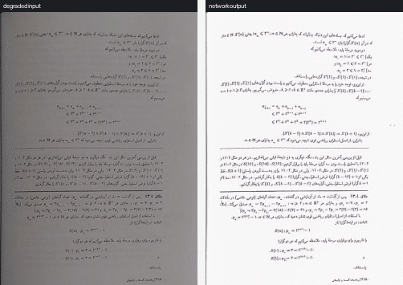
</div>

### Upside-down in, upright out

The same photograph fed in at all four orientations. The pipeline reads the
page after enhancement (raw crops this dim OCR to zero words - orientation has
to run late) and turns it upright - same scan out regardless of how the photo
went in:


The rule that decides a turn is deliberately conservative - three guards
(text-axis says sideways, the page reads enough words to judge, and the
current reading is *not* already confident) - because the first two versions
of this feature each broke a photograph that was already upright. The full
three-iteration story, including the two regressions. The invariant it must hold:
**0 of 24 upright reference scans get turned.**

### Real photographs, image by image

**These are the 25 self-taken phone photos, not synthetic ones.** Every row is
one real input run through the complete chain: the raw photograph, the detected
page (green = my annotation, red = the network's), the rectification, and the
enhanced result. Nothing is hand-picked or hand-corrected - including the rows
where the detector gets it wrong.


Six more, including a page shot in near-darkness lit only by a monitor:


### The enhancement network alone, on real photos

Rectified with my annotated corners, so the detector is out of the loop and what
is being judged is the enhancement network by itself - a dim, colour-cast phone
photo against what the network makes of it.


The same judgement as an animation - a wipe sweeping across four real
photographs, degraded on one side of the line, the network's output on the
other:

<div align="center">
  
</div>

### Export styles, on a real photograph

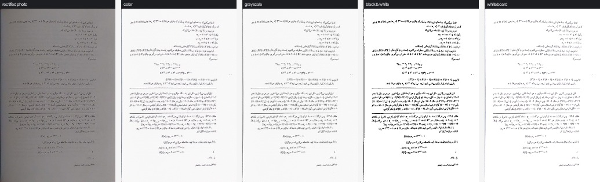

<div align="center">
  
</div>

### The whole real test set, successes and failures together

All 25 photographs with both quads and the error as a percentage of the image
diagonal. Shown complete rather than curated, because a 24-image benchmark with
the bad ones removed is not a benchmark.


### Every photograph, stage by stage

Each of the 25 real photographs as one strip - **input → detected corners →
rectified → enhanced → final** - with the number each stage is responsible for.
The full set with its metrics table is in
**[docs/assets/stages/](docs/assets/stages/README.md)**, ordered *worst corner
error first*: a gallery sorted best-first is a brochure, and the failures are
where the remaining work is.

Across the 24: mean corner error **20.6 px**, median **14.4 px**, and every
single one detected by the network - the classical and full-frame fallbacks
never fired.

The two worst. `img9` at **88.2 px**, quad IoU 0.642 - and OCR falls from 40.0
confidence to **zero words read**, so this one is not a near miss, it is a page
the chain never recovered:


`img4` at **65.7 px**: a page resting on a stack of other paper, where the
detector takes in part of the sheet underneath. OCR survives it (84.2 → 68.8,
13 words), which is the useful thing to notice - a corner error of this size is
not automatically fatal to readability, and quad IoU 0.745 says most of the page
still made it:


And the two best, for contrast - `img1` at 4.4 px and `img3` at 5.6 px, both
above 0.97 quad IoU:


### Accuracy, measured


The shape of this histogram is the story of the project. It used to be
**bimodal** - fourteen photographs within 60 px, then a gap, then ten failing
at 80 px or worse, every one of them an open book or a page resting on other
paper. That shape meant a categorical mistake, not imprecision: the detector
had never been asked *which* bright rectangle is the page. After the
page-boundary augmentation and the mask head, 22 of 24 land under 33 px and
the two survivors (88.2 and 65.7 px) are both the same old failure - a page
lying on another page. See [Limitations](#limitations) for the full account.

Per-image and cumulative views of the same measurement - every photograph a
dot, no averages hiding anything:


### Corner detection under rotation and perspective (synthetic, exact labels)

Green is ground truth, magenta is the prediction, and the number above each
panel is the mean corner error in pixels. Pages appear at every orientation
because the detector's training policy sweeps the full circle.


### The end-to-end chain on synthetic photographs

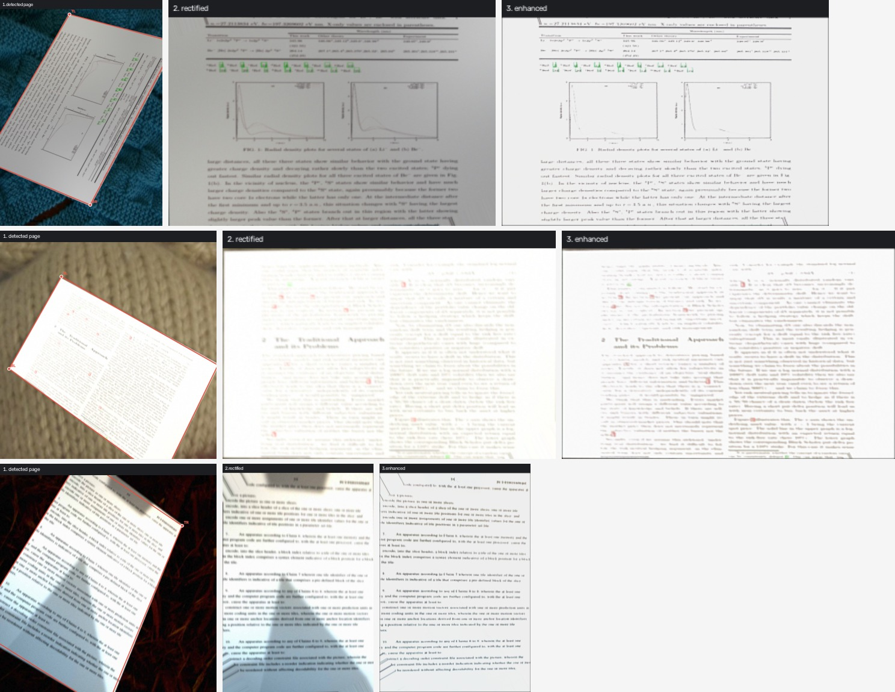

### The degradation engine that trains everything

Every training sample is synthesised: a clean scan is warped onto a random
surface and put through a chain of physically-motivated defects, **built with
OpenCV and NumPy only**. Each frame below is one stage of that chain.

<div align="center">
  
</div>

### Enhancement: before and after

<div align="center">
  
</div>

Degraded input · our output · the clean scan it should match · the remaining
error amplified 4×. PSNR/SSIM is printed above each panel.

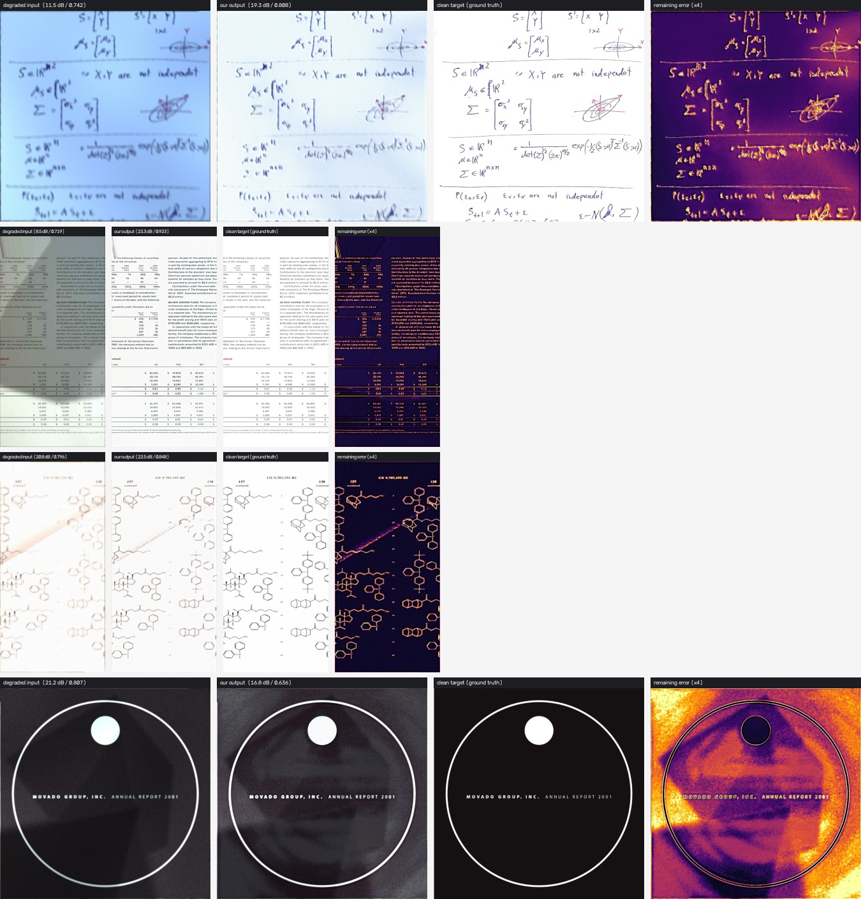

### The supplied course scans, all four stages

Photograph → detected page → rectified input → **enhanced** → the clean scan it
should match. These are the handwritten lecture notes the project is graded on,
on eight different surfaces under eight different lighting conditions.


### Eight more before/after pairs

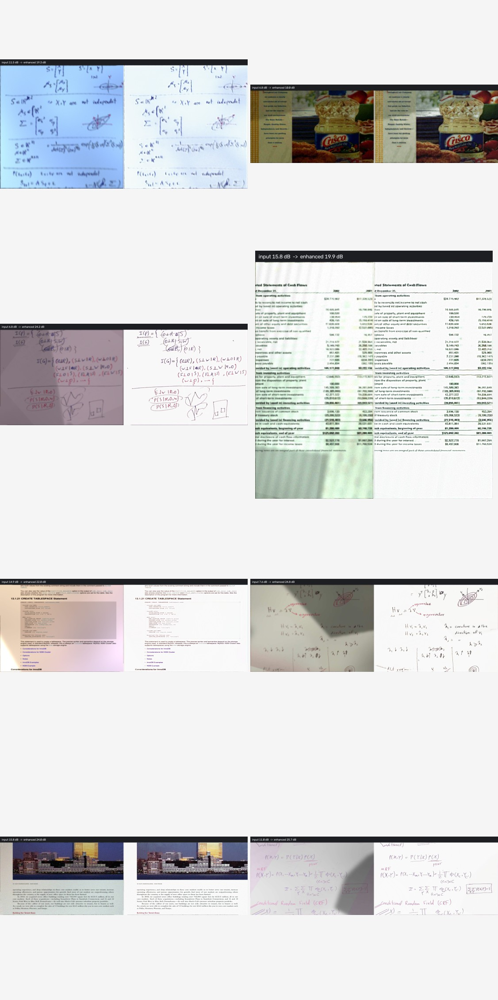

### One page, twelve degradations

The same scan put through the generator twelve times. This is the range the
enhancement network is trained to invert - and the reason a model that has never
seen a shadow will not remove one.


Twelve *different* samples say nothing about how bad "bad" is. This is one page
getting steadily worse, with the PSNR against its clean target printed on each
frame and the network's recovery beside it - severity stops being a matter of
taste:

<div align="center">
  
</div>

### Sixteen synthetic photographs, with their exact corner labels

Free and pixel-perfect, because we chose the four points ourselves.

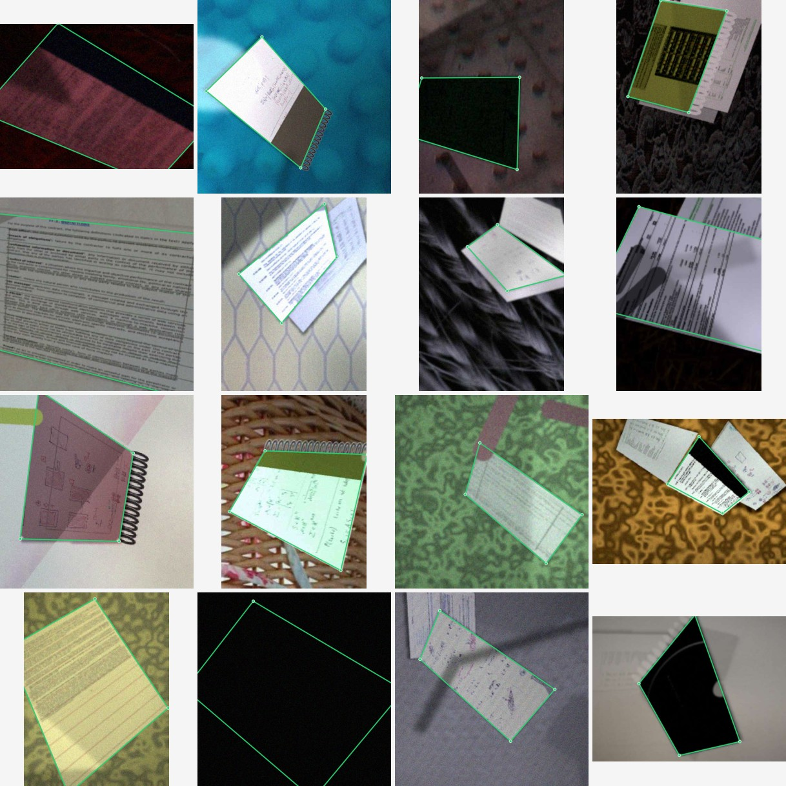

### The surfaces a page lands on

Held-out texture families, so an evaluation page never lies on a surface seen in
training.

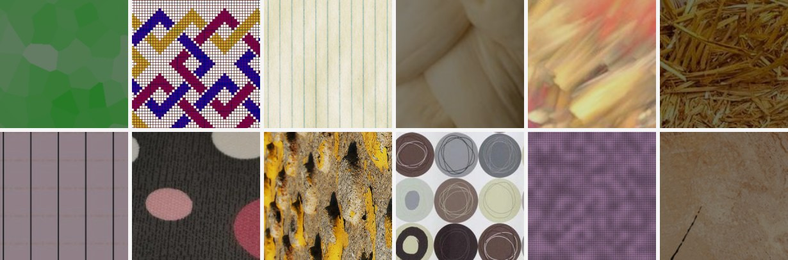

And the detector run on twelve of them in turn - same page, twelve surfaces no
training sample ever used, error printed as a percentage of the diagonal each
time. "Does it only work on a desk?" answered twelve times:

<div align="center">
  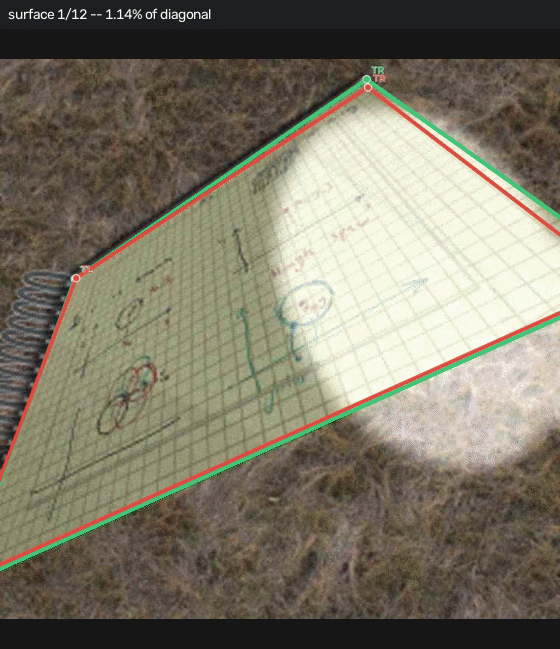
</div>

### Output styles

One network output, four classical post-processing styles - the same choice a
commercial scanner app gives you.

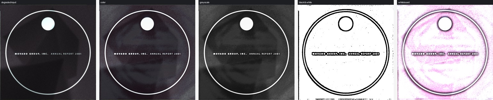

And cycling through them on a real scan, one mode per beat:

<div align="center">
  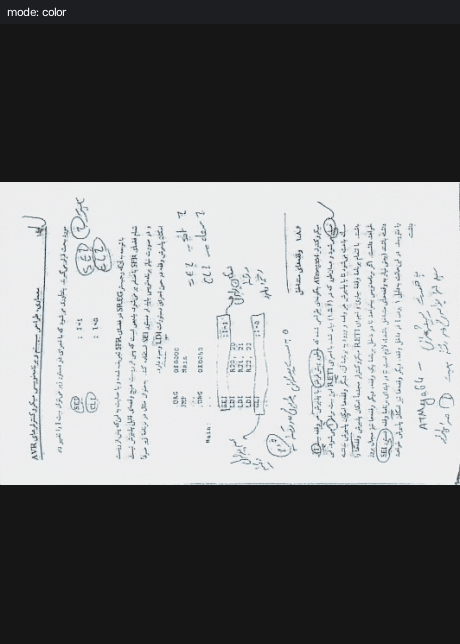
</div>

---

## Quick start

**One command trains everything.** Datasets, both networks, the Section 6
dropout arms, the Section 3.2 loss ablation, the bonus fine-tune, the exported
weights, and every table, chart, figure, demo and report regenerated from what
it just trained:

```bash
pip install -e ".[all]"
amazingscanner all                    # picks a preset from whether CUDA is present
```

It builds the datasets if they are missing, which is the point - getting that
order wrong used to produce a `FileNotFoundError: data/splits.json` three frames
into a training traceback, which is a poor way to learn about a prerequisite.

```bash
amazingscanner all --preset smoke     # ~10 min, proves every step runs
amazingscanner all --device cuda --amp --preset gpu
amazingscanner all --dry-run          # print the plan, run nothing
```

### Retraining one arm

A full run is hours, and most of the time only one thing needs redoing - you
changed the loss, an ablation crashed, or a bug fix means the flagship has to
come back. `--only` takes the step keys from `--list` and runs exactly those;
every other checkpoint in `runs/` is left alone. Order is preserved, so
`--only enhance,refresh` still trains before it measures.

```bash
amazingscanner all --list                                    # the 15 step keys
amazingscanner all --only enhance --skip-data --device cuda --amp
amazingscanner all --only refresh --skip-data                # re-export + re-measure
```

`refresh` is what writes `models/*.pt` and regenerates every table, chart and
figure, so run it after any retrain. Both notebooks have this as a cell.

<details>
<summary>Step by step instead</summary>

```bash
# 1. environment (CPU wheel shown; use the CUDA wheel to train)
make setup                                   # or: task setup
sudo apt-get install -y tesseract-ocr        # OCR metrics + orientation detection

# 2. datasets: downloads the corpora, builds every split, freezes the eval sets
amazingscanner fetch --check                 # what is already here?
amazingscanner data --all --no-midv          # ~4 min of downloads, then ~3 min building
# --no-midv skips a 795 MB evaluation-only set; drop it for the full thing.
# Everything arrives as one archive per corpus, fetched in parallel chunks.

# 3. train (the shipped weights: ~90 min enhancement, ~130 min each detector, on one H100)
amazingscanner train-enhance --minutes 110
amazingscanner train-corners --approach heatmap    --minutes 100
amazingscanner train-corners --approach regression --minutes 100

# 4. everything downstream: export, measure, chart, illustrate, report
amazingscanner refresh

# 5. the interactive app
amazingscanner app                           # http://localhost:7860

# label your own photos' page corners (Section 1.2)
amazingscanner label                         # http://localhost:7861
```

</details>

Prefer a container? `docker compose up`, then open <http://localhost:7860>.
Prefer a task runner? `task` lists everything; `task train` is the command
above. Full reference in **[docs/CLI.md](docs/CLI.md)**.

### Checking the repository itself

```bash
task verify                              # lint + manifests + tests, same as CI
python scripts/validate_manifests.py     # every deployment file, without applying
python scripts/check_regression.py       # has measured accuracy dropped?
```

The accuracy guard is the check a test suite cannot be: `pytest` asks whether
the code runs and the geometry is correct, and stays green through changes that
leave the scanner much worse at finding a page.

---

## The three pipelines

> **Rubric:** B3 · D4 · H1 - [full map](docs/SCORING.md)

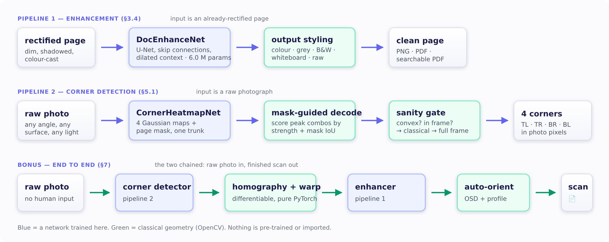

<sub>Diagram sources are committed too - `docs/assets/pipeline.svg` and
`docs/assets/banner.svg`, rasterised by `scripts/render_svg.py` - so the
artwork is editable, not a bitmap somebody once made.</sub>

Hand it an image, get an output. No notebook, no arguments to guess.

```bash
# 1. ENHANCEMENT - input is an ALREADY RECTIFIED document
python -m docscanner.pipeline.run enhance page.jpg -o outputs/

# 2. CORNER DETECTION - input is a RAW PHOTO
python -m docscanner.pipeline.run corners photo.jpg -o outputs/

# 3. END TO END (bonus) - raw photo in, clean scan out
python -m docscanner.pipeline.run scan photo.jpg -o outputs/ --mode whiteboard

# a whole folder into one PDF
python -m docscanner.pipeline.run scan photos/ -o outputs/ --pdf scans.pdf
```

Each writes the result, a step-by-step comparison figure, and a JSON record
(timings, confidence, corner coordinates). From Python:

```python
from docscanner.pipeline.scanner import DocumentScanner

scanner = DocumentScanner("models/corner_heatmap.pt", "models/enhance.pt")
result  = scanner.scan(photo)          # numpy RGB in
result.image                           # the finished page
result.corners                         # (4, 2) TL, TR, BR, BL
result.timings                         # {'detect': .., 'rectify': .., 'enhance': ..}
```

**Measured on a real 12 MP phone photo (4000×3000):** 9.2 s end to end, 1.16 GB
peak memory, on two CPU threads - inference is deliberately timed on CPU,
because the question it answers is what a user without a GPU waits for. The
models themselves were trained on an NVIDIA H100.

---

## How it works

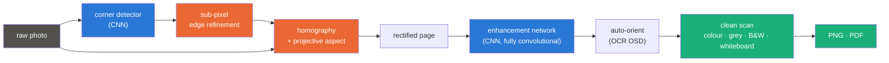
```mermaid
flowchart LR
    P[" raw photo"] --> D["corner detector<br/>(CNN)"]
    D --> R["sub-pixel<br/>edge refinement"]
    R --> H["homography<br/>+ projective aspect"]
    P --> H
    H --> C["rectified page"]
    C --> E["enhancement network<br/>(CNN, fully convolutional)"]
    E --> O["auto-orient<br/>(OCR OSD)"]
    O --> S[" clean scan<br/>colour · grey · B&amp;W · whiteboard"]
    S --> X["PNG · PDF"]

    style P fill:#52514e,color:#fff
    style D fill:#2a78d6,color:#fff
    style E fill:#2a78d6,color:#fff
    style R fill:#eb6834,color:#fff
    style H fill:#eb6834,color:#fff
    style S fill:#1baf7a,color:#fff
    style X fill:#1baf7a,color:#fff
```

Blue is learned, orange is classical geometry. The split is deliberate: a CNN is
good at *finding* a page under bad lighting and poor at sub-pixel straight-line
geometry; least-squares line fitting is the opposite. **The CNN proposes, the
geometry refines.**

### Architecture


---

## The synthetic data engine

> **Rubric:** A4 · A5 · A6 · A7 - [full map](docs/SCORING.md)

### Step 1 - sources

| Corpus | What it is | Role | Split |
|---|---|---|---|
| **Course scans** (50) | the pages supplied with the assignment - handwritten lecture notes in coloured pen, 2480×3521 (~300 dpi) | clean ground-truth targets; **the graded distribution** | 40 / 5 / 5 by source page |
| **DocLayNet** (804) | printed pages: financial reports, laws, manuals, patents, papers | auxiliary targets - layout and typeface diversity 50 pages cannot provide | 643 / 80 / 81 by source page |
| **DTD** (5 640 textures) | desks, fabric, wood, carpet, stone | the surface the page lies on | by *texture family* - whole categories held out |
| **MIDV-500** (139 frames) | **real** phone photos on real desks and in hands | corner ground truth derived from segmentation masks | evaluation only, never trained on |

The generator draws **~45 % of samples from the course scans** rather than the
6 % their raw count would give - they are the graded distribution *and* a
different one (handwriting in coloured pen, not printed text). Left unweighted,
the model would spend 94 % of its capacity on the auxiliary corpus.


### Step 2 - one warp, two labels

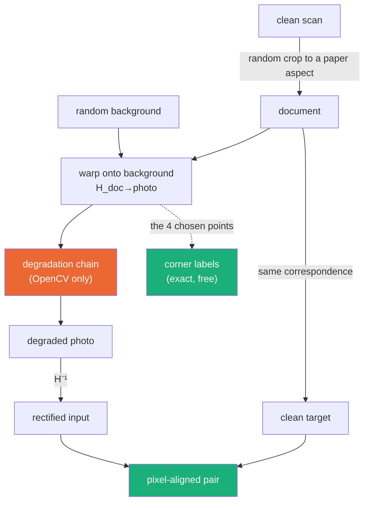
```mermaid
flowchart TD
    S["clean scan"] -->|"random crop to a paper aspect"| D["document"]
    B["random background"] --> W
    D --> W["warp onto background<br/>H_doc→photo"]
    W --> G["degradation chain<br/>(OpenCV only)"]
    G --> PH["degraded photo"]
    W -.->|"the 4 chosen points"| L["corner labels<br/>(exact, free)"]
    PH -->|"H⁻¹"| RI["rectified input"]
    D -->|"same correspondence"| TG["clean target"]
    RI --> PAIR["pixel-aligned pair"]
    TG --> PAIR

    style L fill:#1baf7a,color:#fff
    style PAIR fill:#1baf7a,color:#fff
    style G fill:#eb6834,color:#fff
```

Not one training image was annotated by hand. **The label generator and the data
generator are the same function.** Alignment is exact *by construction* - all
three homographies come from the same four correspondences, so
`H_rect · H_doc→photo ≡ H_target` holds identically, and
`tests/test_generator.py` asserts it numerically.

**Verification - degraded photo, rectified input, clean target, and a
checkerboard interleave proving the last two are aligned:**


The same §2.4 check running over fresh samples. Watch the third frame of each
cycle: in the checkerboard interleave, every edge must run straight through the
tile boundaries. A misalignment of even a few pixels shows up here as a visibly
broken line, which is why this view is the check and the side-by-side is not:

<div align="center">
  
</div>

**On the supplied course scans:**

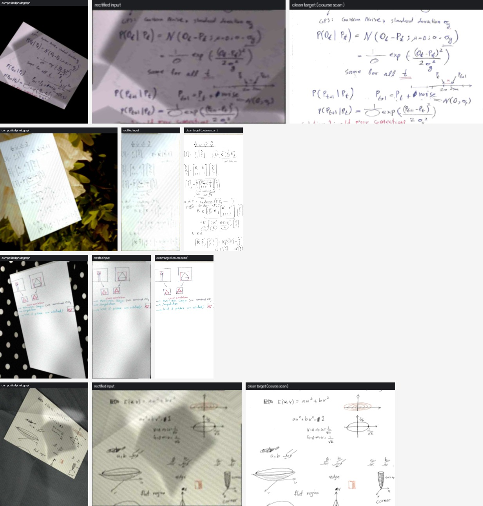

**Training crops, at the resolution the network actually sees:**


### A4 - Preprocessing: the contract every sample obeys

The one rule that makes corner detection work at all: **a corner label is
transformed by exactly the transform its image gets.** A label that is not
scaled with its image is simply a wrong label, and nothing downstream can
detect that.

| Step | What happens | Where | Guarded by |
|---|---|---|---|
| Parse annotations | Roboflow COCO → ordered `(4, 2)` array, TL→TR→BR→BL | `data/real.py::from_coco` | `tests/test_real.py` round-trip |
| Resize | image and its four corners scaled by the **same** factors | `data/datasets.py::resize_with_corners` | `tests/test_preprocess.py` |
| Normalise pixels | `/255`, then per-channel mean/std (`DOC_MEAN`, `DOC_STD`) | `data/datasets.py` | - |
| Normalise coordinates | corners divided by width/height → **`[0, 1]`**, making the task resolution-independent | `data/datasets.py` | `tests/test_preprocess.py` |
| Channel order | HWC → **CHW** float tensors | `to_chw` | - |
| Batch | on-the-fly `Dataset` - every `__getitem__` composites a *fresh* triple, so the training set is effectively infinite | `data/datasets.py` | `tests/test_datasets.py` |

Two deliberate choices worth defending out loud:

* **Training crops are 192×192, not whole resized pages.** Resizing a 2480×3521
  scan down to 192 or 256 turns body text into grey mush, and a model trained on
  mush outputs mush. The network is **fully convolutional**, so inference still
  runs on the whole page at native scale - this is a strictly better way to
  satisfy "standardise to the model's input size".
* **Each task gets its own augmentation policy** (`for_enhancement`,
  `for_corners`) rather than one shared config, because the two networks solve
  different problems on different inputs.

Training crops at the exact resolution the network sees:


### Step 3 - corner labels, free and exact

Every composited photo carries pixel-perfect corners. The set covers the full
circle of camera orientations, strong perspective, shadows, glare, and
backgrounds from desks to carpet.


### Step 4 - real photographs for evaluation

Real phone captures whose ground-truth quads are recovered from MIDV-500's
segmentation masks - validated 139/139 clean by `make check-labels`.

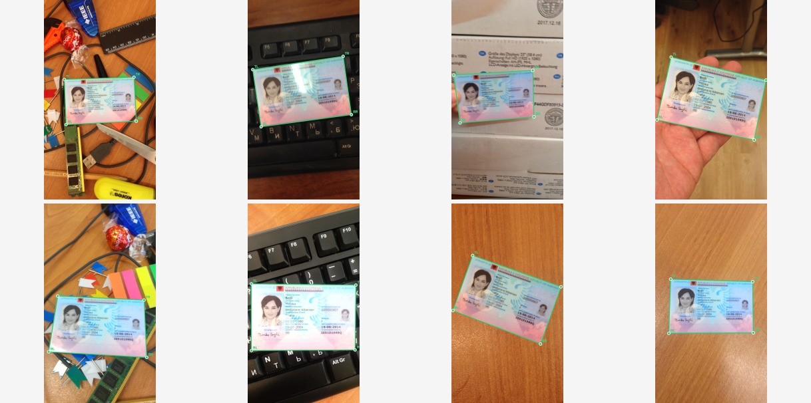

### The degradation chain

| Stage | What it models |
|---|---|
| perspective warp onto a surface | the page is a plane seen from an arbitrary viewpoint |
| page drop shadow, paper grain | the sheet is a physical object lying on something |
| downscale → upscale (1.15–3.0×) | distance to the page, limited sensor resolution |
| brightness / contrast / gamma / colour cast | auto-exposure, white balance, light temperature |
| illumination gradient + soft shadows | uneven room light, the photographer's own hand |
| specular glare, vignetting | glossy paper, lens falloff |
| **camera auto-exposure metering** | the phone pulls the scene back toward mid-grey |
| motion blur, defocus, chromatic aberration | shake, missed focus, lens dispersion |
| sensor noise (with grain correlation) | photon + read noise at high ISO |
| JPEG re-encode (quality 25–90) | lossy storage on the phone |

Two notes. **Auto-exposure** is not in the brief, but without it the stacked
brightness terms produce photographs no real camera would return - adding it
moved the no-model baseline from 9.3 dB to a realistic ~12 dB. **Page curl** is
deliberately *excluded* from training and used only in the harder held-out set:
a curled page is not planar, so no homography can flatten it, and it measures
exactly the failure mode the method cannot fix.

**Two tasks, two datasets, two augmentation policies.** Corner detection is
geometric on the raw photo (full circle of orientations, pages from filling the
frame down to a third of it). Enhancement never sees the raw photo - quarter
turns cancel in the rectified frame - so its geometry narrows and every
*photometric* range widens, because that is the defect set it must invert.

The distribution question, measured: every document in the corpus is a scanned
text page, so "the page" and "the large bright region" used to be the same
statement in every generated sample. Eleven page-boundary augmentations moved
the training distribution onto the real one - 96% of the photographs now fall
inside the training luminance band, against 79% before:


And §4.4's own test - generated samples interleaved with real photographs,
captions withheld. If a stranger can instantly tell which is which, the
degradations are not realistic enough. The answer key is beside the figure in
`docs/assets/realism_check.key.txt`, so it can be judged honestly before it is
scored:


---

## Models

> **Rubric:** B1 · D1 · D2 - [full map](docs/SCORING.md)

Built from primitive `torch.nn` layers. **No pre-built U-Net, no torchvision
backbone, no pre-trained weights.**

### DocEnhanceNet - 6.0 M parameters

| Choice | Why |
|---|---|
| encoder–decoder **with skip connections** | text strokes are 1–2 px wide and do not survive a 16× bottleneck |
| **dilated context** (1/2/4/8) at 1/16 resolution | removing an illumination gradient is a *global* decision |
| **squeeze-excitation** in the decoder | an image-level global signal for a few hundred parameters |
| **classical background prior** as extra input | `image / local-maximum` is the textbook illumination estimate - free supervision of exactly the quantity it needs |
| **residual output**, zero-initialised head | the identity is already a decent answer; the first forward pass returns the input unchanged |
| 192² crops, **fully convolutional** inference | crops keep glyphs at native scale; resizing a page to 192 turns text into mush, and a model trained on mush outputs mush |

### Corner detection - two approaches, one experiment

| | **A - direct regression** | **B - heatmaps** |
|---|---|---|
| head | flatten → FC 256 → 128 → 8 | 4 Gaussian maps at ¼ resolution |
| readout | the 8 numbers | windowed sub-pixel soft-argmax |
| supervision | 8 scalars per image | every output pixel |
| out-of-frame corners | representable | representable - the grid spans `[-0.12, 1.12]`, deliberately larger than the image |

*Prediction written down before running the experiment:* heatmaps should win,
because the loss is dense and the mapping stays local, while regression asks
fully connected layers to turn global features into precise coordinates.
[The measured answer is in the report.](docs/REPORT.md)

#### From network output to a quad you can trust

The network is the first of four steps, not the whole detector. What it
actually emits - four corner heatmaps and a page-interior mask, here overlaid
on real photographs as the decoder sees them:

<div align="center">
  
</div>

Each step below is measured, not assumed - on the 128-image frozen validation
set (synthetic) and on the 24 real photographs, because **the two disagree**,
and that disagreement is the reason the shipped defaults are what they are.

| Step | mean | median | ≥50 px | quad IoU |
|---|---|---|---|---|
| network + mask-guided decode | **15.79 px** | 7.83 px | **5.5%** | 0.898 |
| + sub-pixel edge refinement | 15.79 px | 7.24 px | 6.2% | **0.907** |
| + multi-view TTA | 18.83 px | **6.27 px** | 9.4% | 0.895 |
| + sanity gate → classical → full frame | never returns an implausible quad | | | |

On the 24 real photographs, as a percentage of the image diagonal - the photos
are not all one resolution, so pixels would not be comparable:

| Step | mean | median | ≥3% of diagonal | quad IoU |
|---|---|---|---|---|
| network + mask-guided decode | 2.12% | 1.77% | **3 / 24** | 0.895 |
| **+ multi-view TTA** *(shipped default)* | **2.01%** | **1.47%** | 4 / 24 | **0.900** |
| + sub-pixel edge refinement | 2.39% | 2.11% | **3 / 24** | 0.887 |

1. **Mask-guided decoding.** The trunk also predicts a page-interior mask, and
   the decoder enumerates candidate quads from the top-K peaks of each corner
   heatmap and scores them by peak strength **and** IoU against that mask. Four
   point labels cannot teach a network what a page *region* is; the mask can,
   and it is what stops a book spread being bracketed as one page. The mask is
   trusted only if its own validation IoU clears 0.80 (`DEFAULT_MIN_MASK_IOU`),
   and a checkpoint that cannot prove it fails **closed**, with a warning.
2. **Multi-view TTA.** Four quarter turns, predictions mapped back and reduced
   with a **per-corner median**, so one bad view is outvoted rather than
   averaged in - the mechanism, one view at a time, then the vote:

   <div align="center">
     
   </div>
 It is on by default on the strength of the real-photo column:
   the mean, the median and the IoU all improve. Note it goes the *other* way
   on synthetic data, where it trades a better median for a worse mean and
   twice the catastrophic rate - a real trade-off rather than a free win, and
   the reason it is one flag (`tta=False`) rather than baked in.
3. **Sub-pixel edge refinement - off by default.** Fitting a line to the
   gradient ridge near each predicted edge and re-intersecting is a good idea
   that does not survive contact with real paper: on the 24 photographs it makes
   the mean, the median and the IoU all *worse*. It earns its keep only on clean
   synthetic edges, and it is a strict loss on photographs of textured desks and
   creased pages. Available as `refine=True`; not the default, and the numbers
   above are why.
4. **Sanity gate and graceful degradation.** A quad that is non-convex, covers
   under 2% of the frame, or puts a corner more than a quarter-frame outside the
   image is *never* returned - rectifying one produces a garbage crop. The gate
   falls back to a purely classical page finder (Canny + Otsu cues → largest
   plausible quad), and if that also declines, to the full frame.
   `CornerResult.source` always says which path produced the answer, and the app
   shows it. On all 24 real photographs the network path answered; the fallbacks
   never fired.

Using the classical detector as an *arbiter* rather than a safety net was tried
and **rejected on the evidence**: on this validation set it averages 89 px
against the network's 25 px, and every consensus rule tested made the result
worse. It earns its place only where the network has already failed its own
sanity check.

---

## Results

> **Rubric:** C1 · C2 · C4 · B2 · D3 · E · H2 · H3 - [full map](docs/SCORING.md)

<!-- RESULTS:START -->
### Enhancement - PSNR / SSIM by split

| Split | n | PSNR | SSIM | PSNR (input) | SSIM (input) | dPSNR | dSSIM | seconds/page |
|---|---|---|---|---|---|---|---|---|
| test - degraded input (no model) | 64 | 11.7013 | 0.6968 |  |  |  |  | 0.3159 |
| train | 24 | 22.1047 | 0.8589 | 13.9314 | 0.7325 | 8.1733 | 0.1264 | 1.1067 |
| validation | 48 | 21.8115 | 0.8328 | 11.0148 | 0.6772 | 10.7967 | 0.1556 | 1.0881 |
| test | 64 | 21.4159 | 0.8220 | 11.7013 | 0.6968 | 9.7146 | 0.1252 | 0.9632 |
| test (course scans only) | 40 | 23.7841 | 0.8841 | 11.4037 | 0.7435 | 12.3804 | 0.1406 | 1.0339 |
| pseudo-real (harder, OOD) | 96 | 18.2833 | 0.6889 | 9.2209 | 0.5601 | 9.0624 | 0.1287 | 1.0316 |

### Corner detection - Approach A vs Approach B

The two approaches on the same photographs, side by side - regression's quad in orange, heatmap's in cyan, truth in green. Watching a few frames is the fastest way to understand the table below it: regression is *roughly* right and never precise; the heatmap model snaps to corners:

<div align="center">
  
</div>

| Model | Set | edge refine | n | MCE (px) | median (px) | MCE (% diag) | quad IoU | success@8px | success@16px | success@32px | worst (px) |
|---|---|---|---|---|---|---|---|---|---|---|---|
| A: regression | synthetic test | no | 256 | 68.7424 | 61.8082 | 9.4938 | 0.6416 | 0.0000 | 0.3906 | 4.6875 | 257.3460 |
| A: regression | synthetic test | yes | 256 | 66.8611 | 60.1605 | 9.2340 | 0.6638 | 3.1250 | 4.2969 | 8.9844 | 256.8464 |
| A: regression | synthetic test | no | 256 | 66.2216 | 58.0312 | 9.1456 | 0.6572 | 0.0000 | 1.9531 | 12.1094 | 250.3564 |
| A: regression | synthetic test | yes | 256 | 64.2808 | 55.8967 | 8.8776 | 0.6785 | 5.8594 | 10.1562 | 14.8438 | 249.6806 |
| A: regression | synthetic test (course only) | no | 96 | 71.1054 | 64.5330 | 9.8201 | 0.6357 | 0.0000 | 0.0000 | 9.3750 | 226.6827 |
| A: regression | synthetic test (course only) | yes | 96 | 68.7727 | 60.2225 | 9.4980 | 0.6599 | 3.1250 | 5.2083 | 7.2917 | 225.6928 |
| A: regression | synthetic test (course only) | no | 96 | 70.9096 | 60.6777 | 9.7931 | 0.6329 | 0.0000 | 2.0833 | 12.5000 | 245.2180 |
| A: regression | synthetic test (course only) | yes | 96 | 69.8324 | 65.9476 | 9.6443 | 0.6515 | 5.2083 | 8.3333 | 13.5417 | 240.2729 |
| A: regression | pseudo-real (OOD) | no | 96 | 37.8209 | 30.9651 | 5.2233 | 0.7977 | 0.0000 | 0.0000 | 20.8333 | 121.1718 |
| A: regression | pseudo-real (OOD) | yes | 96 | 32.2962 | 27.1328 | 4.4603 | 0.8448 | 13.5417 | 16.6667 | 30.2083 | 121.5764 |
| A: regression | pseudo-real (OOD) | no | 96 | 39.7628 | 22.8678 | 5.4915 | 0.8138 | 0.0000 | 8.3333 | 42.7083 | 183.4382 |
| A: regression | pseudo-real (OOD) | yes | 96 | 33.3389 | 18.6513 | 4.6043 | 0.8644 | 32.2917 | 37.5000 | 45.8333 | 183.7675 |
| A: regression | real photos (MIDV-500) | no | 139 | 120.9312 | 65.6924 | 8.2344 | 0.6594 | 0.0000 | 0.0000 | 0.0000 | 490.9897 |
| A: regression | real photos (MIDV-500) | yes | 139 | 115.2762 | 63.1874 | 7.8494 | 0.6941 | 3.5971 | 5.7554 | 8.6331 | 490.6140 |
| A: regression | real photos (MIDV-500) | no | 139 | 91.3668 | 41.4637 | 6.2213 | 0.7338 | 0.0000 | 0.0000 | 8.6331 | 406.5384 |
| A: regression | real photos (MIDV-500) | yes | 139 | 78.1301 | 25.3713 | 5.3200 | 0.7983 | 30.2158 | 30.2158 | 33.0935 | 397.8063 |
| A: regression | real photos (own) | no | 25 | 72.1431 | 56.4050 | 5.4692 | 0.7496 | 0.0000 | 0.0000 | 4.0000 | 246.1749 |
| A: regression | real photos (own) | yes | 25 | 68.8159 | 56.6051 | 5.2144 | 0.7643 | 0.0000 | 0.0000 | 8.0000 | 233.4240 |
| A: regression | real photos (own) | no | 25 | 72.2815 | 57.5023 | 5.3844 | 0.7469 | 0.0000 | 0.0000 | 8.0000 | 279.7856 |
| A: regression | real photos (own) | yes | 25 | 69.4186 | 51.3835 | 5.1323 | 0.7630 | 0.0000 | 4.0000 | 12.0000 | 279.6965 |
| B: heatmap | synthetic test | no | 256 | 19.9874 | 8.0900 | 2.7604 | 0.8836 | 22.2656 | 52.7344 | 70.7031 | 239.5560 |
| B: heatmap | synthetic test | yes | 256 | 19.9430 | 8.3760 | 2.7543 | 0.8917 | 31.2500 | 50.7812 | 64.8438 | 239.5560 |
| B: heatmap | synthetic test | no | 256 | 18.0860 | 7.1050 | 2.4978 | 0.8976 | 30.0781 | 54.2969 | 71.8750 | 228.6031 |
| B: heatmap | synthetic test | yes | 256 | 18.5743 | 7.2598 | 2.5652 | 0.9018 | 33.2031 | 55.4688 | 66.7969 | 221.7977 |
| B: heatmap | synthetic test (course only) | no | 96 | 18.6181 | 8.0752 | 2.5713 | 0.8907 | 29.1667 | 57.2917 | 69.7917 | 111.2513 |
| B: heatmap | synthetic test (course only) | yes | 96 | 18.4365 | 7.6470 | 2.5462 | 0.8979 | 34.3750 | 59.3750 | 69.7917 | 117.7214 |
| B: heatmap | synthetic test (course only) | no | 96 | 17.2106 | 6.7180 | 2.3769 | 0.9009 | 37.5000 | 58.3333 | 71.8750 | 212.5935 |
| B: heatmap | synthetic test (course only) | yes | 96 | 17.3167 | 5.9698 | 2.3916 | 0.9055 | 36.4583 | 59.3750 | 71.8750 | 215.1446 |
| B: heatmap | pseudo-real (OOD) | no | 96 | 13.7953 | 6.3774 | 1.9052 | 0.9211 | 37.5000 | 57.2917 | 75.0000 | 96.5560 |
| B: heatmap | pseudo-real (OOD) | yes | 96 | 11.3197 | 1.2185 | 1.5633 | 0.9463 | 57.2917 | 61.4583 | 75.0000 | 103.7902 |
| B: heatmap | pseudo-real (OOD) | no | 96 | 10.5581 | 4.2230 | 1.4581 | 0.9387 | 48.9583 | 62.5000 | 77.0833 | 66.9561 |
| B: heatmap | pseudo-real (OOD) | yes | 96 | 8.9133 | 1.1936 | 1.2310 | 0.9570 | 60.4167 | 68.7500 | 78.1250 | 66.9561 |
| B: heatmap | real photos (MIDV-500) | no | 139 | 67.3266 | 14.8737 | 4.5844 | 0.7906 | 0.7194 | 19.4245 | 54.6763 | 441.9712 |
| B: heatmap | real photos (MIDV-500) | yes | 139 | 61.7278 | 4.7057 | 4.2032 | 0.8268 | 49.6403 | 55.3957 | 60.4317 | 449.4474 |
| B: heatmap | real photos (MIDV-500) | no | 139 | 65.7924 | 21.0457 | 4.4799 | 0.8058 | 10.0719 | 40.2878 | 46.7626 | 410.7723 |
| B: heatmap | real photos (MIDV-500) | yes | 139 | 65.4623 | 11.6970 | 4.4574 | 0.8260 | 42.4460 | 44.6043 | 50.3597 | 406.1432 |
| B: heatmap | real photos (own) | no | 25 | 32.9298 | 23.0995 | 2.4797 | 0.8697 | 0.0000 | 0.0000 | 28.0000 | 110.1403 |
| B: heatmap | real photos (own) | yes | 25 | 35.6444 | 28.3189 | 2.7193 | 0.8604 | 4.0000 | 4.0000 | 20.0000 | 105.9348 |
| B: heatmap | real photos (own) | no | 25 | 34.0605 | 20.9090 | 2.4855 | 0.8680 | 0.0000 | 8.0000 | 40.0000 | 143.2317 |
| B: heatmap | real photos (own) | yes | 25 | 37.8628 | 27.9205 | 2.8092 | 0.8530 | 4.0000 | 4.0000 | 28.0000 | 148.9110 |
| A: regression (control) | synthetic test | yes | 256 | 95.5959 | 88.5299 | 13.2024 | 0.5785 | 0.0000 | 0.0000 | 0.3906 | 247.5996 |
| A: regression (control) | synthetic test (course only) | yes | 96 | 93.6617 | 81.3199 | 12.9353 | 0.5743 | 0.0000 | 0.0000 | 1.0417 | 234.6319 |
| A: regression (control) | pseudo-real (OOD) | yes | 96 | 69.1567 | 56.3071 | 9.5510 | 0.7162 | 2.0833 | 2.0833 | 2.0833 | 202.6281 |
| A: regression (control) | real photos (MIDV-500) | yes | 139 | 132.6105 | 107.3962 | 9.0297 | 0.5911 | 0.0000 | 0.0000 | 0.0000 | 389.4629 |
| A: regression (control) | real photos (own) | yes | 25 | 116.8807 | 112.4971 | 8.9046 | 0.6391 | 0.0000 | 0.0000 | 0.0000 | 233.0450 |
| A: regression + dropout | synthetic test | yes | 256 | 87.4685 | 81.5544 | 12.0800 | 0.5967 | 0.0000 | 0.0000 | 0.3906 | 209.3231 |
| A: regression + dropout | synthetic test (course only) | yes | 96 | 92.2250 | 86.9057 | 12.7369 | 0.5827 | 0.0000 | 0.0000 | 0.0000 | 206.0001 |
| A: regression + dropout | pseudo-real (OOD) | yes | 96 | 65.2767 | 54.7080 | 9.0152 | 0.7331 | 0.0000 | 0.0000 | 3.1250 | 213.7154 |
| A: regression + dropout | real photos (MIDV-500) | yes | 139 | 141.7866 | 128.3615 | 9.6545 | 0.5725 | 0.0000 | 0.0000 | 0.0000 | 344.3411 |
| A: regression + dropout | real photos (own) | yes | 25 | 85.9874 | 79.4382 | 6.5312 | 0.7261 | 0.0000 | 0.0000 | 4.0000 | 284.6630 |
| B: heatmap (control) | synthetic test | yes | 256 | 78.0050 | 55.6280 | 10.7730 | 0.6487 | 12.5000 | 19.9219 | 25.0000 | 292.8734 |
| B: heatmap (control) | synthetic test (course only) | yes | 96 | 85.4065 | 66.0168 | 11.7952 | 0.6154 | 10.4167 | 20.8333 | 22.9167 | 251.2493 |
| B: heatmap (control) | pseudo-real (OOD) | yes | 96 | 32.2128 | 3.7221 | 4.4488 | 0.8595 | 50.0000 | 52.0833 | 58.3333 | 229.7276 |
| B: heatmap (control) | real photos (MIDV-500) | yes | 139 | 76.3053 | 1.6410 | 5.1958 | 0.8121 | 55.3957 | 56.8345 | 58.9928 | 516.9412 |
| B: heatmap (control) | real photos (own) | yes | 25 | 49.3412 | 31.8867 | 3.7633 | 0.8242 | 4.0000 | 4.0000 | 24.0000 | 267.8463 |
| B: heatmap + dropout | synthetic test | yes | 256 | 79.9998 | 65.8295 | 11.0485 | 0.6399 | 12.1094 | 16.0156 | 20.3125 | 287.7107 |
| B: heatmap + dropout | synthetic test (course only) | yes | 96 | 87.4231 | 78.7894 | 12.0737 | 0.6124 | 6.2500 | 18.7500 | 20.8333 | 271.7377 |
| B: heatmap + dropout | pseudo-real (OOD) | yes | 96 | 35.6224 | 5.3867 | 4.9197 | 0.8449 | 47.9167 | 50.0000 | 55.2083 | 238.1554 |
| B: heatmap + dropout | real photos (MIDV-500) | yes | 139 | 87.5811 | 34.9206 | 5.9636 | 0.7675 | 41.7266 | 46.0432 | 48.2014 | 489.2776 |
| B: heatmap + dropout | real photos (own) | yes | 25 | 56.3775 | 35.6136 | 4.2976 | 0.8039 | 4.0000 | 4.0000 | 16.0000 | 271.4518 |

Full analysis: **[docs/REPORT.md](docs/REPORT.md)**
<!-- RESULTS:END -->

### B2 - Which loss? Measured, not asserted

MSE is known to blur, and blur is exactly what destroys text. Rather than
assert that, all three candidates were trained at a **matched reduced budget**
so the comparison is the loss and nothing else:

| Loss | PSNR | SSIM | vs the combined loss |
|---|---|---|---|
| degraded input (no model) | 12.33 | 0.711 | the line every arm must clear |
| **combined** (L1 + MS-SSIM + Sobel gradient) | **19.14** | **0.786** | - |
| MSE | 16.54 | 0.708 | **−2.60 dB**, and SSIM back at the *input's* level |
| L1 | 15.85 | 0.701 | −3.29 dB |

MSE does not merely score lower - its SSIM (0.708) lands essentially on the
degraded input's own 0.711, which is the measurement saying what the textbooks
say: a pixel-mean loss buys PSNR by smoothing, and smoothing is the one thing a
text restorer must not do. The flagship at full budget reaches **21.16 / 0.809**
on this same 24-page probe.


### C2 - OCR readability, the metric that tracks the actual goal

PSNR is a proxy. "Can a machine read the page afterwards?" is the goal. Run on
the synthetic test pages, all three versions of the same document:

| Image | OCR confidence | words read | CER vs clean scan | WER |
|---|---|---|---|---|
| degraded input | 43.78 | 13.15 | 0.83 | 0.94 |
| **our enhanced output** | **55.39** | **38.25** | **0.76** | 0.92 |
| clean target (the ceiling) | 71.41 | 110.00 | 0.00 | 0.00 |

Enhancement **triples the words recognised** (13.2 → 38.3) and adds **+11.6
confidence points**. The clean-target row is there to keep it honest: the
ceiling is 110 words, so this recovers roughly a third of what a true scan
would give - the degradations genuinely destroy information, and a restorer
reconstructs a plausible page rather than inverting a bijection.


Watch it happen - every word tesseract found, boxed, before and after:

<div align="center">
  
</div>

### E - Dropout, on both models, each against its own control

Section 6 asks for dropout added to both networks and the difference reported.
The trap is comparing a dropout arm against the *flagship*, which was trained
on a much larger budget - that measures budget, not dropout. **Every arm here
carries its own control at the identical reduced budget**, so each row-pair
differs by dropout alone.

| Model | control | + dropout | change | verdict |
|---|---|---|---|---|
| Enhancement (p=0.15) | 19.14 dB / 0.786 | **19.46 dB / 0.791** | +0.32 dB | within noise |
| Corners - heatmap (p=0.15) | 43.83 px / 0.819 | **43.05 px / 0.821** | −0.8 px | within noise |
| Corners - regression (p=0.3, FC head) | 84.49 px / 0.702 | **63.55 px / 0.755** | **−20.9 px** | the one real effect |

Corner numbers are on the 24 real photographs; enhancement is PSNR/SSIM on the
24-page probe.

**The reported impact, plainly:** dropout does *not* close the synthetic-to-real
gap for the two encoder–decoder models - both move by less than measurement
noise. It helps exactly where the theory says it should: the **fully connected
regression head**, the only place in the project with a dense layer big enough
to memorise, improves by 21 px. That is a null result for two of three arms,
and it is reported as one rather than dropped.


The same result as an animation - each arm alternating against its matched
control, so "no visible difference" is something you can see rather than take
on trust:

<div align="center">
  
</div>

### H3 - The bonus's ambitious option, and its honest answer

The chain is differentiable throughout - `get_perspective_transform` and
`warp_perspective` implemented in **pure PyTorch, with kornia not a
dependency**, verified against OpenCV in `tests/test_warp.py`. So the corner
detector *can* be trained for what the pipeline actually needs. The brief asks
whether that helps and whether the annotated-vs-predicted gap shrinks. Both
detectors, run unchanged over the same 25 frozen photographs:

| Detector | mean | median | quad IoU | worst | OCR gap vs annotated corners |
|---|---|---|---|---|---|
| **baseline** (trained on coordinates) | **20.55 px** | **14.38 px** | **0.901** | **88.2 px** | **−2.31** |
| fine-tuned through the warp | 34.38 px | 24.63 px | 0.844 | 135.5 px | −9.21 |

**The answer to both questions is no.** Corner error nearly doubles and the gap
the option was meant to close gets four times wider. Three explanations, all
indicting the budget rather than the idea: a reconstruction gradient is a far
noisier teacher than dense heatmap supervision, and six epochs of sixty steps
is little in which to move a detector that dense supervision had already placed
well; the reconstruction term rewards *a crop the enhancer can restore*, which
is not the same objective as *the page border*; and the fine-tune trains on
synthetic pairs while this table is real photographs.

So the fine-tuned weights are **not shipped**. The mechanism stays in the
repository, working and tested, because a negative result is only worth
anything if the thing it tested was real. Full write-up, REPORT §4. Reproduce with
`python scripts/measure_finetune.py`.

### Are these numbers good? Reading them honestly

**Is 21.4 dB test PSNR low?** Read it against the two lines that give it
meaning. The do-nothing baseline is 11.7 dB, so the network adds **+9.7 dB** -
roughly a 9× reduction in mean squared error - and on the course scans the
project is actually about, it reaches **23.8 dB / 0.884 SSIM**. And the ceiling sits far below a lossless
reconstruction: the degradations *destroy* information (a page downscaled 3×
and JPEG-compressed at quality 30 does not contain its original strokes), so a
restorer is reconstructing a plausible page, not inverting a bijection.
Document-restoration systems in the literature report the same 18–25 dB band on
comparable tasks. And PSNR is the wrong axis to over-read anyway - the last
retrain *won* on PSNR and lost by eye and by grey-band measurement, which is why the pinned network ships. The
number that tracks the actual goal: OCR reads **13.2 → 38.3 words** per page
after enhancement, at +12 points of confidence.

**Is 20.6 px mean corner error high?** The mean is carried by two photographs.
`img9` (88.2 px) and `img4` (65.7 px) are both a page lying on other pages -
subtract the two known failures and the remaining 22 average **≈15.5 px**, with
the median at **14.4 px ≈ 1.4% of the image diagonal**. Three calibrations for
what a pixel costs here: (1) the network sees a 256² input, so one heatmap cell
is ~4 photo pixels - a 14 px error is ~3.5 cells, near the resolution floor of
the representation; (2) rectifying with predicted instead of annotated corners
costs only **3 points of OCR confidence and zero words** (words actually rose,
32.3 → 35.3 - REPORT §4), so the typical miss trims margin, not text;
(3) mean quad IoU is **0.90**, i.e. the detected page and the true page overlap
by nine tenths even counting the failures. High would be an error that costs
readability; the measured cost of the typical error is a slightly tighter crop.

### Every question, charted

The full set with a paragraph per chart is **[docs/CHARTS.md](docs/CHARTS.md)**;
these are the same images, placed where a reader will actually meet them.

#### Enhancement (§3)

PSNR and SSIM on every split, always next to the degraded-input baseline that
gives them meaning:


Overfitting read from the *gain over the input*, not the raw score - the raw
train/test difference mostly measures how hard each split's inputs are:


The §3.2 loss question - plain MSE against L1 against the shipped
Charbonnier + MS-SSIM + Sobel-gradient combination, at matched budgets:


Why the shipped network is **not** the highest-PSNR one. The last retrain
scores +0.4 dB on the frozen benchmark and loses by eye - on a dark notebook
cover it leaves an 88%-grey slab where the pinned network produces clean paper
(top row; on the blue cover below, the two agree). PSNR could not see this;
the grey-band measurement and the pin in `models/enhance.pt.pin` could:

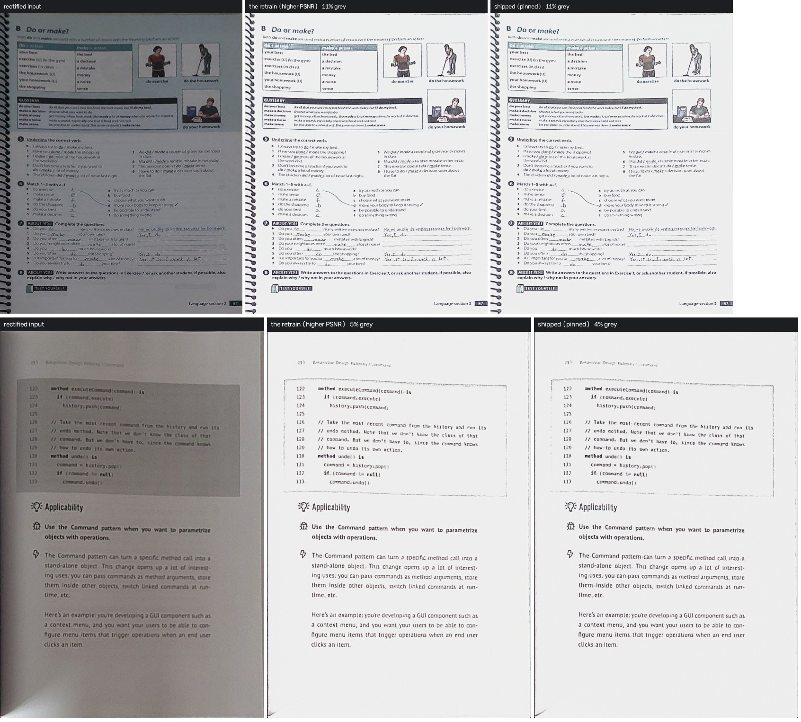

Whitening has a failure mode of its own - pushing 10–14.5% of a real page past
the top of the range - which is what the highlight-compression step recovers:


#### Corner detection (§5)

Approach A against Approach B on every set, and the strict all-four-corners
success metric the brief asks for:


The inference ladder - what each step past the raw network is worth, by mean
and by median, because they answer different questions:


The two charts behind the mask-guided decoder: how far a mask can degrade
before it stops helping (the pipeline gates on exactly this), and the
defecting-corner failure the page-mask head was built to fix:


#### Dropout (§6)

The question §6 actually asks is whether the synthetic→real *gap* shrinks - so
the gap is what is plotted, each arm against its own matched-budget control:


"No measured difference" is a claim worth *seeing*. The dropout arm and its
matched control, alternating on the same photographs - this is what a null
result looks like when it is honest:

<div align="center">
  
</div>

#### OCR readability (§3.3)

Confidence, words recovered, and character error rate against the clean-scan
transcript - degraded input vs enhanced output vs the clean target:


The same kind of claim as a picture rather than a bar - this time on real
photographs, so the counts are its own, not the synthetic table's: every word
tesseract actually found, boxed on the page, rectified input against enhanced
output. Boxes show you *where* the recogniser gains ground, which a bar cannot:

<div align="center">
  
</div>

#### The end-to-end chain (§7)

The brief's exact experiment: the same chain run twice, once rectifying with
annotated corners and once fully automatic - the difference is what corner
error costs:


#### Speed


Full analysis, ablations and failure cases: **[docs/REPORT.md](docs/REPORT.md)**

---

## The unseen test pack

> **Rubric:** C4 - [full map](docs/SCORING.md)

A fair worry about any project that generates its own data: *has everything
been tuned to the photographs it gets measured on?* This section is the
answer. `scripts/make_test_pack.py` mints brand-new test photographs that no
model here has ever seen - twice over, by construction:

* the source pages come from the **held-out test split** - splits are by
  source scan, so no model trained on these pages in any form; and
* every composite draws from **seeds ≥ 7000**, a range reserved for this tool
  that no training, validation or frozen-set generation ever touches.

Each pack spans three styles: `clean` (the enhancement degradation policy),
`corner-hard` (the harsher corner policy - full circle of orientations, pages
down to a third of the frame), and `ood` (page curl, heavy glare, long motion
blur - degradations **no model trained on at all**). A small 18-photo pack is
committed at [`data/test_pack/`](data/test_pack/README.md) so there is always
something unseen to point the scanner at:

<div align="center">
  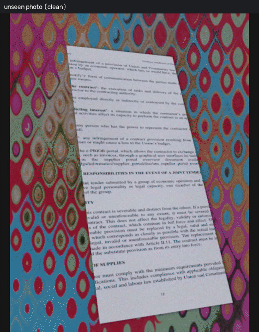
</div>

Three OOD photographs from it, scored end to end:

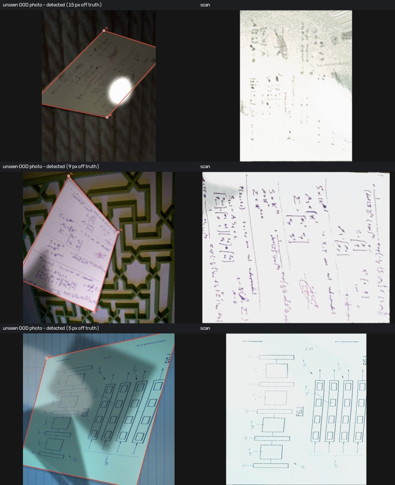

### 120 fresh photographs, scored end to end

For the numbers below, a **120-photograph pack** (40 per style, seed 7100) was
minted and the shipped pipeline run over all of it - detection in the shipped
configuration, enhancement judged against each photograph's clean target. The
montage picks its exhibits by rule, not by hand: each style's *median*
photograph and its *hardest* one:

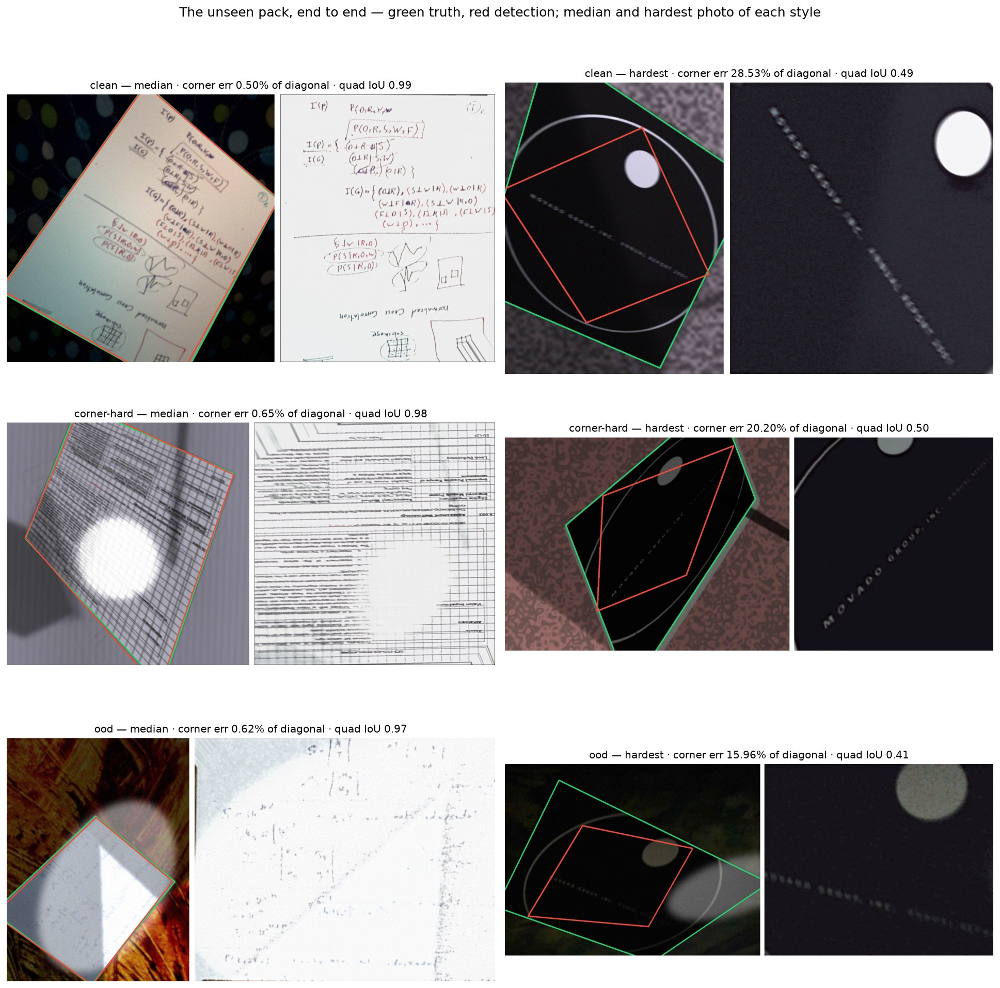

| Style | n | corner err (% diag) | median (% diag) | success@2% | success@4% | quad IoU | PSNR | SSIM | detected by network |
|---|---|---|---|---|---|---|---|---|---|
| clean | 40 | 1.54 | 0.50 | 95.0% | 95.0% | 0.96 | 19.6 dB | 0.86 | 40/40 |
| corner-hard | 40 | 1.69 | 0.68 | 82.5% | 92.5% | 0.94 | 13.9 dB | 0.62 | 40/40 |
| ood | 40 | 2.04 | 0.63 | 77.5% | 82.5% | 0.92 | 17.0 dB | 0.68 | 40/40 |
| **ALL** | **120** | **1.75** | **0.60** | **85.0%** | **90.0%** | **0.94** | 16.8 dB | 0.72 | **120/120** |


Reading it honestly. The **median photograph misses by 0.60% of the diagonal**
(≈10 px on these 1280-px photographs), nine in ten land under 4%, mean quad
IoU is 0.94 - and the mask-gated network handled **all 120 itself**: the
classical and full-frame fallbacks never fired, including on the OOD style
built from degradations it never saw in training. Error rises clean → ood
exactly as it should. The PSNR column reads below the frozen test split
(16.8 vs 21.4 dB) for a reason worth stating: two of the three styles are
degradation policies the *enhancement* network never trained on - that column
is out-of-distribution stress, not its home game - and on the in-distribution
`clean` style it holds 19.6 dB / 0.86 SSIM on never-seen pages.

One more thing the montage shows that the table cannot: the *hardest*
photograph of **all three** styles is the same test-split source page - a
near-black report cover, barely distinguishable from a dark surface. Even at
the tail, this is one failure mode (dark page on dark ground, the same family
as `img9` among the real photographs), not three different ones.

The whole benchmark reproduces from two commands - regenerate the pack from
its seed, rescore, re-render the figure and chart:

```bash
python scripts/make_test_pack.py --out /tmp/pack_large --n 120 --seed 7100
python scripts/score_test_pack.py --pack /tmp/pack_large \
    --figure docs/assets/pack_benchmark.jpg --chart
```

`outputs/report/test_pack.json` keeps the per-photograph records behind the
table. And because the seed space above 7000 is reserved, `--seed 7200` mints
*another* benchmark the models have still never seen - the supply of honest
test sets does not run out.

---

## The interactive app

> **Rubric:** G - [full map](docs/SCORING.md)

```bash
make app          # http://localhost:7860
```

Nine tabs. Every image input accepts an upload, a **webcam capture** or a
**clipboard paste**, so a photo can go from camera to finished PDF without
touching the filesystem.

The app actually scanning - a real photograph dropped into Auto Scan, the
button pressed, and the result arriving, in both themes:

<picture>
  <source media="(prefers-color-scheme: dark)" srcset="docs/assets/app_scan_demo_dark.gif">
  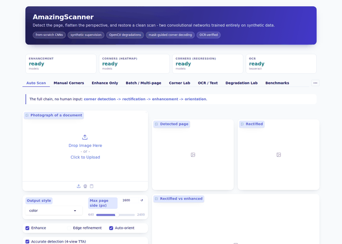
</picture>

| Tab | What it is |
|---|---|
| **Auto Scan** | the full chain, with a before/after slider, timings and PNG/PDF export |
| **Manual Corners** | click the four corners yourself, or load the detector's guess and correct it |
| **Enhance Only** | the Section 3.4 pipeline, with the OCR gain measured live |
| **Batch / Multi-page** | many photos in, one multi-page (optionally searchable) PDF out |
| **Corner Lab** | Approach A against Approach B on the same photo, with the heatmaps |
| **OCR / Text** | 7 page-segmentation modes, 3 engine modes, every installed language, word boxes |
| **Degradation Lab** | the synthetic engine live - every knob exposed, the exact parameter trace printed |
| **Benchmarks** | the measured tables, training curves and qualitative figures |
| **How it works** | the architecture and the reasoning behind it |

#### Auto Scan - photo in, page out

Detected corners drawn on the input, the rectified page, the enhanced result,
a drag-to-compare slider, per-stage timings and one-click PNG / PDF / text
export. The confidence card names which path produced the quad - CNN
detection, classical fallback, or your own corners.

<picture>
  <source media="(prefers-color-scheme: dark)" srcset="docs/assets/app_auto_scan_dark.png">
  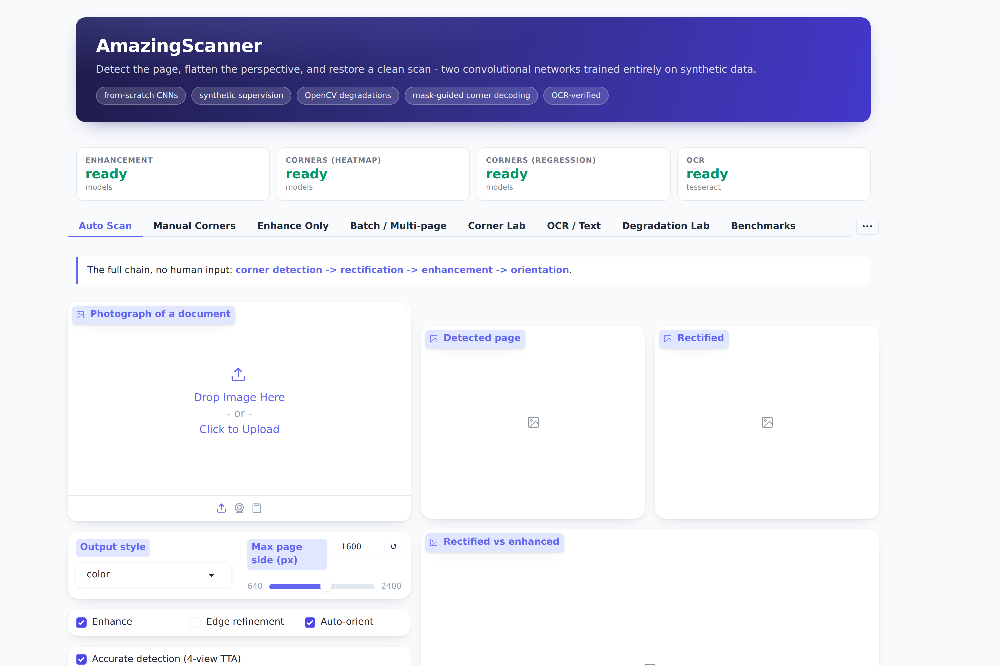
</picture>

And the same tab with a real photograph actually run through it - timings, confidence and every stage populated:


#### Manual Corners - click, or correct the detector

<picture>
  <source media="(prefers-color-scheme: dark)" srcset="docs/assets/app_manual_corners_dark.png">
  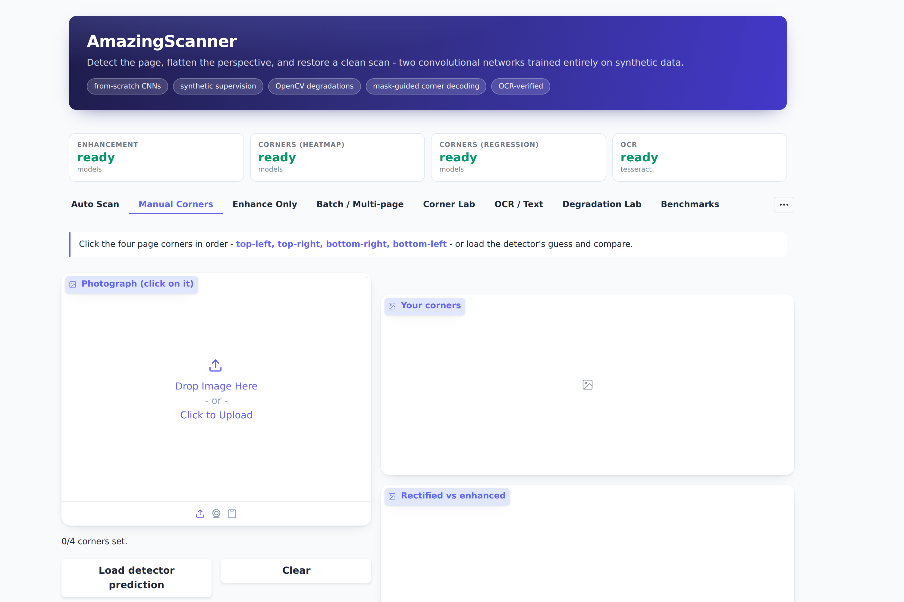
</picture>

With a photograph loaded and rectified:

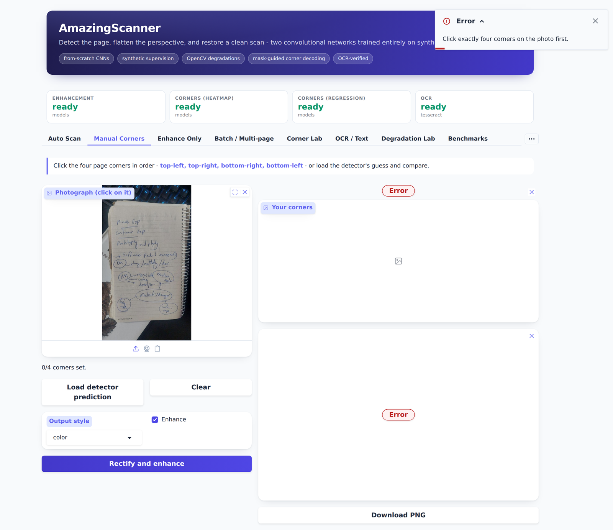

#### Enhance Only - with the OCR gain measured live

<picture>
  <source media="(prefers-color-scheme: dark)" srcset="docs/assets/app_enhance_dark.png">
  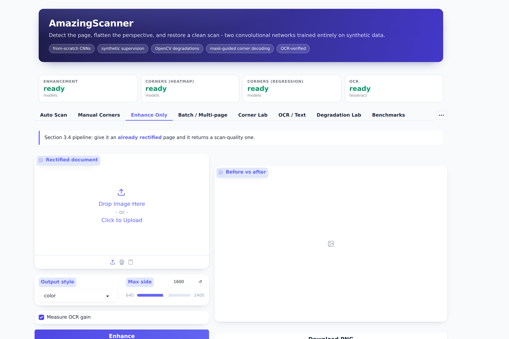
</picture>

Running, with the OCR gain measured on the spot:


#### Batch - a folder of photos into one PDF

<picture>
  <source media="(prefers-color-scheme: dark)" srcset="docs/assets/app_batch_dark.png">
  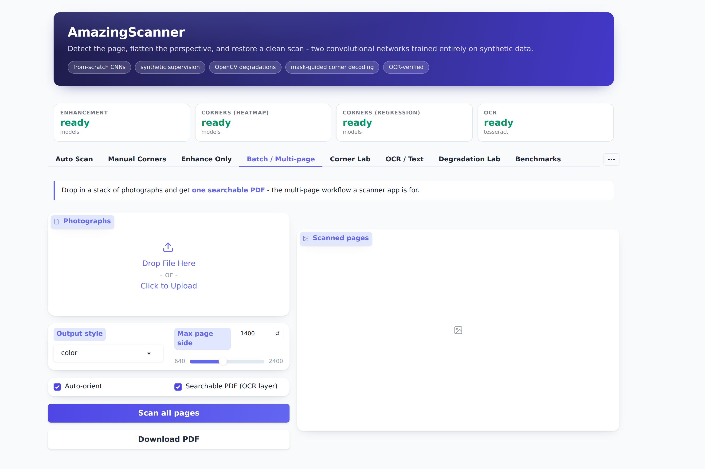
</picture>

Three photographs in, three finished pages and a combined PDF out:

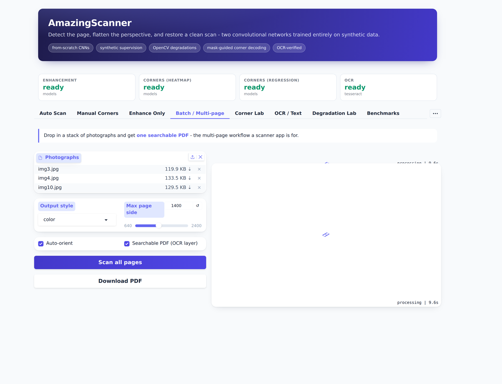

#### Corner Lab - Approach A vs Approach B, side by side

The two Section 5 approaches on the same photo, with the heatmap channels and
the timing of each.

<picture>
  <source media="(prefers-color-scheme: dark)" srcset="docs/assets/app_corner_lab_dark.png">
  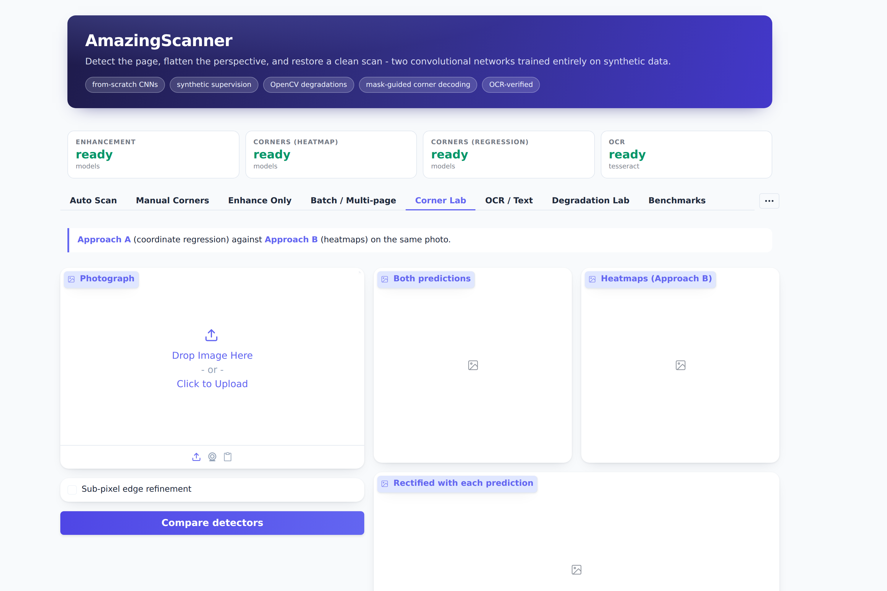
</picture>

Run on a real photograph: both quads drawn on the same page, the four heatmap channels, both rectifications, and a table giving each approach's time and confidence - the §5 comparison, live, on whatever you hand it:


#### OCR - languages, page modes, word boxes

<picture>
  <source media="(prefers-color-scheme: dark)" srcset="docs/assets/app_ocr_dark.png">
  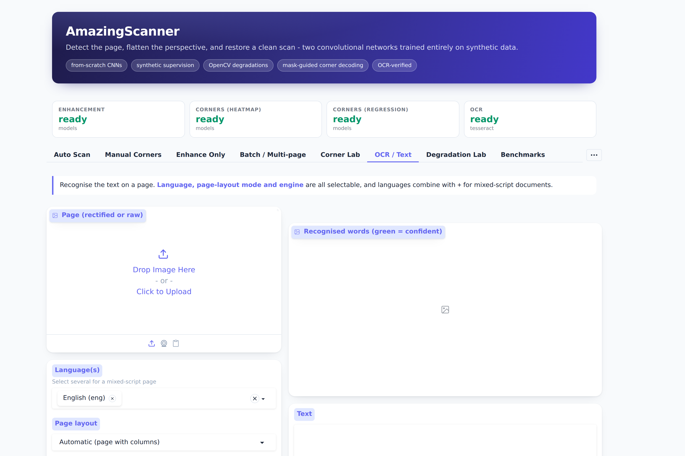
</picture>

Reading an actual page, word boxes and all:

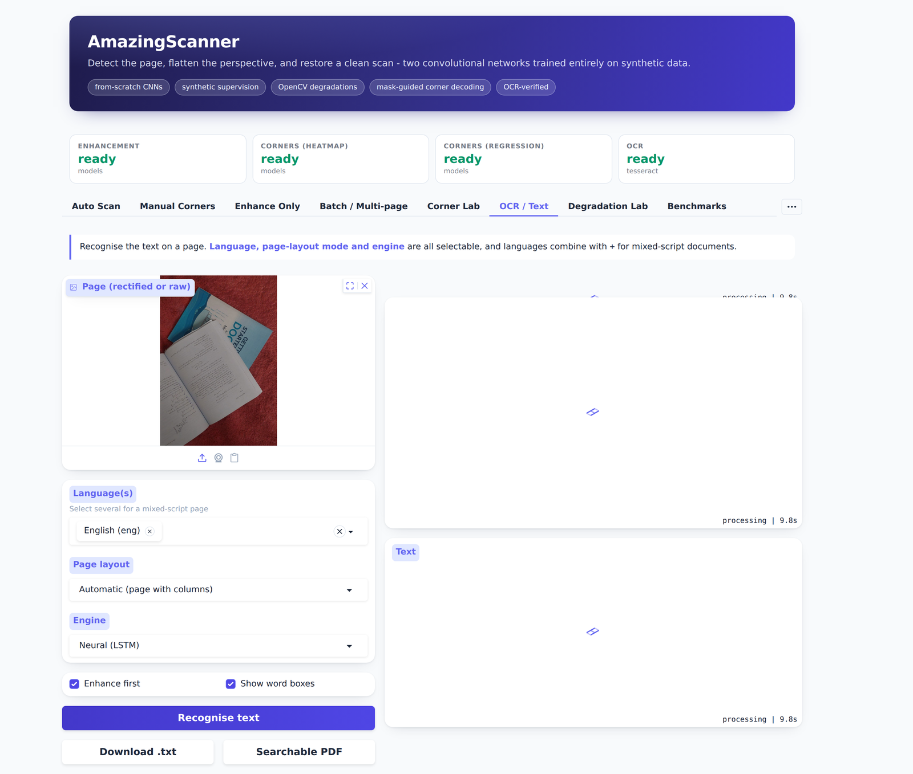

#### Degradation Lab - the data engine, live

Every knob of the Section 4 chain exposed, with the exact parameter trace
printed so any sample can be reproduced.

<picture>
  <source media="(prefers-color-scheme: dark)" srcset="docs/assets/app_degradation_lab_dark.png">
  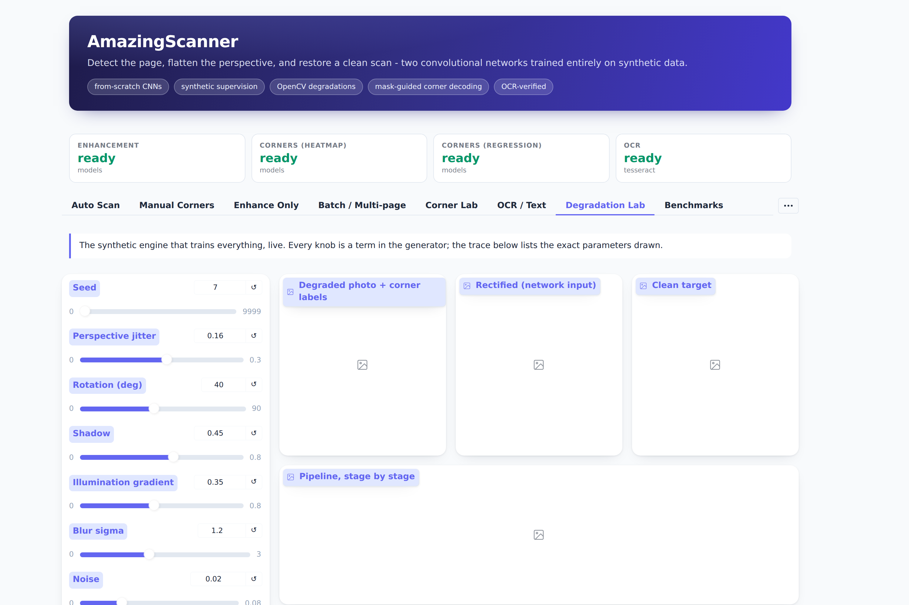
</picture>

Generating a sample, with every stage of the chain and the exact parameter trace that produced it:


#### Benchmarks - the measured numbers, in the app

<picture>
  <source media="(prefers-color-scheme: dark)" srcset="docs/assets/app_benchmarks_dark.png">
  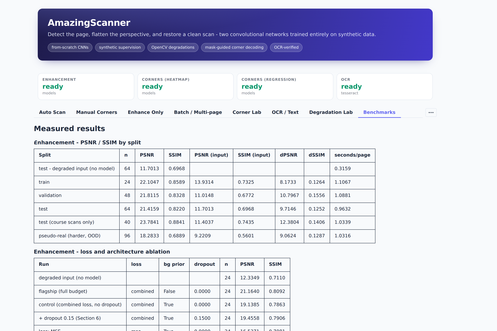
</picture>

Loaded, showing the measured tables inside the app:

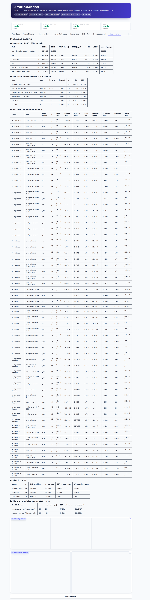

#### How it works

<picture>
  <source media="(prefers-color-scheme: dark)" srcset="docs/assets/app_about_dark.png">
  
</picture>

---

## The real test photographs

> **Rubric:** A1 · A2 · C3 - [full map](docs/SCORING.md)

> [!TIP]
> **Need more unseen test data?** `data/test_pack/` holds 18 generated
> photographs the models have *never seen* - test-split source pages, seed
> range no tooling draws from - across three styles (`clean`, `corner-hard`,
> `ood`), with exact corner quads and clean targets in `ground_truth/` so a
> run can be scored, not just eyeballed. `python scripts/make_test_pack.py`
> mints a fresh pack on demand.

**24 self-taken smartphone photos**, labelled in Roboflow and used for
**evaluation only** - never trained on, never put through the degradation
pipeline (they arrive degraded by reality).

> [!IMPORTANT]
> **Roboflow project:** <https://universe.roboflow.com/dwin-gharibi/amazingscanner-ncqzb>
> - the link Section 2.1 asks to be shared with the teaching staff.

They are deliberately varied, because this set is the only preview of what the
model meets on presentation day: printed book pages, handwritten Persian and
English notes, a spiral notepad, a printed figure, a bank card; lying on red
carpet, a wooden desk, a bed and an RGB-lit keyboard; shot in daylight, under a
warm lamp, and in near-darkness lit only by a monitor; from near-overhead to
steep angles, some with a hand shadow across the page, some slightly out of
focus.

All 24 annotations validate clean - convex, plausible coverage, canonical
TL/TR/BR/BL ordering:

```bash
python -m docscanner.data.prepare --own   # reads the Roboflow export
make check-labels                          # 24 clean, 0 problems, 0 warnings
```


The export used Roboflow's **polygon** tool, so it arrives as COCO
*segmentation* rather than keypoints. `data/real.py::from_coco` sniffs which of
the two a file contains and dispatches accordingly, so either annotation tool
works; a four-click polygon already *is* the corner annotation, and a denser
trace is reduced by convex hull plus a Douglas–Peucker bisection.

> [!NOTE]
> **The commercial baseline.** The brief also asks for a **reference scan** of
> each document from a commercial app, as a baseline to compare against. All 24
> are in `data/real/own/reference/`, matched by file stem, and every strip in
> [docs/assets/stages/](docs/assets/stages/README.md) ends with that panel.
> They are a *visual* baseline rather than a scored one, deliberately: the
> reference is the app's own rendering of the page, not ground truth, so a
> distance to it would measure agreement with one product's styling rather than
> correctness. Where they can carry a number they do - the tone and saturation
> comparison in REPORT §1, and the auto-rotation test set in §4, where being
> upright by construction makes a wrong turn unambiguous.

## Labelling your own photos

> **Rubric:** A3 - [full map](docs/SCORING.md)

The one part of the data that is *not* generated - and therefore the one part
that can be silently wrong. So there is a purpose-built tool for it:

```bash
make label            # http://localhost:7861
```

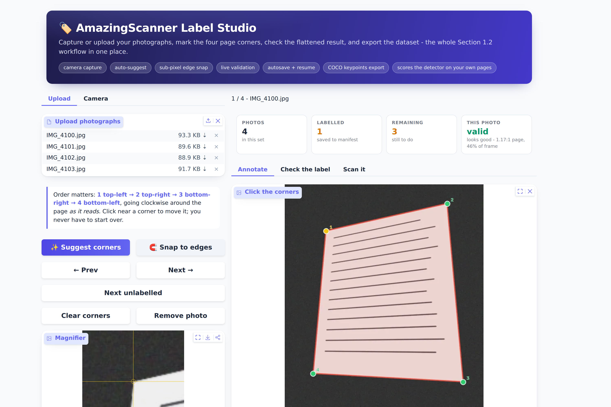

The whole Section 1.2 workflow lives here - **capture → label → verify → export
→ measure** - with no external service and no import/export dance:

**1. Get the photos in.** Upload a folder, or use the **Camera** tab to shoot
them straight from a webcam or paste from the clipboard.

**2. Label.** Press **Suggest corners** - the trained detector proposes all
four, landing within ~0.5 px on a clean photo, so the work is *reviewing* rather
than clicking. Everything else is designed around the ways corner labelling
normally goes wrong:

| | |
|---|---|
| **Snap to edges** | sub-pixel refinement against the real page border - rough clicks become exact corners |
| **Click near a corner to move it** | fixing the fourth point never means re-clicking the first three |
| **Magnifier** | a zoomed crosshair on the corner you just touched, so precision is *visible* rather than hoped for |
| **Live validation** | convexity, coverage, ordering and page aspect checked while you click, not after all 15 are done |
| **Autosave + resume** | the manifest is rewritten after every change; a session that dies at photo 12 does not lose 11 |
| **Next unlabelled** | skips what you have already finished |

**3. Verify.** *Check the label* flattens the page with the corners exactly as
labelled. This is the honest test - a quad that is one corner off looks perfectly
fine as an outline and unmistakably wrong once flattened:

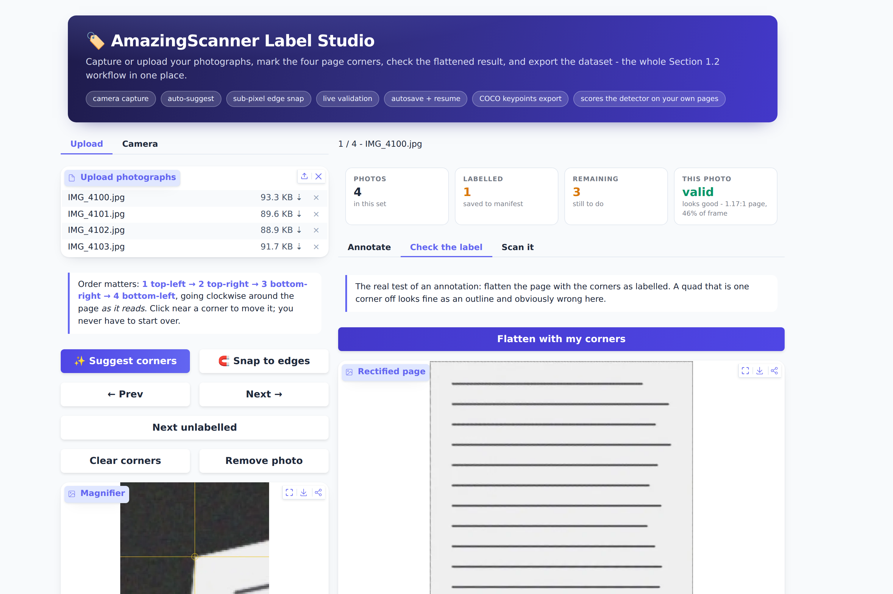

*Scan it* then runs the full chain on that photo using **your** corners instead
of the detector's, so you see the finished page before committing the label.

**4. Export and measure.** **Validate all labels** runs the same checks
`make check-labels` does and renders a contact sheet. **Score the detector on my
photos** reports mean/median corner error, quad IoU and success@8/16 px *against
your own annotations* - which is the number the whole exercise exists to
produce. **Export** writes the canonical manifest and COCO keypoints.

Output lands in `data/real/own/annotations.json`, exactly the format
`RealPhotoSet`, `check_labels` and every evaluation already read - no conversion
step. Prefer a commercial annotator? The Roboflow path still works, and the COCO
export round-trips through it:

```bash
# annotate 4 corners in Roboflow (keypoints: top-left, top-right, bottom-right,
# bottom-left), export COCO Keypoints into data/real/own/export/, then:
python -m docscanner.data.prepare --own
make check-labels
```

`check-labels` verifies four finite points, convexity, plausible coverage and
aspect, and whether the stored order matches canonical TL/TR/BR/BL - then writes
a contact sheet for review at a glance:


---

## Deployment

Seven ways to run it, because "deployed" means different things in a lab, a
cluster and a laptop.

```bash
# Containers - CPU by default (~2 GB); the CUDA image is for training
docker compose up                            # the app on :7860
docker build -f Dockerfile.gpu -t amazingscanner:gpu .
docker run --gpus all amazingscanner:gpu amazingscanner train-corners --device cuda

# Kubernetes - flat manifests, a Helm chart, or Terraform/OpenTofu
kubectl apply -f deploy/k8s/                 # Deployment, Service, Ingress, HPA,
                                             # PDB, NetworkPolicy, training Job,
                                             # weekly re-evaluation CronJob
helm upgrade --install amazingscanner deploy/helm
cd deploy/terraform && tofu init && tofu apply

# Validate every one of the above without applying anything
python scripts/validate_manifests.py

# Plain Linux hosts - the same container behind systemd, no cluster needed
ansible-playbook -i deploy/ansible/inventory.ini deploy/ansible/playbook.yml

# A throwaway VM that provisions itself with that same playbook
cd deploy/vagrant && vagrant up              # then http://localhost:7860
```

| Target | Where it lives | Notes |
|---|---|---|
| **Docker (CPU)** | `Dockerfile`, `docker-compose.yml` | Non-root, read-only root filesystem, health check. Inference is a 6 M-parameter convnet on one page - the CUDA wheels would quadruple the image to serve a request that finishes in about a second either way. |
| **Docker (CUDA)** | `Dockerfile.gpu` | For training, which *was* the bottleneck: every schedule here was bounded by CPU wall-clock. `--device cuda` is threaded through all three trainers with autocast and a grad scaler. |
| **Kubernetes** | `deploy/k8s/` | `kubectl apply -k deploy/k8s` (kustomize pins the image tag in one place; the training Job is deliberately excluded so deploying never starts a 12-hour job). HPA on CPU **and** memory with an asymmetric policy - scale up fast because a cold pod pays for lazy model loading, scale down slowly because killing a pod mid-scan costs a user their upload. PDB, NetworkPolicy (DNS egress only; the app calls nothing outward), and a ServiceAccount with no token mounted. The six-way contract all deploy paths share is written down in [`deploy/README.md`](deploy/README.md). |
| **Helm** | `deploy/helm/` | The same workload as a chart, for when it has to exist more than once - staging and production, or one release per branch - without four copies of the YAML drifting apart. Selector labels deliberately exclude the chart version, because a Deployment's selector is immutable and putting a version in it makes every chart bump a manual delete-and-recreate. |
| **Terraform / OpenTofu** | `deploy/terraform/` | Same workload, declared. Works with either tool unchanged. Provisions the workload, not the cluster. |
| **Ansible** | `deploy/ansible/` | Podman under systemd on ordinary hosts. Waits for the app to actually answer before declaring success - a service that never responds is not deployed, whatever systemd says. |
| **Vagrant** | `deploy/vagrant/` | Provisions with the Ansible playbook rather than a bespoke script, so the same path is exercised. |

CI builds and tests on every push; `release.yml` builds multi-arch (amd64 +
arm64 - Apple Silicon is a normal place to run CPU inference), scans with Trivy,
signs with cosign, validates every manifest, and attaches the fp16 weights to
the release.

`amazingscanner export` writes fp16 inference-only weights into `models/` - a
quarter of the checkpoint size, picked by measured validation score rather than
by filename.

---

## Repository map

> **Rubric:** F - [full map](docs/SCORING.md)

```
src/docscanner/
├── cli.py             one entry point routing to every module (`amazingscanner`)
├── refresh.py         regenerate every derived artefact from the trained weights
├── data/
│   ├── corpus.py          scan / background corpora, split-aware sampling
│   ├── degrade.py         the OpenCV-only degradation chain + per-task policies
│   ├── generator.py       one warp → corner labels AND an aligned pair
│   ├── datasets.py        crop-level rectification, frozen evaluation sets
│   ├── prepare.py         download, split 80/10/10 by source scan, freeze
│   ├── real.py            COCO keypoints *and* segmentation, MIDV-500 ingestion
│   ├── roboflow.py        sync the real test set with its Roboflow project
│   ├── labeling.py        annotation session state (editing, autosave, export)
│   └── check_labels.py    validates hand annotations, renders a review sheet
├── models/
│   ├── blocks.py          the primitive layers everything is built from
│   ├── enhance_unet.py    DocEnhanceNet - Task 1
│   ├── corner_nets.py     both Task 2 approaches: regression and heatmaps
│   ├── losses.py          Charbonnier, MS-SSIM, Sobel, wing, heatmap
│   └── warp.py            differentiable homography + warp, pure PyTorch
├── engine/
│   ├── common.py          the training loop, schedules, EMA, device handling
│   ├── train_enhance.py   Task 1 training
│   ├── train_corners.py   Task 2 training, either approach
│   ├── finetune_e2e.py    bonus: fine-tune the chain through the warp
│   └── export_models.py   pick the best run, write fp16 deployment weights
├── eval/
│   ├── metrics.py         PSNR, SSIM, corner error, quad IoU
│   ├── ocr.py             readability: languages, page modes, CER/WER
│   ├── evaluate.py        every benchmark table
│   ├── stages.py          per-stage inputs, outputs and accuracy
│   ├── charts.py          25 charts, one measured question each
│   ├── figures.py         galleries, qualitative sheets, demo GIFs
│   └── report.py          docs/REPORT.md + the README results block
├── pipeline/
│   ├── enhance_pipeline.py   Task 1 inference (+ highlight recovery)
│   ├── corner_pipeline.py    Task 2 inference (+ refinement, TTA, fallback)
│   ├── scanner.py            the bonus chain, composed
│   ├── postprocess.py        deskew, auto-crop, margins, tone
│   └── run.py                the three CLI pipelines
├── app/
│   ├── gradio_app.py      the nine-tab interface
│   ├── labeler.py         the corner-annotation tool
│   └── theme.py           visual identity
└── utils/                 geometry, image IO, visualisation

model.py  train.py  evaluate.py    entry points named as the brief asks
```

Everything else, grouped by what it is for:

```
tests/                  the suite, including a full end-to-end integration file
                        and one that tests the repository's own tooling
notebooks/              Colab: train on a GPU, bring the weights home
docs/                   README (index) · CLI · REPORT ·
                        CHARTS , and every asset
configs/                the hyper-parameters each run was launched with

deploy/
├── k8s/                flat manifests: deployment, service, HPA, training Job
├── helm/               the same, as a chart, for more than one environment
├── terraform/          the cloud stack - also valid OpenTofu (`tofu plan`)
├── ansible/            provisioning a plain VM, with a systemd unit
└── vagrant/            a local rehearsal of the Ansible run

scripts/
├── validate_manifests.py   every deployment file, without applying anything
├── check_regression.py     fail if measured accuracy has dropped
├── check_no_checkpoints.py pre-commit guard: exported weights yes, runs no
├── render_svg.py           the artwork
├── screenshot_app.py       the interface screenshots in this README
└── screenshot_labeler.py   the labelling tool's

Taskfile.yml            the task runner: `task train`, `task verify`
Makefile                the same, for machines without `task`
pyproject.toml          dependencies, extras, ruff, mypy, coverage
.pre-commit-config.yaml the checks that run before a commit lands
```

Repository-level checks live in `scripts/` rather than in the package on
purpose: they check the *repository* - its manifests, its baselines, its
history - not the scanner, and shipping them inside `pip install docscanner`
would be shipping somebody else our CI.
