# AmazingScanner — the measurements, one chart at a time

Every chart here is generated from `outputs/report/*.json`, which is written by
`python -m docscanner.eval.evaluate`. Nothing is hand-typed, and re-running the
evaluation refreshes all of them:

```bash
make eval          # measure
python -m docscanner.eval.charts   # redraw
```

---

## PSNR by split

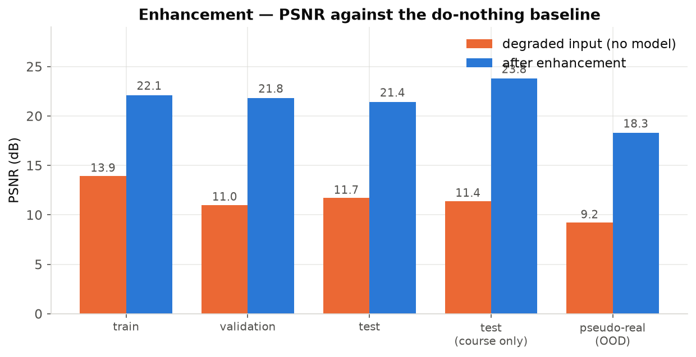

Every bar pair is the same images before and after the network. On the held-out test split the model turns 11.70 dB into 21.42 dB, a gain of 9.71 dB. The brief's instruction is that if the model is not clearly above the orange bars it is not earning its parameters.

---

## SSIM by split

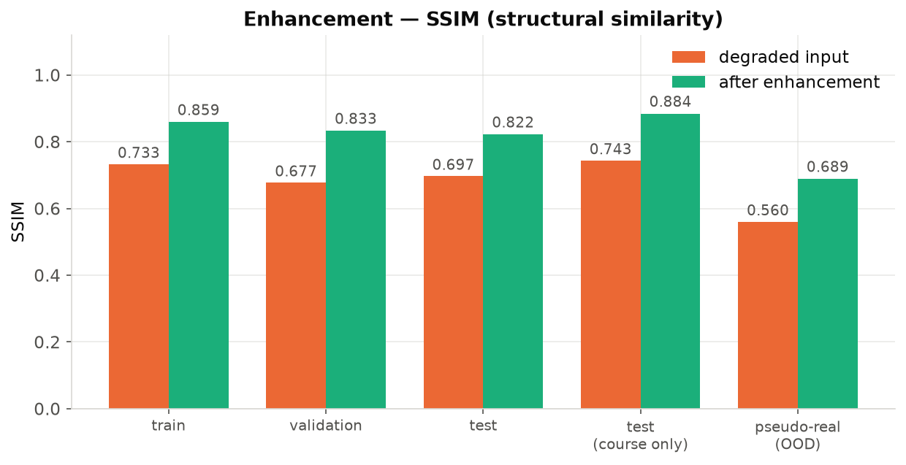

SSIM rewards structure rather than pixel-for-pixel agreement, which is why it is the better proxy for whether text stayed readable. It rises on every split, including the out-of-distribution one.

---

## Overfitting check

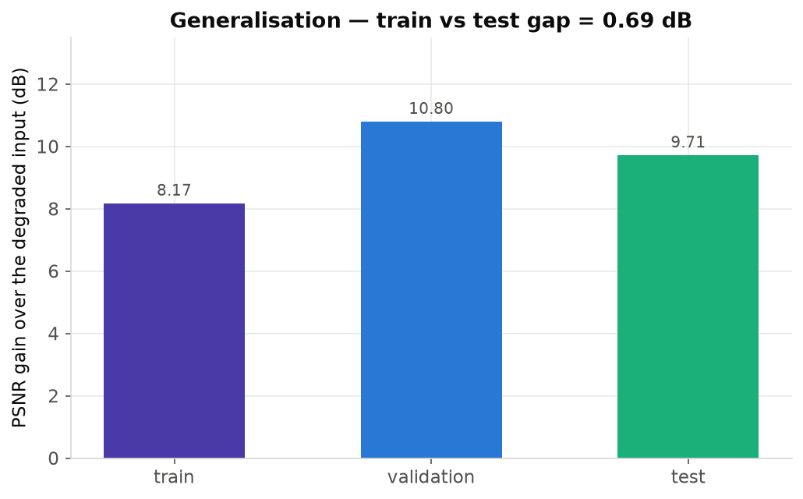

The gain over the do-nothing baseline on each split. Training reaches 22.10 dB and the held-out test split 21.42 dB — a gap of 0.69 dB, which is small, so the model is fit rather than memorising. Validation sits between them and is optimistic by construction, since it is what model selection steered on.

---

## Loss ablation — PSNR (dB)

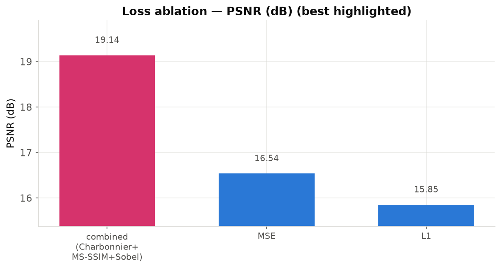

Four objectives trained at identical budgets, so the only difference is what the model was asked to minimise. PSNR is a monotone function of MSE, so an MSE-trained model is optimising this metric directly and tends to lead on it — which is exactly why PSNR alone is the wrong way to pick a restoration loss.

---

## Loss ablation — SSIM

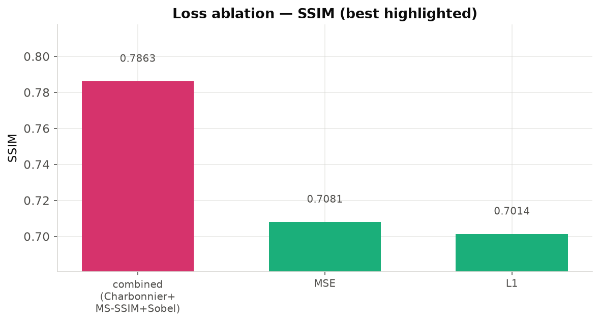

The same four runs judged by structural similarity, which is what tracks legibility. The combined Charbonnier + MS-SSIM + Sobel objective wins here, and that is the one the pipeline ships with: text lives in the edges, and the gradient and MS-SSIM terms are what preserve them.

---

## Approach A vs Approach B

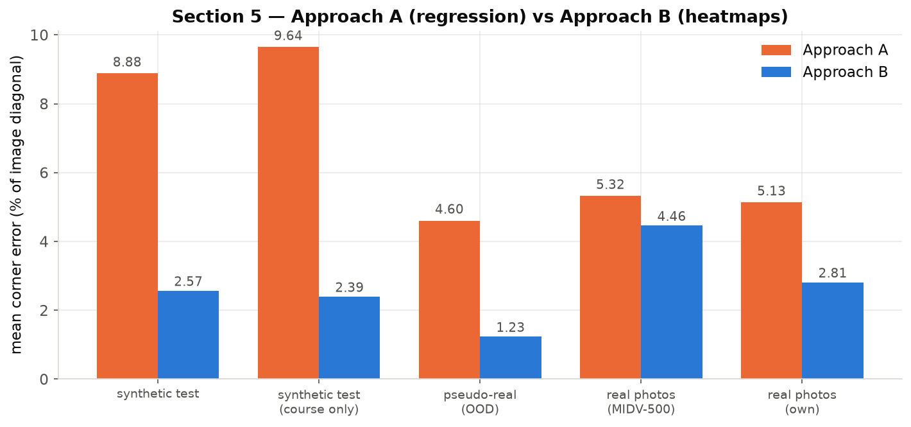

Error as a percentage of the image diagonal, so datasets at different resolutions can sit on one axis. Heatmaps win on every set. The prediction written down before running the experiment was that they would, because the loss is dense and the mapping stays local, whereas regression asks fully connected layers to turn a global description into precise coordinates.

---

## Inference ladder — mean corner error (px)

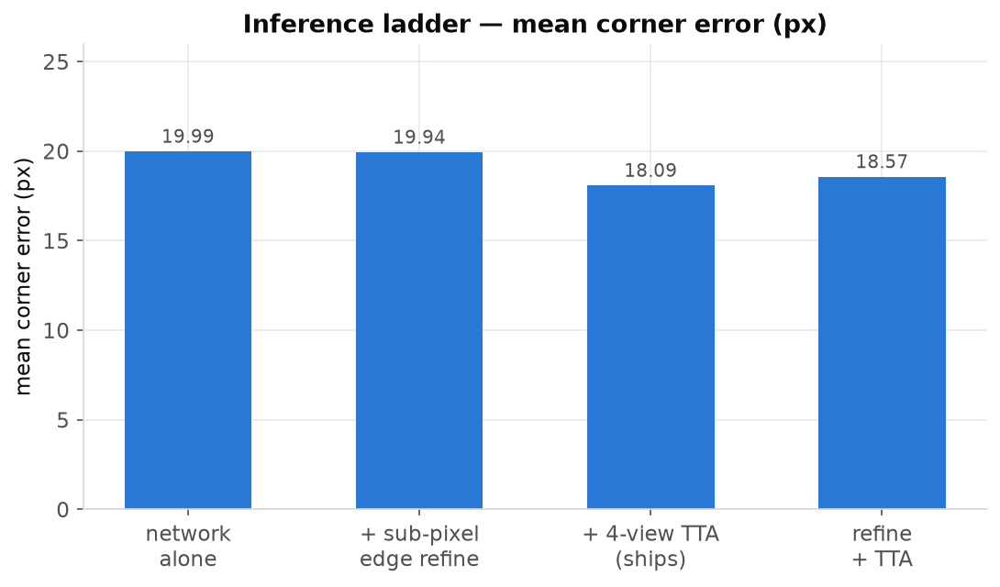

The same trained weights at each rung of the inference chain, on the synthetic test set. Edge refinement leaves the mean where it found it; the improvement comes from TTA, because the mean is set by the images where the network picked the wrong rectangle, and outvoting those is what four views do. Both rungs behave differently on real photographs — see the ladder in the README, which is why refinement ships off.

---

## Inference ladder — median corner error (px)

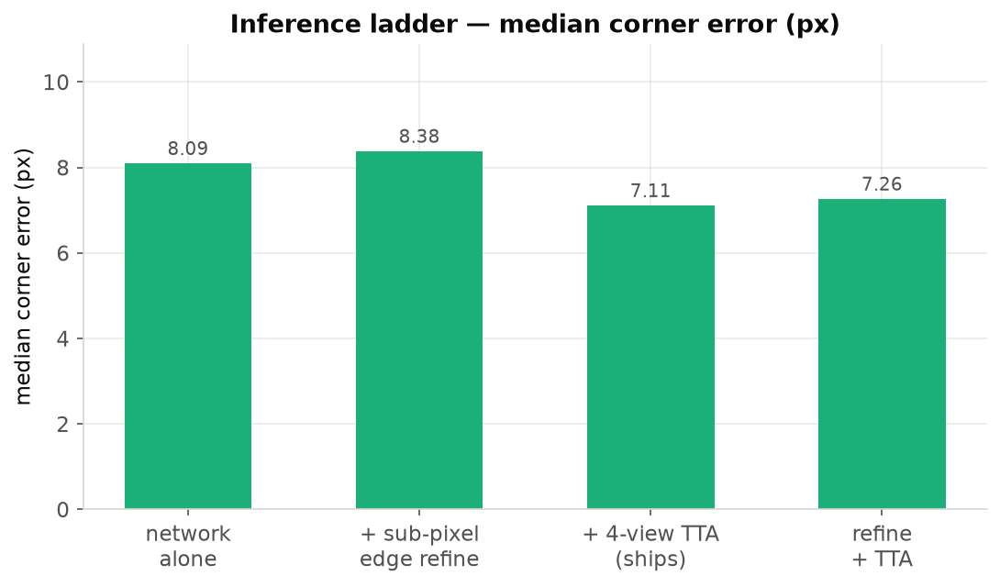

The same three configurations by median — the typical page rather than the worst one. Worth reading against the claim refinement is usually given credit for: on its own it moves the median the wrong way (8.09 → 8.38 px), and the drop to 7.26 px arrives with TTA. Mean and median answer different questions, which is why they are two charts and not one.

---

## Strict success rate

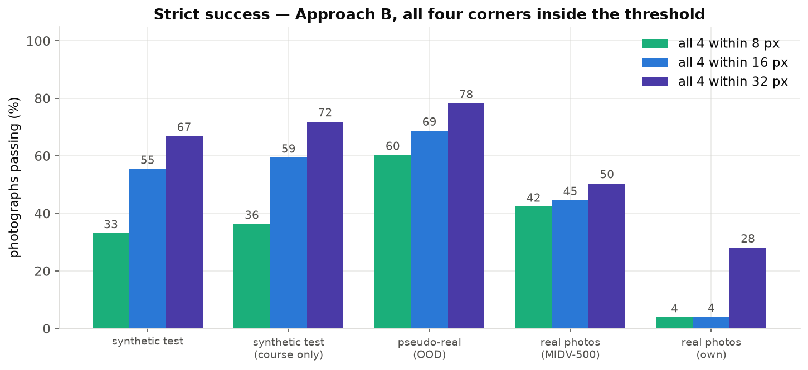

A stricter question than mean error: on what fraction of images do *all four* corners land inside the threshold. One bad corner fails the image, which is the right standard for a scanner — a page cropped along three correct edges and one wrong one is still a ruined scan.

---

## Dropout and the synthetic-to-real gap

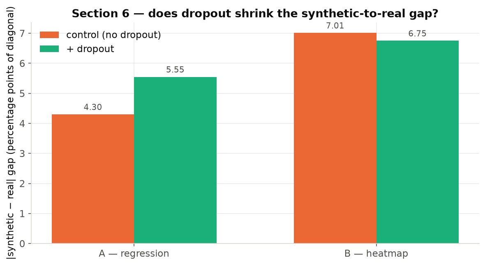

Section 6 does not ask whether dropout lowers the error — it asks whether the gap between synthetic and real performance narrows. Shorter bars are better. Measured: regression by -1.25 pp, heatmap by +0.26 pp. Dropout trades in-distribution fit for a model that transfers slightly better, which is what regularisation is supposed to do.

---

## Real photographs, per image

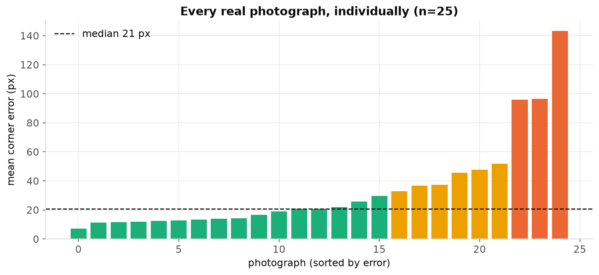

Not a summary statistic — every one of the 25 photographs. The shape is the finding: 22 land within 60 px, then there is a visible gap, then 3 fail at 80 px or worse. A bimodal distribution like this means a categorical mistake, not general imprecision, and the mean of it describes none of its images.

---

## Cumulative accuracy

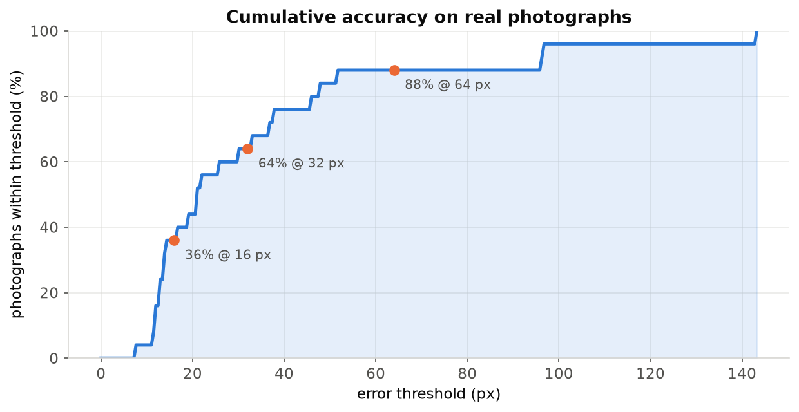

Read it as: pick an accuracy you need, and this is the fraction of real photographs that meet it. The curve is the honest way to state a requirement — a product decision about acceptable crop error becomes a readable number instead of an argument about means.

---

## Bonus §7 — mean OCR confidence

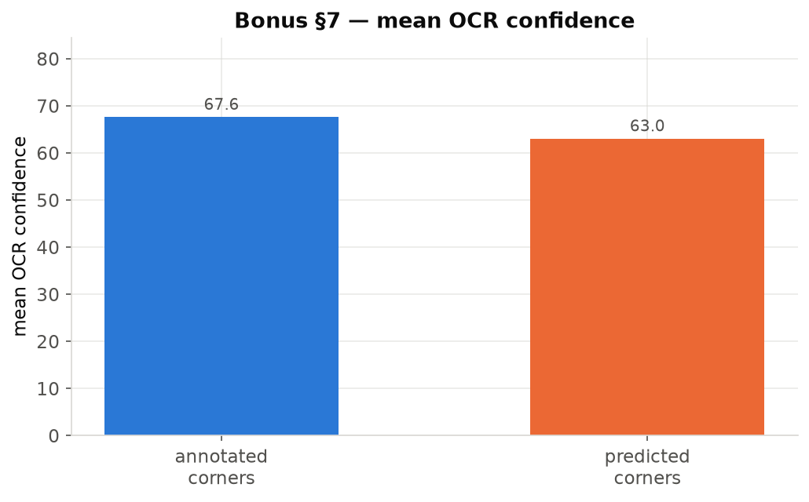

The same photographs and the same enhancement network, rectified twice: once with my annotations and once with the detector's output. That isolates what corner error costs. At 47.8 px mean corner error the price is 4.6 points of OCR confidence (67.6 against 63.0).

---

## Bonus §7 — words recognised per page

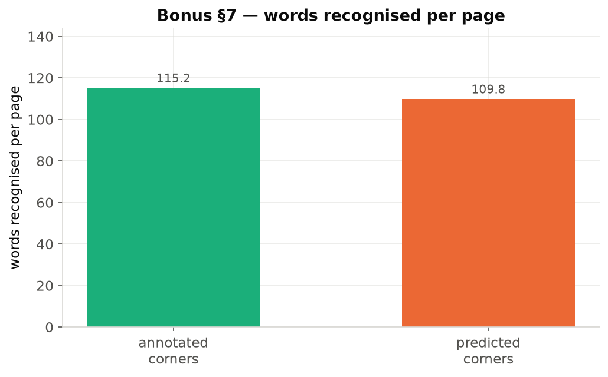

The same comparison counted in words actually recognised — the number a user would notice. Predicted corners cost 2.0 words per page (111.5 against 109.5), because a mis-cropped page loses whole lines at the edges rather than degrading evenly.

---

## Readability — mean OCR confidence

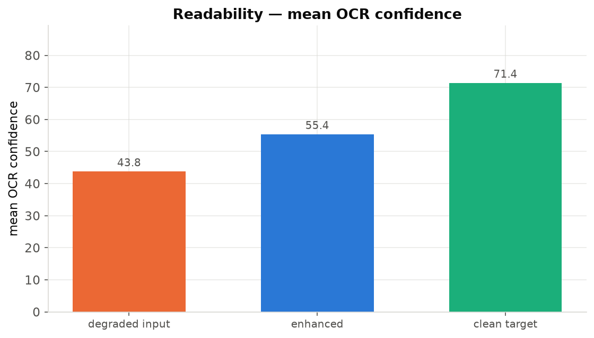

Section 3.3 asks about usefulness, not pixel agreement: did the page become more readable? Confidence rises from the degraded input to the enhanced output, with the clean scan shown as the ceiling neither is expected to reach.

---

## Readability — words recognised per page

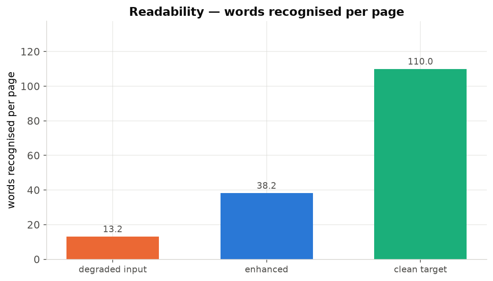

The same question counted in words the engine actually returned. This is the blunter and more honest number — a page can gain confidence while still hiding most of its text, and word count catches that.

---

## Readability — character error rate

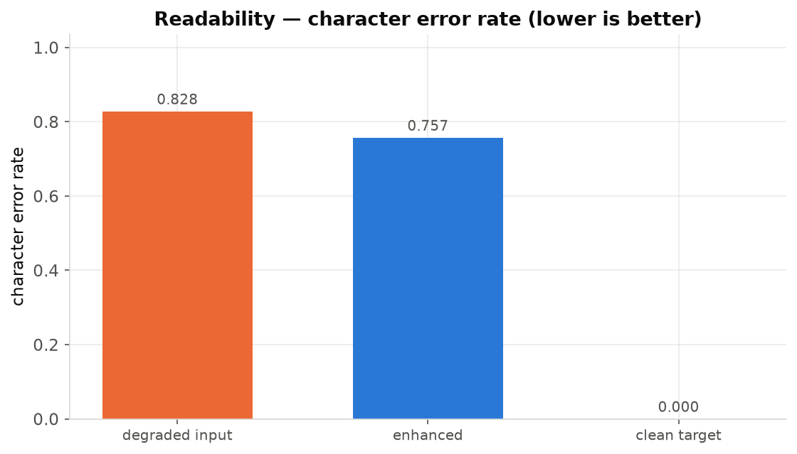

Character error rate against the text read from the clean scan, so lower is better. It falls after enhancement, which is the direct statement that the network made the document more machine-readable rather than merely brighter.

---

## Throughput

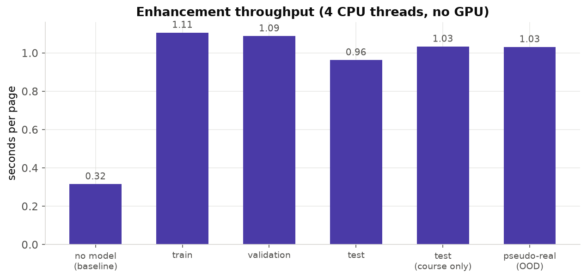

Seconds per page for the enhancement pipeline on four CPU threads. Training ran on an NVIDIA H100 (every run config records device=cuda with AMP); these inference numbers are deliberately CPU, because the question they answer is what a user without a GPU waits for.

---

## What a page looked like, before and after

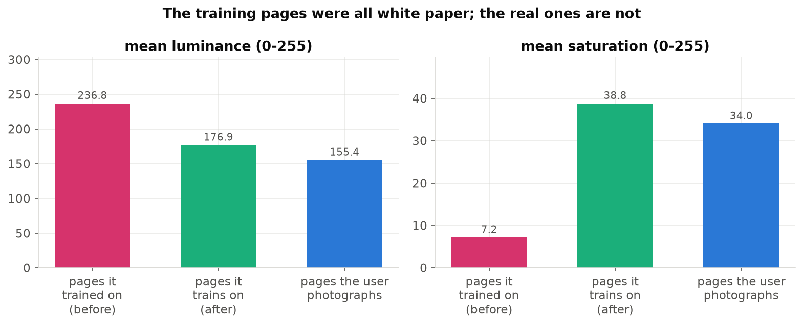

Every document in the corpus is a scanned text page, so "the page" and "the large bright region" were the same statement in every sample ever generated -- which is why a cover with a dark title panel had its boundary drawn at the panel. Eleven augmentations move the training distribution onto the real one: 96% of the photographs now fall inside the training luminance band, against 79% before.

---

## How good the page-mask head has to be

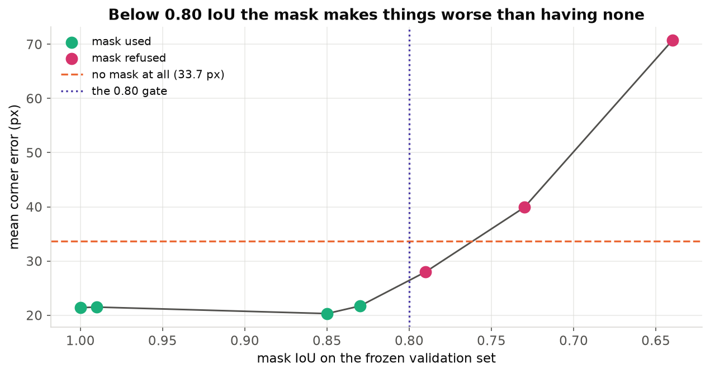

Simulating the ways a real segmentation head fails -- soft boundary, wrong scale, wrong position -- every variant at 0.79 IoU and above beats plain per-head argmax, while 0.73 and 0.64 come out worse than using no mask at all. Nothing about a mask reveals that it is in the wrong *place*, so the pipeline checks the recorded IoU instead and decodes without the mask below the gate. The shipped detector records 0.921.

---

## The corner fix: prediction against outcome

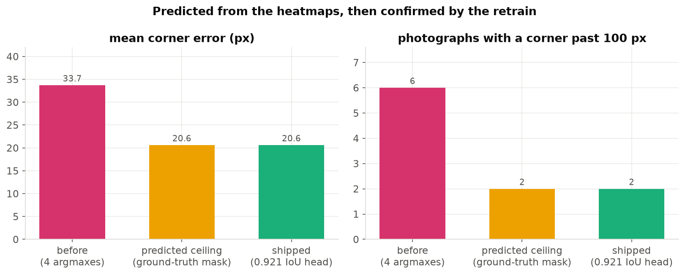

Four heatmaps were decoded by four independent argmaxes, with nothing requiring the answers to describe one page -- so with a competing rectangle in frame the heads split. Probing showed the correct location present as a near-tied secondary peak in 6 of 9 defecting heads, so a ground-truth mask was used to measure the ceiling the mechanism could reach. The retrained head landed on that ceiling exactly, which is the strongest evidence here that the diagnosis was right.

---

## Blown highlights, removed

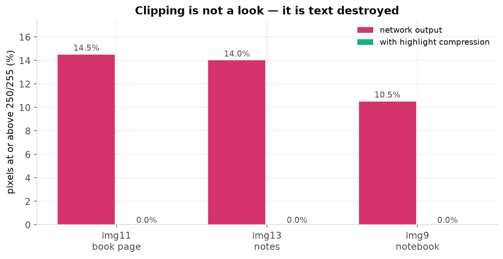

All 50 enhancement targets average 249/255 luminance with 92.8% of pixels above 250, so "make it look like a clean scan" means "make it white" -- and on a real photograph that pushes 10-14.5% of the page past the top of the range, where no detail remains. Compression pulls the top end back without changing the whitened appearance the pages are supposed to have.

---

## Which corner is hardest

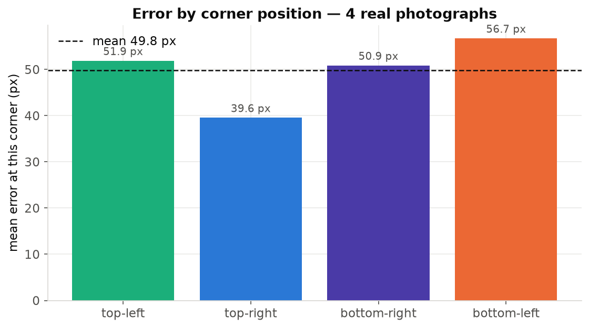

Each heatmap head is scored separately, because a single mean corner error cannot say whether the detector is uniformly imprecise or has one bad head. The answer here is the reassuring one: bottom-left is worst at 56.7 px and top-right best at 39.6 px, a spread of only 1.4x around a 49.8 px mean, with all four heads within a few pixels of each other. No head is broken, and nothing here suggests the corner *ordering* is inconsistent — the error is spread across the quad, which is what a shared trunk running out of resolution looks like rather than a labelling or decode bug.

---

## The unseen pack, by style

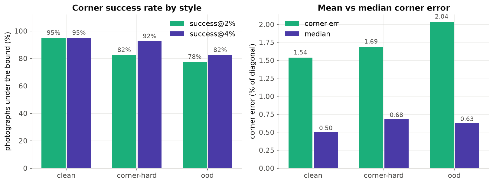

120 photographs no model has seen — test-split source pages composited at seeds reserved above 7000, scored in the shipped configuration. The gap between the two right-hand bars is the story: medians sit near half a percent of the diagonal in every style while means run three times that, so the typical detection is tight and the average is carried by a few hard tails. Error rises clean → corner-hard → ood, exactly the ordering the styles were built to produce.

---

## Unseen pack, cumulative accuracy

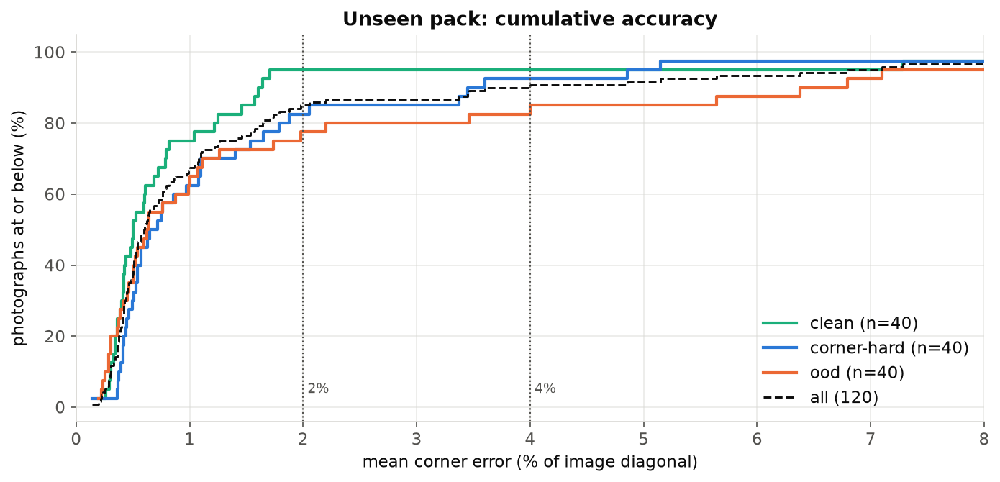

Read it as “what fraction of unseen photographs land at least this good”. Every curve rises almost vertically at the left — the median photograph misses by 0.60% of the diagonal — and then flattens into a long tail, which is the honest shape of this detector: usually very tight, occasionally lost. The `clean` curve sits above the other two everywhere, and `ood` below, so the ordering holds at every bar, not just at the two the table reports.

---
