# Every test photograph, stage by stage

All 25 real photographs, each as one strip: **input → detected corners → rectified → enhanced → final**.

Ordered **worst corner error first**. A gallery sorted best-first is a brochure; the failures are where the remaining work is.

`source` is which path produced the quad — `network` is the detector, `classical` and `full_frame` are the sanity-gate fallbacks that fire when the predicted quad is non-convex, too small, or well outside the frame.

| photo | corner error | quad IoU | source | OCR conf. in → out | words | seconds |
|---|---:|---:|:--|---:|---:|---:|
| [`img1`](#img1) | 535.8 (34.5%) | 0.583 | `network` | 0.0 → 0.0 | 0 | 3.13 |
| [`img27`](#img27) | 96.5 (6.4%) | 0.628 | `network` | 72.2 → 70.7 | 274 | 1.86 |
| [`img28`](#img28) | 95.9 (6.2%) | 0.688 | `network` | 86.5 → 87.6 | 116 | 1.66 |
| [`img2`](#img2) | 51.7 (3.2%) | 0.783 | `network` | 67.4 → 70.4 | 129 | 8.61 |
| [`img25`](#img25) | 47.7 (3.2%) | 0.853 | `network` | 67.0 → 64.9 | 195 | 8.50 |
| [`img6`](#img6) | 45.5 (2.9%) | 0.808 | `network` | 74.3 → 80.4 | 82 | 3.99 |
| [`img4`](#img4) | 37.4 (2.5%) | 0.888 | `network` | 79.3 → 77.0 | 140 | 2.94 |
| [`img26`](#img26) | 36.8 (2.3%) | 0.886 | `network` | 74.4 → 73.2 | 344 | 16.35 |
| [`img15`](#img15) | 32.8 (3.1%) | 0.853 | `network` | 55.2 → 60.3 | 57 | 1.50 |
| [`img8`](#img8) | 29.8 (2.0%) | 0.883 | `network` | 0.0 → 82.7 | 159 | 4.79 |
| [`img18`](#img18) | 25.8 (2.5%) | 0.845 | `network` | 60.9 → 63.2 | 28 | 3.81 |
| [`img21`](#img21) | 22.0 (2.1%) | 0.889 | `network` | 57.4 → 64.5 | 111 | 1.91 |
| [`img5`](#img5) | 20.9 (1.3%) | 0.921 | `network` | 90.1 → 86.2 | 231 | 11.14 |
| [`img17`](#img17) | 20.8 (1.8%) | 0.916 | `network` | 62.9 → 51.5 | 2 | 1.38 |
| [`img23`](#img23) | 18.9 (1.6%) | 0.922 | `network` | 0.0 → 65.7 | 35 | 5.70 |
| [`img22`](#img22) | 16.7 (1.8%) | 0.921 | `network` | 0.0 → 61.0 | 26 | 3.48 |
| [`img9`](#img9) | 14.2 (0.9%) | 0.946 | `network` | 75.2 → 70.9 | 249 | 6.87 |
| [`img11`](#img11) | 13.9 (1.5%) | 0.937 | `network` | 57.0 → 56.0 | 112 | 6.79 |
| [`img10`](#img10) | 13.4 (1.4%) | 0.930 | `network` | 0.0 → 59.0 | 133 | 6.41 |
| [`img7`](#img7) | 12.8 (1.2%) | 0.926 | `network` | 0.0 → 65.8 | 38 | 2.78 |
| [`img24`](#img24) | 12.6 (1.3%) | 0.925 | `network` | 0.0 → 60.6 | 17 | 2.88 |
| [`img20`](#img20) | 11.9 (1.1%) | 0.939 | `network` | 56.6 → 59.1 | 104 | 1.47 |
| [`img3`](#img3) | 11.7 (0.8%) | 0.939 | `network` | 74.7 → 71.0 | 54 | 1.01 |
| [`img19`](#img19) | 11.3 (1.1%) | 0.921 | `network` | 0.0 → 53.7 | 42 | 3.12 |
| [`img14`](#img14) | 7.2 (0.7%) | 0.968 | `network` | 53.6 → 58.3 | 82 | 1.56 |

---

### img1

corner error **535.8 px** · quad IoU 0.583 · detected via `network`

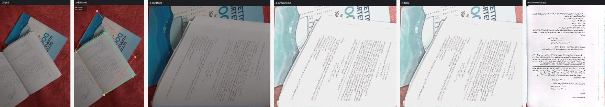

### img27

corner error **96.5 px** · quad IoU 0.628 · detected via `network`

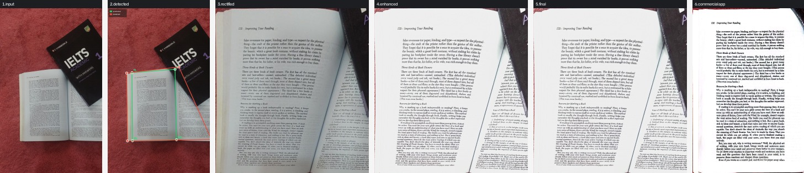

### img28

corner error **95.9 px** · quad IoU 0.688 · detected via `network`

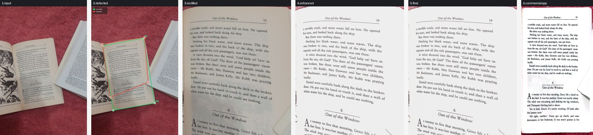

### img2

corner error **51.7 px** · quad IoU 0.783 · detected via `network`

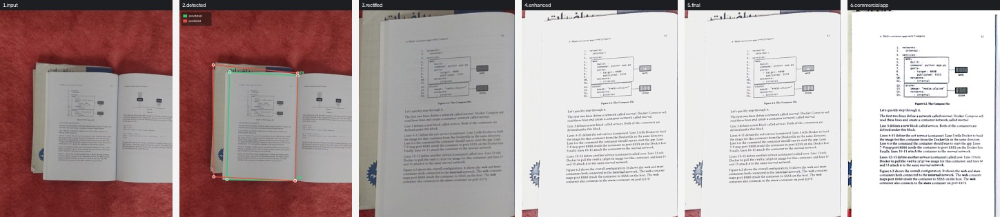

### img25

corner error **47.7 px** · quad IoU 0.853 · detected via `network`

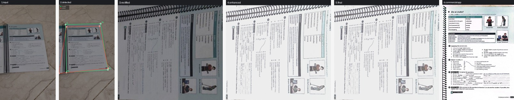

### img6

corner error **45.5 px** · quad IoU 0.808 · detected via `network`

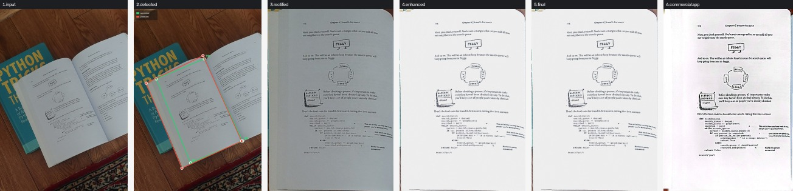

### img4

corner error **37.4 px** · quad IoU 0.888 · detected via `network`

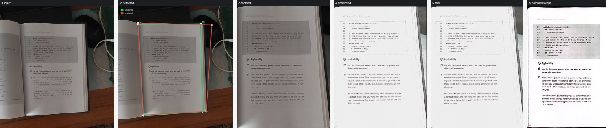

### img26

corner error **36.8 px** · quad IoU 0.886 · detected via `network`

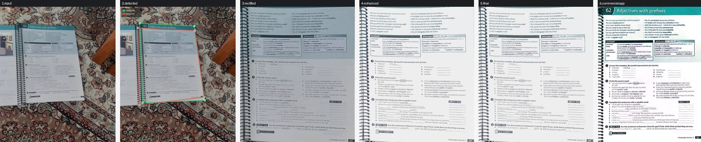

### img15

corner error **32.8 px** · quad IoU 0.853 · detected via `network`

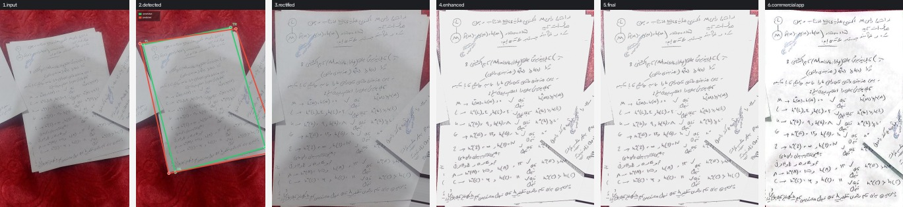

### img8

corner error **29.8 px** · quad IoU 0.883 · detected via `network`

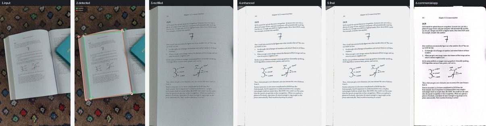

### img18

corner error **25.8 px** · quad IoU 0.845 · detected via `network`

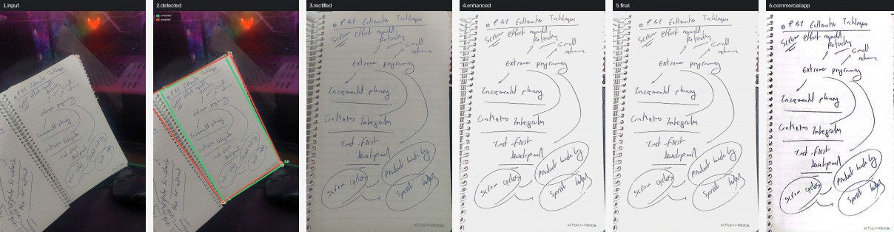

### img21

corner error **22.0 px** · quad IoU 0.889 · detected via `network`

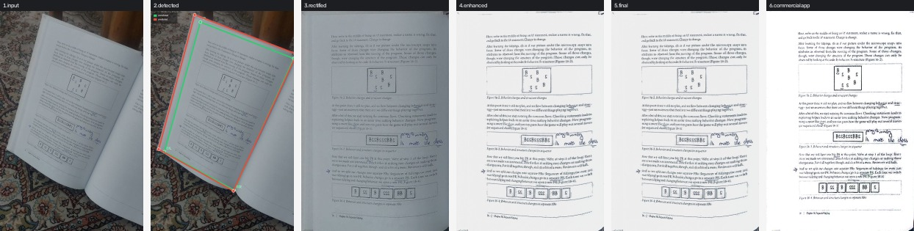

### img5

corner error **20.9 px** · quad IoU 0.921 · detected via `network`

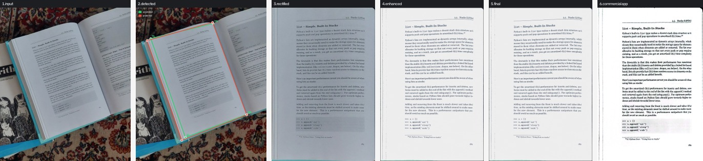

### img17

corner error **20.8 px** · quad IoU 0.916 · detected via `network`

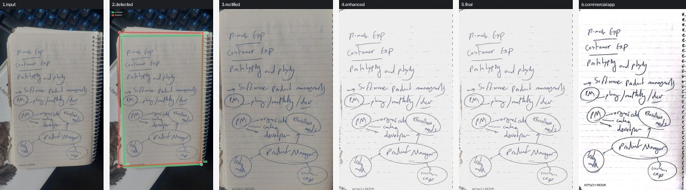

### img23

corner error **18.9 px** · quad IoU 0.922 · detected via `network`

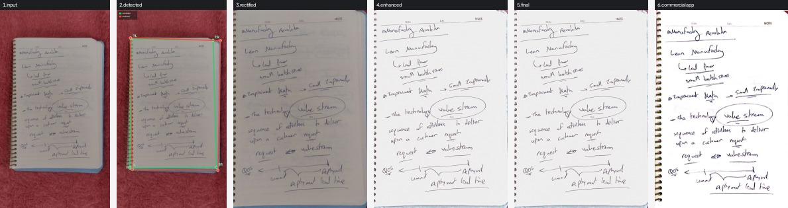

### img22

corner error **16.7 px** · quad IoU 0.921 · detected via `network`

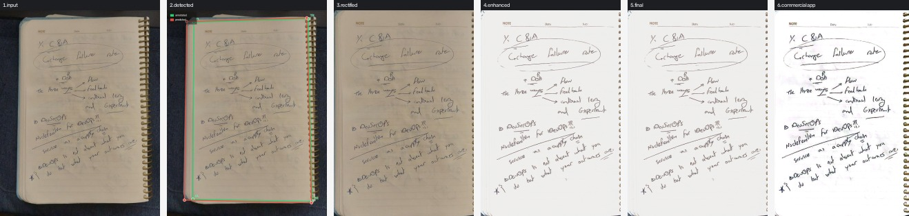

### img9

corner error **14.2 px** · quad IoU 0.946 · detected via `network`

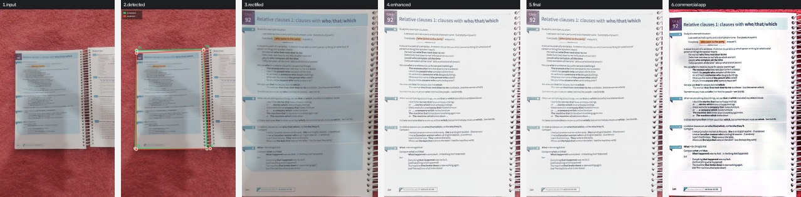

### img11

corner error **13.9 px** · quad IoU 0.937 · detected via `network`

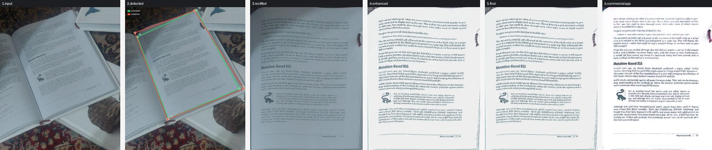

### img10

corner error **13.4 px** · quad IoU 0.930 · detected via `network`

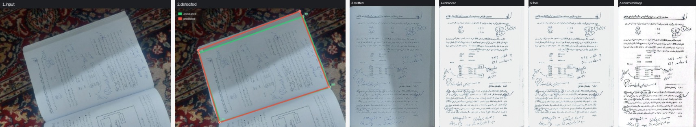

### img7

corner error **12.8 px** · quad IoU 0.926 · detected via `network`

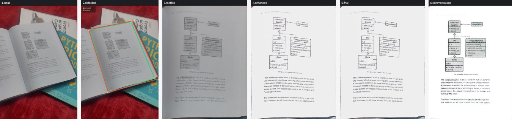

### img24

corner error **12.6 px** · quad IoU 0.925 · detected via `network`

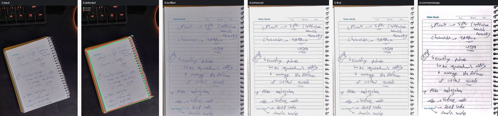

### img20

corner error **11.9 px** · quad IoU 0.939 · detected via `network`

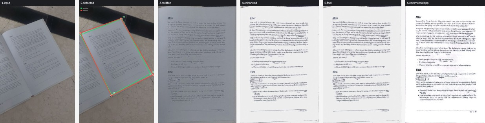

### img3

corner error **11.7 px** · quad IoU 0.939 · detected via `network`

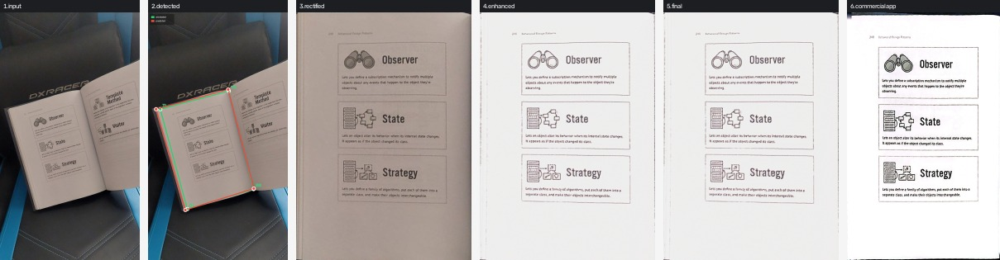

### img19

corner error **11.3 px** · quad IoU 0.921 · detected via `network`

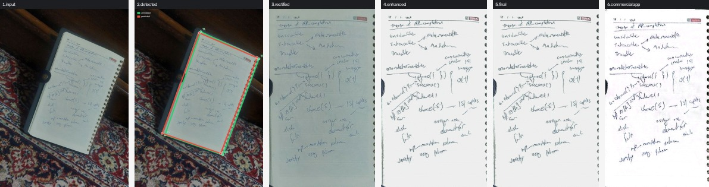

### img14

corner error **7.2 px** · quad IoU 0.968 · detected via `network`

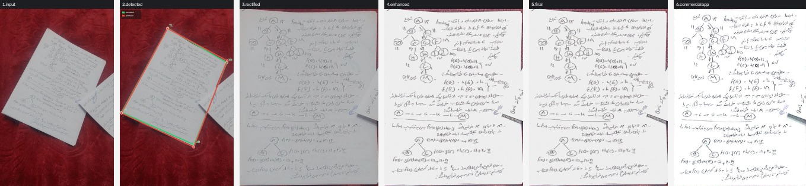

